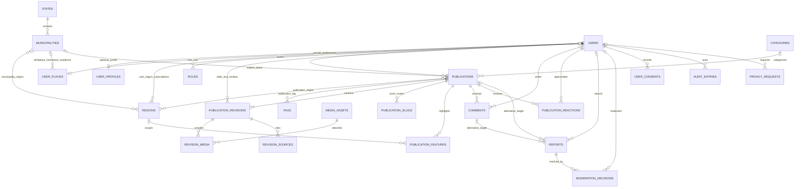

# DESG-V2-004 — Fundação territorial e administrativa

Data: 2026-10-05, America/Sao_Paulo. Status: implementação e verificações automatizadas concluídas. Homologação visual pendente; primeiro administrador não concedido.

## Comparação e escopo executado

O `correio.md` mudou da DESG-V2-003 para DESG-V2-004 e autorizou implementação controlada. SHA-256 anterior: `4657b95853aa213fadf3ca97153ff19524fdfab6eb0ee1afc971b2d1e22bb654`. SHA-256 atual executado: `c933c400467d14e8f3a5edad79eecd2f175ef789e1da657919c8b0be6ebaf3ef`.

Foram implementados território nacional, importação IBGE, papéis, auditoria e proteção do último administrador verificado, páginas públicas e navegação administrativa. Somente este projeto e os bancos `desgarrados2`/`desgarrados2_test` foram utilizados. Não foram instaladas dependências, criados usuários/senhas no principal, iniciados editorial/comunidade nem executado `migrate:fresh` no banco principal. A proteção de testes existente foi preservada.

Versões conferidas por Composer: Laravel 13.34.0, Fortify 1.40.0, Inertia Laravel 3.5.1, Wayfinder 0.1.21 e Pest 5.3.0. A interface utiliza os pacotes React/Inertia/TypeScript existentes. Node instalado: 24.18.0. `.ai/rules` não existe neste workspace. O Git não está disponível como repositório utilizável no executor; a lista abaixo foi registrada diretamente a partir dos arquivos trabalhados.

## 1. Arquivos criados e alterados

### Banco e Models

- `database/migrations/2026_10_05_182231_create_territory_tables.php`.
- `database/migrations/2026_10_05_182232_create_roles_and_role_audits_tables.php`.
- Models novos: `app/Models/State.php`, `Municipality.php`, `Region.php`, `Role.php`, `RoleAssignmentAudit.php`.
- `app/Models/User.php`: relação com papéis, verificação explícita de papel, proteção transacional da exclusão e da perda de verificação, auditoria das associações removidas pela exclusão.
- Factories: `database/factories/StateFactory.php`, `MunicipalityFactory.php`, `RegionFactory.php`, `RoleFactory.php`.
- `database/seeders/RoleSeeder.php`: catálogo fixo e idempotente de cinco papéis, sem contas ou associações.
- `database/seeders/DatabaseSeeder.php`: substituída a criação automática de “Test User” pela chamada exclusiva ao catálogo de papéis.

### Operações, autorização e HTTP

- `app/RoleCode.php`.
- `app/Actions/Territory/ImportIbgeTerritory.php`.
- `app/Actions/Administration/ManageRoleAssignments.php` e `ProtectLastAdministrator.php`.
- `app/Console/Commands/ImportTerritory.php` e `GrantRole.php`.
- `app/Policies/RolePolicy.php`.
- `app/Http/Requests/Admin/RoleAssignmentRequest.php`.
- `app/Http/Controllers/TerritoryController.php` e `Admin/AdministrationController.php`.
- `app/Http/Controllers/Settings/ProfileController.php`: proteção antes do logout, mantendo logout/exclusão dentro da transação.
- `app/Providers/AppServiceProvider.php`: Gates explícitos, sem `Gate::before` universal.
- `app/Http/Middleware/HandleInertiaRequests.php`: capacidade administrativa compartilhada com a navegação.
- `routes/web.php`: rotas públicas e administrativas.

### Interface e testes

- `resources/js/layouts/public-layout.tsx`: navegação pública, link de pular conteúdo, adaptação mobile e modo escuro.
- `resources/js/pages/welcome.tsx`: nova home com conceito de pertencimento, ilustração vetorial de campos e destaque para RS.
- `resources/js/pages/territory/states.tsx`, `state.tsx`, `municipality.tsx`, `my-land.tsx`.
- `resources/js/pages/admin/index.tsx` e `roles.tsx`.
- `resources/js/components/territory-pagination.tsx` e `resources/js/types/territory.ts`.
- `resources/js/app.tsx`: aplicação do layout público à home/território.
- `resources/js/components/app-sidebar.tsx`: Minha terra e item administrativo autorizado.
- `tests/Feature/TerritoryTest.php`, `IbgeImportTest.php`, `RoleAccessTest.php`.
- `executed.md`: registro desta execução, preservando abaixo as anteriores.

Wayfinder regenerou `resources/js/actions/`, `resources/js/routes/` e `resources/js/wayfinder/`. Builds geraram `public/build/` e `bootstrap/ssr/`, diretórios já ignorados. Arquivos temporários de trabalho e respostas HTTP ficaram em `/tmp`, sem credenciais. `.env`, dependências e migrations da fundação não foram modificados.

## 2. Estrutura efetiva do banco

As duas migrations foram aplicadas no principal, batch 2. `migrate:status` confirmou as três migrations anteriores no batch 1 e as duas novas como `Ran`. Não houve remoção de tabela existente.

| Tabela nova | Campos/índices relevantes | FKs e exclusão |
| --- | --- | --- |
| `states` | PK `id`; UNIQUE `ibge_code CHAR(2)`, `abbreviation CHAR(2)`, `slug`; nome, active, synced_at, timestamps | Sem FK |
| `municipalities` | PK `id`; UNIQUE `ibge_code CHAR(7)` e `(state_id,slug)`; índice `(state_id,name,id)`; active/synced_at | state_id → states, RESTRICT |
| `regions` | PK `id`; slug UNIQUE; `kind ENUM(cultural,geographic)`; nome/descrição/active/timestamps | Sem limitação a um estado |
| `municipality_region` | PK `(municipality_id,region_id)`; reverso `(region_id,municipality_id)` | Ambas FKs com RESTRICT; associações sobrepostas permitidas |
| `roles` | PK `id`; code UNIQUE; nome/timestamps | Valores conhecidos por RoleCode e catálogo fixo, sem endpoint de criação arbitrária |
| `role_user` | PK `(role_id,user_id)`; índice reverso `(user_id,role_id)`; granted_by e created_at | role → roles RESTRICT; user → users CASCADE; granted_by → users SET NULL |
| `role_assignment_audits` | PK `id`; role_code, action ENUM(granted,revoked), reason até 500; índice `(target_user_id,created_at,id)` | actor/target → users SET NULL, preservando o registro após exclusão |

Models têm relacionamentos tipados; flags booleanas e synced_at possuem casts. O schema final foi consultado com `database-schema` do Boost, incluindo os índices e as FKs acima. As nove tabelas da fundação permanecem presentes; total final: 16 tabelas.

## 3. Importação oficial IBGE

Fonte: [API oficial de localidades do IBGE](https://servicodados.ibge.gov.br/api/docs/localidades), endpoints `/api/v1/localidades/estados` e `/api/v1/localidades/municipios`.

Comando executado duas vezes: `php artisan territory:import-ibge --no-interaction`.

Resultados confirmados no banco principal:

- 27 unidades da Federação.
- 5.571 municípios, todos com código IBGE distinto e ID distinto.
- 497 municípios vinculados ao Rio Grande do Sul.
- Segunda importação manteve as contagens e não duplicou registros.
- Zero regiões culturais/geográficas criadas automaticamente: a curadoria não foi substituída por inferências sobre cultura.
- Zero usuários, zero associações de papéis e zero auditorias de concessão no principal.

O importador usa timeouts/retry para GET, lock do cache existente e transação de gravação após validação das duas respostas. Valida códigos, nomes, siglas, duplicidades e correspondência município/UF pelo prefixo IBGE. Faz upsert em lotes de 500; preserva IDs, slugs existentes, registros ausentes da resposta e associações regionais. Inativações manuais existentes também são preservadas. `synced_at`/`updated_at` são atualizados ao sincronizar; idempotência significa identidade e conteúdo estáveis, não timestamps imutáveis.

Não há truncamento, exclusão por ausência na fonte, importação durante migrations ou busca da API para servir páginas públicas. Os testes confirmaram atualização de nome com preservação de slug/ID, vínculo regional e município previamente cadastrado; resposta inválida e indisponibilidade HTTP não produziram gravação territorial parcial.

## 4. Administração e segurança

Usuário comum é o acesso base, sem precisar de associação. Papéis adicionais: Colaborador, Autor, Editor, Moderador e Administrador. O catálogo não concede poderes automaticamente.

Todos os cinco papéis podem acessar a estrutura administrativa com e-mail verificado. Somente Administrador pode consultar e alterar associações. Editor e Moderador não herdam poderes de administração de papéis; capacidades editoriais/comunitárias não foram implementadas nesta etapa. O Gate `manage-territory` está definido para Administrador, mas não há CRUD territorial administrativo nesta entrega.

Concessões/revogações passam pela Policy, exigem justificativa e usam transação, lock na linha do papel Administrador e atualização do alvo. Repetição da mesma concessão é idempotente e não duplica a auditoria. Remoção de papel administrativo, exclusão de conta e perda de verificação são recusadas quando eliminariam o último administrador verificado. Administradores não verificados não contam como sucessores ativos.

Não existe bypass universal de Policies/Gates. Capacidade compartilhada com a UI apenas controla a navegação; middleware, Form Request, Policy e operação transacional mantêm a autorização no servidor. Usuários comuns, visitantes e privilegiados não verificados foram cobertos nos testes.

O seeder padrão agora também não cria contas. Não foi concedido administrador no principal, que contém zero usuários. Para uma futura concessão inicial explícita, existe `roles:grant` com `--bootstrap`, permitido somente para o papel Administrador quando não existe administrador e o usuário escolhido já existe e está verificado. O comando exige justificativa e não cria usuário/senha. Depois do bootstrap, concessões CLI exigem `--actor` autorizado; pela interface, o responsável vem da sessão. A opção bootstrap não é aceita como atalho pela requisição HTTP.

Exemplo para um operador, não executado nesta entrega: `php artisan roles:grant ID_EXISTENTE administrator --bootstrap --reason='Concessão inicial aprovada' --no-interaction`. O ID precisa ser substituído por uma conta real escolhida explicitamente.

## 5. Rotas e páginas funcionais

| Rota | Página/comportamento |
| --- | --- |
| `/` | Home pública Desgarrados, destaque RS e chamadas para exploração |
| `/estados` | Todas as UFs ativas, RS primeiro e contagem de municípios ativos |
| `/estados/{state:slug}` | Municípios ativos, busca com limites e paginação de 24 itens |
| `/estados/{state:slug}/municipios/{municipality:slug}` | Página municipal e regiões vinculadas; binding escopado e rejeição de estado divergente |
| `/minha-terra?state=...` | Escolha de território apenas na URL/navegação, sem gravar dados pessoais ou solicitar geolocalização |
| `/administracao` | Estrutura administrativa sob auth, verified e Gate |
| `/administracao/papeis` | Lista paginada de usuários, papéis, concessão/revogação e últimas auditorias, somente Administrador |
| POST/DELETE `/administracao/usuarios/{user}/papeis/{role}` | Alteração autorizada, justificada e auditada |

Links e formulários utilizam funções Wayfinder. A listagem administrativa não envia e-mails de outros usuários. Páginas territoriais inativas e município acessado sob UF incorreta retornam 404. Busca escapa `%`/`_` como caracteres literais. A interface pública inclui labels, estados vazios, navegação por teclado e classes responsivas/modo escuro; isso não equivale a homologação visual ou certificação de acessibilidade.

## 6. Evidências das verificações executadas

| Verificação | Resultado |
| --- | --- |
| Testes novos de território/importação/papéis | 30 aprovados, 188 assertions |
| Testes de perfil e papéis após correção da exclusão | 24 aprovados, 120 assertions |
| Testes de papéis após ajuste do seeder padrão | 19 aprovados, 99 assertions |
| Suíte completa `php artisan test --compact` | 83 testes: 79 aprovados, 4 ignorados por 2FA desativado; 317 assertions |
| `vendor/bin/phpstan analyse --no-progress` | Aprovado, zero erros após os ajustes finais |
| Pint nos arquivos/pastas PHP trabalhados, `--format agent` | Formatação aplicada; verificações seguintes aprovadas |
| `npm run types:check` | Aprovado |
| `vp fmt` nos arquivos frontend trabalhados | Formatação aplicada em 12 arquivos |
| `vp lint` nos arquivos frontend trabalhados | Saída 0, sem diagnósticos |
| `npm run build:ssr` | Builds cliente e SSR aprovados; 2286 módulos cliente, 81 módulos SSR |
| Schema e migrations principais via Boost/Artisan | 16 tabelas; migrations novas no batch 2; fundação preservada |

Durante o desenvolvimento, a suíte detectou uma regressão de exclusão: logout após apagar o usuário podia gravá-lo novamente ao atualizar o remember token. A ordem final verifica a proteção antes do logout e mantém logout/exclusão na mesma transação. O teste existente de exclusão voltou a passar; o teste novo confirma que a recusa do último administrador mantém a sessão autenticada.

Também foi corrigida a tipagem de uso do lock do importador para a API documentada `Cache::lock()`. Nenhum erro de PHPStan foi suprimido.

### HTTP e SSR local

Requisições reais via curl ao servidor local retornaram HTTP 200 para home, estados, RS, Porto Alegre, Minha terra, login, cadastro e recuperação de senha. `/administracao` sem sessão retornou HTTP 302. Essas verificações não criaram contas.

O HTML da home continha `<h1>` com “Nossas raízes … seguem conosco”, demonstrando conteúdo renderizado no servidor no ambiente local, sem executar JavaScript pelo curl. O build SSR utilizou a entrada automática `resources/js/app.tsx` e gerou `bootstrap/ssr/app.js`/manifest. Não foi iniciado nem homologado um processo SSR de produção; essa operação depende do ambiente de implantação. Referência técnica consultada: [SSR do Inertia v3](https://inertiajs.com/docs/v3/advanced/server-side-rendering).

Não há ferramenta de navegador nesta sessão. Portanto, login/cadastro/reset, dashboard, navegação, responsividade e foco visual ainda precisam de homologação visual; status HTTP e testes não substituem essa inspeção. Não foi criada conta persistente no principal.

## 7. Pendências, limites e recomendações para DESG-V2-005

- Selecionar explicitamente uma conta existente/verificada e conceder o primeiro administrador; a administração permanece protegida enquanto isso não ocorrer. Não houve concessão automática nesta execução.
- Homologar em navegador mobile/desktop, teclado e modo escuro. Fluxos administrativos foram validados por testes no banco dedicado, sem login manual no principal.
- Fazer a curadoria das regiões culturais/geográficas e, se aprovado, implementar seu CRUD administrativo e associação a municípios. O modelo N:N está pronto e testado; não existem regiões sem curadoria no principal.
- Planejar publicação/agendamento editorial como próximo incremento, com revisões aprovadas e privacidade, sem iniciar comunidade ou comércio nesta entrega.
- No ambiente de implantação, supervisionar o processo SSR e verificar respostas sem JavaScript, indisponibilidade do renderer e hidratação.
- O build emitiu avisos não bloqueantes sobre `fontaine` opcional e sourcemaps do plugin Inertia. Os dois builds terminaram com sucesso; não foram instaladas dependências para silenciar avisos.
- `pint --dirty --format agent` não é utilizável sem Git neste executor; foi executado conforme solicitado e substituído por formatação explícita dos caminhos trabalhados.
- A proteção do último administrador cobre operações da aplicação via Model/serviço. Alterações SQL diretas ou remoção de associações fora dessas operações exigem cuidado operacional; concorrência foi tratada por locks/transações, mas não foi realizado ensaio multiprocesso de carga.
- A importação preserva registros ausentes; não decide automaticamente extinção territorial nem fusão de municípios. Mudanças dessa natureza precisam de curadoria e procedimento específico.

Para reproduzir a verificação completa no ambiente local, executar `php artisan test --compact`. A configuração continua direcionando testes para MariaDB `desgarrados2_test` e recusando o banco principal.

---

# Histórico preservado — DESG-V2-003

O trecho abaixo registra a etapa anterior e não representa comandos repetidos nesta execução.

# DESG-V2-003 — Arquitetura funcional e modelagem de domínio

Data: 2026-10-05, America/Sao_Paulo. Status: análise e documentação concluídas; proposta ainda não aprovada para implementação. Inspeção visual pendente.

## Controle da execução e evidências

O `correio.md` mudou da DESG-V2-002.4 para DESG-V2-003. Hash anterior: `8bc710404e42be96bda2c22a34a205a0befc187811bbf1ed7e75a7c8e668e722`. SHA-256 atual executado: `4657b95853aa213fadf3ca97153ff19524fdfab6eb0ee1afc971b2d1e22bb654`.

Esta execução consultou exclusivamente o Desgarrados 2 e fontes oficiais públicas. Foram lidos código, configuração, rotas e schema existentes. Não foram executadas migrations, testes com preparação de banco, instalação de dependências, criação de contas, alterações de autenticação/permissões ou implementação de módulos. Somente `executed.md` foi editado. O relatório da fundação está preservado ao final como histórico.

Versões conferidas: PHP 8.4.24; Laravel 13.34.0; Fortify 1.40.0; Inertia Laravel 3.5.1; Wayfinder 0.1.21; React 19.3.0; adaptador React e plugin Vite do Inertia 3.8.0; TypeScript 5.9.3. As versões JavaScript foram obtidas dos pacotes em `node_modules`, além da leitura do `package.json`; as PHP, de `composer show --direct`, com confirmação específica de Wayfinder por `composer show laravel/wayfinder --format=json`.

Schema MariaDB consultado pelo Boost: as nove tabelas da fundação permanecem presentes (`users`, `password_reset_tokens`, `sessions`, `cache`, `cache_locks`, `jobs`, `job_batches`, `failed_jobs`, `migrations`). Não existem tabelas de domínio implementadas. As versões e resultados do relatório anterior são evidências históricas, não uma nova execução da suíte.

## 1. Visão funcional

Desgarrados é um portal de pertencimento: “nossas raízes seguem conosco”. Reúne quem saiu e quem permaneceu, permitindo descobrir histórias, memória, cultura e informações de uma terra escolhida, sem exigir exposição da residência ou classificação de alguém como migrante.

Território nacional no modelo; curadoria e lançamento concentrados no Rio Grande do Sul, com expansão para Santa Catarina e Paraná. O estado inicial é um recorte editorial, não uma restrição nas entidades. Municípios oficiais e regiões culturais são conceitos distintos: uma região cultural pode atravessar limites estaduais, e um município pode integrar várias regiões.

Jornadas centrais: visitante explora a região e lê conteúdo; pessoa cadastrada escolhe suas terras em privado, acompanha regiões e envia uma história; equipe editorial revisa e publica; moderador recebe denúncias e retira conteúdo quando necessário. Origem, terra natal afetiva, residência atual e regiões acompanhadas são escolhas independentes.

## 2. Escopo proposto do MVP

O MVP completo deve ser entregue em incrementos, sem abrir participação pública antes de haver moderação e privacidade.

| Incremento | Inclui | Condição para abertura |
| --- | --- | --- |
| MVP A — portal editorial | Estados/municípios, regiões, página Minha terra, artigos/notícias/crônicas/causos, categorias, tags, imagens, revisões, agendamento, destaques e administração mínima | Publicação autorizada, SEO com HTML verificável e conteúdo inicial curado |
| MVP B — comunidade controlada | Perfil opcional, lugares privados, histórias/relatos/memórias, comentários sem encadeamento, reação de apreciação, denúncias, consentimento e exclusão | Moderação operacional e matriz de privacidade testada |
| Expansão posterior | Agenda e guias de serviços públicos curados | Fontes, responsáveis e rotina de atualização definidos |

Tradições começam como conteúdo editorial categorizado. Uma entidade cultural própria só entra quando houver atributos e relacionamentos que categorias e publicações não representem bem. Agenda e serviços são domínios planejados, mas não requisitos para abrir MVP A/B. Esse recorte é uma decisão proposta para evitar iniciar módulos comerciais nesta fase.

## 3. Limites entre domínios

| Domínio | Responsabilidade | Limite |
| --- | --- | --- |
| Território | Identificadores oficiais, regiões curadas, associação município/região | Não armazena residência individual nem redefine o IBGE |
| Identidade e preferências | Perfil público opcional, lugares pessoais e regiões acompanhadas | Nunca publica preferências pessoais por inferência |
| Publicação | Texto, revisão, atribuição, mídia, taxonomia e ciclo de publicação | Compartilhado apenas por conteúdo editorial e histórias; não absorve eventos/serviços |
| Comunidade e moderação | Comentários, apreciações, denúncias e decisões | Não concede poderes editoriais automaticamente |
| Agenda e diretório | Datas de eventos, fontes e validade de informações locais | Futuro; sem checkout, cobrança ou marketplace |
| Administração | Papéis, acesso e auditoria | Sem multitenancy e sem permissões definidas pelo cliente |

Uma tabela `publications` é justificável porque artigos e histórias compartilham texto, revisão, taxonomia e moderação. O campo `kind` terá conjunto fechado de valores; não será uma tabela universal para qualquer entidade, nem usará EAV, `target_type` ou `target_id` sem FK. Regras específicas por tipo ficam em validação, Policies e transições.

## 4. Modelo entidade-relacionamento proposto

O diagrama representa tabelas futuras, não o schema atual. Para leitura, pivôs simples são resumidos como relações N:N e descritos no dicionário. Toda tabela nova depende de aprovação.

`PUBLICATIONS` referencia também sua revisão pública em `PUBLICATION_REVISIONS`; essa FK circular deve ser adicionada após criar as duas tabelas, com ponteiro inicialmente nulo. Em `REPORTS`, somente um dos alvos publicação/comentário pode ser preenchido.

## 5. Dicionário preliminar de dados

Convenções propostas: PK `id BIGINT UNSIGNED`; FKs do mesmo tipo; timestamps `DATETIME(6)` em UTC; nomes em inglês conforme a fundação. Tabelas de negócio recebem `created_at`/`updated_at`, salvo logs imutáveis e pivôs com apenas `created_at`. `?` significa nullable. Texto em `utf8mb4_unicode_ci`, preservando tabelas existentes. Estados de domínio: `VARCHAR(32)` limitado por CHECK e enum PHP com casos TitleCase. Não armazenar documentos ou endereços residenciais.

| Tabela | Campos principais e restrições |
| --- | --- |
| `states` | `id`, `ibge_code CHAR(2)` UNIQUE, `abbreviation CHAR(2)` UNIQUE, `name VARCHAR(100)`, `slug VARCHAR(100)` UNIQUE, `active BOOL` |
| `municipalities` | `id`, `state_id` FK, `ibge_code CHAR(7)` UNIQUE, `name VARCHAR(150)`, `slug VARCHAR(160)`, `active BOOL`; UNIQUE `(state_id,slug)` |
| `regions` | `id`, `name VARCHAR(150)`, `slug VARCHAR(160)` UNIQUE, `kind VARCHAR(32)` (`cultural`/`geographic`), `description TEXT?`, `active BOOL`; sem hierarquia obrigatória |
| `municipality_region` | PK composta `(municipality_id,region_id)`, duas FKs; não presumir uma única região por município |
| `user_profiles` | `id`, `user_id` FK UNIQUE, `public_slug VARCHAR(100)` UNIQUE, `display_name VARCHAR(100)`, `bio TEXT?`, `avatar_media_id?` FK, `is_public BOOL DEFAULT false`; não reutilizar e-mail como identificador público |
| `user_places` | `id`, `user_id` FK UNIQUE, `birthplace_municipality_id?`, `hometown_municipality_id?`, `residence_municipality_id?`, todas FKs; `birthplace_visibility`, `hometown_visibility`, `residence_visibility` (`private`/`public`, padrão `private`) |
| `user_region_subscriptions` | PK composta `(user_id,region_id)`, FKs; assinatura apenas personaliza leitura, sem adesão automática a marketing |
| `roles` / `role_user` | Papel: `id`, `code VARCHAR(32)` UNIQUE, `name`; pivô PK `(role_id,user_id)`, FKs, `granted_by?` FK users, `created_at`; papéis fixos, permissões inicialmente em código |
| `categories` | `id`, `name VARCHAR(100)`, `slug VARCHAR(120)` UNIQUE, `description TEXT?`; uma categoria principal por publicação; hierarquia adiada |
| `tags` / `publication_tag` | Tag: `id`, `name VARCHAR(80)`, `slug VARCHAR(100)` UNIQUE; pivô PK `(publication_id,tag_id)` com FKs |
| `publications` | `id`, `author_id?` FK users, `municipality_id?` FK, `category_id?` FK, `kind VARCHAR(32)`, `status VARCHAR(32)`, `visibility VARCHAR(16)` padrão `private`, `published_revision_id?` FK, `scheduled_for?`, `published_at?`, `archived_at?`, `deleted_at?`; nenhum campo monetário |
| `publication_revisions` | `id`, `publication_id` FK, `version INT UNSIGNED`, `editor_id?` FK users, `reviewer_id?` FK users, `status VARCHAR(32)`, `title VARCHAR(200)`, `summary VARCHAR(500)?`, `body LONGTEXT`, `public_byline VARCHAR(120)?`, `submitted_at?`, `reviewed_at?`, `review_note TEXT?`; UNIQUE `(publication_id,version)` e `(publication_id,id)` |
| `publication_region` | PK `(publication_id,region_id)`, FKs; regiões do assunto, sem derivação automática dos lugares privados do autor |
| `publication_slugs` | `id`, `publication_id` FK, `slug VARCHAR(180)` UNIQUE global, `is_current BOOL`, `retired_at?`; registra slug atual e anteriores; máximo um atual por publicação, via restrição auxiliar descrita abaixo |
| `media_assets` | `id`, `uploader_id?` FK users, `disk VARCHAR(32)`, `path VARCHAR(255)`, `mime_type VARCHAR(100)`, `byte_size BIGINT UNSIGNED`, `width INT?`, `height INT?`, `status VARCHAR(32)` (`pending`/`ready`/`blocked`), `rights_basis VARCHAR(32)`, `rights_note TEXT?`, `deleted_at?`; UNIQUE `(disk,path)` |
| `revision_media` | PK `(revision_id,media_asset_id)`, FKs, `position SMALLINT UNSIGNED`, `usage VARCHAR(16)` (`cover`/`inline`), `alt_text VARCHAR(255)?`, `caption VARCHAR(500)?`, `credit VARCHAR(150)?`; contexto pertence à revisão |
| `revision_sources` | `id`, `revision_id` FK, `title VARCHAR(200)`, `url VARCHAR(500)?`, `attribution VARCHAR(255)?`, `accessed_at?`; fontes e créditos vinculados à versão aprovada |
| `publication_features` | `id`, `publication_id` FK, `region_id?` FK (nulo = home geral), `position SMALLINT`, `starts_at`, `ends_at`, `created_by?` FK users; período e posição validados; nada de publicidade implícita |
| `comments` | `id`, `publication_id` FK, `user_id?` FK, `body TEXT`, `status VARCHAR(32)` (`pending`/`approved`/`hidden`/`rejected`), `reviewed_by?` FK users, `reviewed_at?`, `deleted_at?`; comentários planos no MVP |
| `publication_reactions` | `id`, `publication_id` FK, `user_id` FK, `kind VARCHAR(16)` limitado a `appreciate`; UNIQUE `(publication_id,user_id)` |
| `reports` | `id`, `reporter_id?` FK users, `publication_id?` FK, `comment_id?` FK, `reason_code VARCHAR(32)`, `details TEXT?`, `status VARCHAR(32)` (`open`/`reviewing`/`resolved`/`dismissed`), `assigned_to?` FK users, `closed_at?`; CHECK de exatamente um alvo |
| `moderation_decisions` | `id`, `report_id` FK, `moderator_id?` FK users, `action VARCHAR(32)`, `reason TEXT`, `created_at`; imutável; histórico de decisão e recurso, sem copiar o conteúdo denunciado indiscriminadamente |
| `user_consents` | `id`, `user_id` FK, `purpose VARCHAR(50)`, `notice_version VARCHAR(32)`, `granted_at`, `withdrawn_at?`; registros históricos, sem IP obrigatório; autorização de imagem de terceiros documentada separadamente na mídia |
| `privacy_requests` | `id`, `user_id?` FK, `type VARCHAR(32)` (`access`/`correction`/`export`/`erasure`/`withdrawal`), `status VARCHAR(32)`, `requested_at`, `completed_at?`, `handled_by?` FK users, `retention_reason TEXT?`; dados de contato apenas quando necessários e com acesso restrito |
| `audit_entries` | `id`, `actor_id?` FK users, `subject_user_id?` FK users, `publication_id?` FK, `comment_id?` FK, `report_id?` FK, `action VARCHAR(50)`, `changes JSON?`, `created_at`; alvos explícitos, JSON somente para diferenças permitidas; nunca senha/token/texto pessoal integral |

Tipos fechados de publicação: `article`, `news`, `chronicle`, `causo`, `cultural_history`, `personal_story`, `migration_story`, `memory`. `publication_revisions` usam `draft`, `in_review`, `approved`, `rejected`; após submissão o snapshot é imutável, e correções geram nova revisão. O armazenamento inicial do corpo deve ser texto simples com parágrafos, escapado ao renderizar. Editor rico/Markdown depende de avaliação posterior, sem aceitar HTML arbitrário nem instalar biblioteca nesta etapa.

Fontes oficiais de município: [API de localidades do IBGE](https://servicodados.ibge.gov.br/api/docs/localidades). Importação futura deve guardar proveniência e data em execução auditada, ser idempotente por código IBGE, preservar municípios referenciados e não depender da API durante uma leitura do portal. Códigos oficiais são identificadores externos; não substituem as PKs internas.

### Entidades futuras, fora do MVP A/B

| Domínio | Tabelas e campos propostos |
| --- | --- |
| Localidades/distritos | `localities(id,municipality_id,name,kind,ibge_code?,slug,active)`, UNIQUE `(municipality_id,slug)`; introduzir apenas com fonte e demanda; códigos não oficiais não podem fingir ser IBGE |
| Tradições estruturadas | `traditions(id,name,slug UNIQUE,description,status)` e pivôs `tradition_region`/`publication_tradition`; só quando conteúdo categorizado for insuficiente |
| Eventos | `events(id,municipality_id,title,slug UNIQUE,status,source_url,source_checked_at,expires_at,organizer_name?,public_venue?)`; `event_occurrences(id,event_id,starts_at,ends_at,timezone,is_cancelled)`, FK e CHECK `ends_at > starts_at`; rodeios, feiras e festas como categorias |
| Serviços e guias | `service_listings(id,municipality_id,name,slug UNIQUE,kind,description,public_address?,public_phone?,source_url,last_verified_at,valid_until,status)`; apenas dados destinados a divulgação; `service_hours(id,service_listing_id,weekday,opens_at,closes_at,valid_from,valid_until)` e `service_hour_exceptions(id,service_listing_id,date,is_closed,opens_at?,closes_at?)` |
| Monetização | Conceitos reservados: anunciante, campanha, posição publicitária e patrocínio com vínculo explícito ao estabelecimento; sem tabelas ou campos de cobrança agora. Produtos personalizados, parceiros e classificados terão requisitos próprios antes da modelagem detalhada |

Horários que atravessam meia-noite exigirão `ends_next_day` e validação própria. Eventos públicos usam horário UTC e timezone IANA para apresentação, inicialmente `America/Sao_Paulo`; eventos de dia inteiro usarão datas locais, sem converter meia-noite como se fosse horário universal. Serviços vencidos devem ser marcados como desatualizados e sair de recomendações; horário sem fonte não é apresentado como confirmado.

## 6. Integridade, estados, índices e consultas

### Integridade e ciclo editorial

- FKs em InnoDB. Catálogos de território: `RESTRICT` se referenciados, com inativação em vez de apagar. Pivôs podem ter `CASCADE`; referências a autor/editor/moderador podem ter `SET NULL` após tratamento de privacidade, evitando perda automática de conteúdo ou prova de decisão.
- `publications.status`: `draft → in_review → scheduled/published`; revisão pode ser rejeitada e reaberta como nova versão. `published → hidden/archived` por ação autorizada. Conteúdo excluído usa `deleted_at`; exclusão definitiva é um processo distinto. Agendamento exige revisão aprovada e data futura.
- A leitura pública exige simultaneamente status `published`, `visibility=public`, `published_at <= agora UTC`, ausência de `deleted_at` e revisão apontada com status `approved`. Autor não pode trocar esses atributos por mass assignment.
- Revisar um texto já publicado gera nova revisão em paralelo; a versão aprovada anterior continua pública até a troca autorizada do ponteiro. Anexos e fontes também pertencem à revisão, impedindo troca de imagem ou de texto após aprovação.
- FK composta `(id,published_revision_id)` em publications para `(publication_id,id)` em revisions assegura que a revisão pertença à publicação. Ponteiro nulo permite criar a publicação antes da primeira revisão. Aprovação e publicação precisam de transação, controle de versão e lock na publicação para resolver concorrência; versão se aloca sob o mesmo lock.
- Exclusão definitiva de publicação deve primeiro remover o ponteiro de revisão e depois tratar revisões/anexos conforme retenção, evitando conflito na FK circular. Anexos não devem apagar um arquivo compartilhado com outra revisão ainda válida.
- Denúncia tem CHECK `(publication_id IS NOT NULL AND comment_id IS NULL) OR (publication_id IS NULL AND comment_id IS NOT NULL)`. Datas de destaques têm CHECK `ends_at > starts_at`. Estados e visibilidades têm CHECKs de valores permitidos, além de validação na aplicação.
- Um slug nunca é reaproveitado por outra publicação, mesmo após soft delete. Mudança cria alias e redirecionamento 301; conteúdo privado/removido não revela título nem slug histórico por redirecionamento público.
- Para garantir um único slug atual no MariaDB: coluna gerada nullable `current_publication_id`, derivada de `is_current`, com índice UNIQUE. UNIQUE global em `slug` impede colisões; transação resolve troca de slug. A sintaxe da coluna gerada será confirmada antes da migration.
- Texto, título e slug têm limites em Form Requests. Não usar UNIQUE incluindo `deleted_at` para tentar reservar slugs: múltiplos NULL não dão a garantia pretendida.
- Relação entre perfil e lugar não torna qualquer município público. Denúncias, razões de revisão, dados de contato e lugares privados ficam fora de Resources públicos e cache público.

### Índices propostos por consulta

| Consulta | Índice inicial |
| --- | --- |
| Municípios por estado e nome | `municipalities(state_id,name,id)`; UNIQUE do slug já cobre busca estadual por slug |
| Municípios de uma região | PK `(municipality_id,region_id)` e reverso `(region_id,municipality_id)` |
| Feed público | `publications(status,visibility,deleted_at,published_at,id)` |
| Feed municipal | `publications(municipality_id,status,visibility,deleted_at,published_at,id)` |
| Fila editorial/agendamento | `(status,scheduled_for,id)`; revisão `(publication_id,status,version)` conforme uso |
| Conteúdo do autor | `publications(author_id,created_at,id)` |
| Conteúdo regional/tag | PKs dos pivôs e reversos `(region_id,publication_id)` / `(tag_id,publication_id)`; ordenar pelo índice da publicação e medir o JOIN |
| Comentários públicos | `comments(publication_id,status,deleted_at,created_at,id)` |
| Denúncias pendentes | `reports(status,created_at,id)`; índice para `assigned_to` se a fila por responsável justificar |
| Histórico de auditoria | `audit_entries(publication_id,created_at,id)` e `(subject_user_id,created_at,id)` conforme telas |
| Consentimento por finalidade | `user_consents(user_id,purpose,granted_at,id)` |
| Agenda futura | `event_occurrences(starts_at,id)` e `(event_id,starts_at)`; diretório `(municipality_id,status,valid_until,id)` |

Esses índices são candidatos, não uma promessa de plano de execução. Conferir índices de FK já criados para evitar duplicação e medir EXPLAIN com dados representativos antes de ampliar. Filtros opcionais por tipo/categoria só ganham índices próprios quando o uso justificar. Não criar todos os índices possíveis por combinação de filtros.

Feeds ordenados por `published_at DESC,id DESC`, comentários por `created_at,id`. Cursor para feeds extensos; paginação por página para catálogos/administração onde total e página são úteis. Limite inicial de 20 itens, máximo 50 por requisição. Contagem de reações por agregação, sem carregar todas as linhas; contadores persistentes apenas após medir demanda.

Busca inicial: título, categoria, região e município; filtro textual limitado e paginado. `LIKE '%termo%'` é uma solução limitada, não usa índice B-tree para resolver texto. Avaliar FULLTEXT nativo MariaDB com amostra de nomes e termos regionais antes de adotá-lo. Elasticsearch e Redis ficam fora da proposta inicial.

## 7. Arquitetura Laravel, React e contratos

Manter um único aplicativo, usando as pastas Laravel existentes. Os agrupamentos abaixo são propostas de organização futura, sem criar diretórios agora: `app/Models` para entidades; `app/Http/Controllers/{Territory,Publications,Community,Admin}`; `app/Http/Requests` com agrupamentos equivalentes; `app/Policies`; operações transacionais em `app/Actions/{Publications,Moderation,Privacy}` quando necessárias. Não criar pacotes internos ou repositório abstrato para cada Model.

| Camada | Responsabilidade proposta |
| --- | --- |
| Models | Relações tipadas: State hasMany Municipality; Municipality belongsTo State e belongsToMany Region; User hasOne Profile/Places, belongsToMany Role/Region; Publication belongsTo autor/município/categoria e hasMany revisions/comments; pivôs com FKs |
| Form Requests | `StorePublicationRequest`, `SubmitRevisionRequest`, `UpdatePlacesRequest`, `StoreCommentRequest`, `StoreReportRequest`; normalização, limites, valores permitidos e autorização; autor vem da sessão |
| Policies | `PublicationPolicy`, `RevisionPolicy`, `CommentPolicy`, `ProfilePolicy`, `ReportPolicy`; visibilidade, propriedade, papéis e estado do recurso |
| Actions | `SubmitRevision`, `ApproveRevision`, `PublishRevision`, `ResolveReport`, `ErasePersonalData`; transações, locks e auditoria. CRUD simples permanece no controller |
| Controllers | Coordenar Request/Policy/ação/resposta; recursos para index/show/store/update/destroy, operações editoriais explícitas quando necessárias |
| Resources/DTOs | Contratos distintos para resumo público, detalhe público, edição própria e revisão administrativa; nunca enviar Model completo ao cliente para depois esconder campos na UI |
| Jobs e eventos | Processar variantes de imagem, publicar agendados, exportar/excluir dados e invalidar cache; jobs idempotentes, com retries limitados e dispatch após commit |

Inertia serve as páginas React em `resources/js/pages`, com `Inertia::render()` e props tipadas. Exemplos de contratos propostos: listagem `{items:{data,next_cursor},filters,region}`; detalhe `{publication:{id,slug,title,summary,body,published_at,byline,media},can:{comment,report}}`; edição `{draft,revisionVersion,errors}`. Flags `can` ajudam a interface, mas toda autorização é repetida no servidor. E-mail, município privado, IP, tokens, notas de moderação e caminhos internos de mídia não entram no contrato público.

Reutilizar `components/ui`, `heading`, `input-error`, `alert-error`, `pagination` quando existir, e elementos de navegação existentes. Novos componentes de domínio serão pequenos: cartão de publicação, seletor de município, filtro regional, metadados de autoria e lista de comentários. Rotas frontend por funções nomeadas Wayfinder; formulários Inertia `<Form>`/`useForm`, sem URLs de ações codificadas diretamente. Resources de API versionada apenas se uma API externa passar a ser requisito.

Layouts propostos: público para home/território/conteúdo; autenticado usando o AppLayout existente para preferências e contribuições; administrativo reutilizando a estrutura de navegação existente com itens autorizados. AuthLayout e configurações atuais são preservados. Skeleton em props adiadas; título e conteúdo principal de páginas indexáveis não podem depender de props adiadas.

## 8. Autenticação e autorização

Preservar Fortify, guard web, sessões atuais, cadastro, recuperação e verificação de e-mail. 2FA permanece desativado conforme a fundação. A leitura pública permite visitante; contribuição, comentário e reação exigem sessão e e-mail verificado. Nenhuma destas regras foi implementada nesta etapa.

RBAC inicial: tabela de papéis e pivô usuário/papel; usuário comum é o papel base implícito, e os demais são cumulativos. Capacidades ficam declaradas em Policies/Gates, sem painel para criar permissões arbitrárias. Um papel não implica os poderes de outro automaticamente.

| Papel | Poderes propostos |
| --- | --- |
| Usuário comum | Gerir seu perfil/lugares, submeter suas histórias, comentar, apreciar e denunciar; editar somente rascunhos próprios |
| Colaborador | Enviar material editorial para revisão, sem aprovar/publicar |
| Autor | Criar e revisar suas próprias publicações editoriais, sem publicar por conta própria |
| Editor | Revisar, aprovar, agendar e publicar conteúdo editorial e comunitário; gerir taxonomia/destaques |
| Moderador | Avaliar denúncias, ocultar comentários/publicações e registrar decisão; não publicar editorial nem conceder papéis |
| Administrador | Gerir papéis e operação; acesso a capacidades editoriais por regra explícita, sem bypass universal de privacidade |

Gate para acesso administrativo; Policy por ação e estado. Ownership deriva da sessão e FK, nunca de `author_id` fornecido pelo formulário. Editor não aprova a própria revisão no fluxo normal; exceção operacional, se necessária, exige regra explícita, justificativa e auditoria. Moderador não decide sua própria denúncia. Concessão/revogação de papel exige transação/auditoria; proteger a existência de pelo menos um administrador ativo. Não automatizar criação de administrador nesta fase. A distinção entre Gates e Policies foi conferida na [documentação oficial de autorização do Laravel 13](https://github.com/laravel/docs/blob/13.x/authorization.md).

A rota existente de exclusão em `ProfileController::destroy()` apaga o usuário diretamente. Ela é compatível com a fundação atual, mas antes de criar novas FKs será necessário projetar a integração com o processo de exclusão, mídia e atribuição. Essa observação não autoriza alterar autenticação agora.

## 9. Segurança, privacidade, moderação e retenção

### Controles de produto e aplicação

Perfil público é opcional e desligado por padrão. Lugares pessoais são opcionais e privados por campo; mostrar a cidade só após escolha explícita, sem endereço, coordenadas ou data completa de nascimento. “Minha terra” funciona também por filtro de leitura, sem gravar uma localização pessoal. Assinatura de região não permite inferir origem ou residência. Texto de história deve alertar o autor sobre divulgação voluntária e identificação de terceiros.

Uploads: lista permitida de imagens raster, limite de 10 MB e limite de dimensões a validar com a infraestrutura. Inspecionar o conteúdo, reprocessar imagem, remover EXIF e gerar nomes internos; não aceitar SVG/HTML enviados pelo usuário. Originais privados, derivados públicos somente para versões aprovadas e mídias liberadas. Impedir acesso direto a arquivos privados; bloquear também derivados e invalidar cache quando uma publicação for ocultada.

CSRF, cookies seguros em produção, validação, escaping e rate limits por ação. Comentários/denúncias têm tamanho e frequência limitados; motivos de denúncia estruturados e detalhes privados. Não buscar automaticamente URLs fornecidas pelo usuário, evitando transformar fontes editoriais em um mecanismo de acesso à rede interna. Logs não registram senhas, tokens nem corpos pessoais integrais.

Comentários começam pendentes; edição de comentário aprovado volta à revisão. Publicações comunitárias exigem revisão inicial; denúncia não remove automaticamente o alvo. Moderador registra decisão, motivo e possibilidade de recurso; ocultação urgente pode anteceder análise final, com trilha auditada. Relator e acusado não recebem a identidade um do outro pela resposta pública. Antes de abrir participação, definir responsáveis, canal de contato, atendimento e tratamento de abuso recorrente.

### LGPD e ciclo de dados

Finalidade, necessidade, transparência e segurança orientam a proposta. Cada finalidade deve ter base legal registrada; consentimento não é a base universal. O processo deve atender direitos do titular e prever término do tratamento, com retenção excepcional justificada. A responsabilidade pelo enquadramento e pelos prazos deve ser validada pelo controlador antes do lançamento. Referência: [LGPD, arts. 6, 7, 15, 16 e 18](https://www.planalto.gov.br/ccivil_03/_ato2015-2018/2018/lei/l13709compilado.htm).

Proposta operacional de retenção, sujeita a aprovação: rascunhos apagados ficam recuperáveis por 30 dias; arquivos de exportação expiram em 7 dias; imagens órfãs são purgadas após 30 dias; logs técnicos têm janela de 90 dias; evidências de moderação/consentimento seguem prazo documentado por finalidade, evitando retenção indefinida. Esses números são escolhas de produto, não prazos legais afirmados.

Exclusão começa bloqueando acesso público e sessões. Processo idempotente elimina lugares, perfil, reações e mídias pessoais; conteúdo e autoria recebem tratamento específico conforme solicitação e eventual retenção justificada. `SET NULL` não anonimiza por si só: revisar texto, byline, fotos, revisões, fontes, auditoria, denúncias e referências indiretas. Soft delete não equivale a eliminar dados. Originais e derivados, caches, exports e cópias de segurança entram no plano; backups precisam de prazo aprovado e reaplicação de exclusões após restauração. Não prometer apagamento imediato de backups sem mecanismo correspondente.

Antes de abrir comunidade, decidir política etária e tratamento de imagens/relatos sobre menores. Não coletar idade/documentos preventivamente sem necessidade definida. Publicação de foto de terceiros exige comprovação de direitos/autorização aplicável, além do consentimento do titular da conta.

## 10. SEO, performance e experiência

### Renderização e descoberta

Priorizar Inertia SSR para home, páginas territoriais e publicações. O plugin `@inertiajs/vite` já existe; `config/inertia.php` habilita SSR. O script `build:ssr` está declarado, mas não foi encontrado bundle em `bootstrap/ssr` nesta inspeção. Configuração habilitada e build cliente aprovado não demonstram SSR operacional.

Inertia v3 oferece SSR automático em desenvolvimento via plugin; produção exige bundle e processo SSR supervisionado, com Node compatível. A implementação futura deve confirmar HTML inicial contendo título, texto e metadados com JavaScript desligado, além de testar hidratação e falhas. Fonte: [SSR do Inertia v3](https://inertiajs.com/docs/v3/advanced/server-side-rendering). A ausência de `resources/js/ssr.tsx` isoladamente não é diagnóstico de erro: o plugin pode usar entrada automática. Não introduzir Blade como um segundo sistema de páginas sem decisão arquitetural explícita.

URLs propostas: território por UF e slug municipal, conteúdo por slug global reservado. Canonical, title, descrição, Open Graph e dados estruturados apropriados ao tipo; sitemap somente com conteúdo público aprovado. Preview privado requer autenticação e `noindex`; robots não substitui autorização. Antigos slugs redirecionam sem cadeias. Conteúdo oculto não pode reaparecer no sitemap, busca ou cache. Filtros geram canonical e regras de indexação para evitar infinitas páginas equivalentes.

### Performance

Eager loading de relações necessárias, seleção de colunas e paginação limitada. Cache em banco para feeds públicos e taxonomias; chaves por filtros/versão pública e invalidação após publicação/ocultação. Nunca cachear uma resposta autenticada sob chave compartilhada nem incluir locais privados em feed público. Locks e filas MariaDB preservam a fundação; monitorar contenção antes de sugerir novos serviços.

Imagens com dimensões explícitas, variantes responsivas e lazy loading abaixo da dobra; imagem principal não deve ser atrasada. Formatos derivados dependem de extensões já disponíveis, a conferir antes de implementação; não instalar pacotes nesta etapa. Métricas iniciais propostas: ausência de N+1, paginação máxima respeitada e orçamento de consultas por página medido; metas de latência só após amostra e ambiente definidos.

### Navegação e identidade

Navegação alvo: início, Minha terra, Histórias, Cultura e tradições, Causos, Agenda regional, Serviços e Comunidade. No MVP A/B, não mostrar links vazios para módulos futuros. “Minha terra” usa seleção municipal/regional independente da cidade de residência; permite acompanhar mais de uma região.

Identidade valoriza paisagens, linguagem e memória do Sul sem pressupor vestimenta, origem étnica ou hábitos iguais para todos. Embaixador é recurso editorial opcional, não avatar obrigatório nem barreira ao acesso; não criar personagem ou telas definitivas agora.

Projeto mobile-first: navegação clara, filtros utilizáveis sem mapa, formulários curtos, estados de carregamento/erro/vazio, retorno preservando filtros. Meta de acessibilidade: WCAG 2.2 AA, teclado, foco visível, labels e mensagens associadas, contraste, texto alternativo, zoom/reflow e respeito a movimento reduzido. Conferência manual e automatizada será critério de entrega, não afirmação de conformidade atual. Referência: [WCAG 2.2](https://www.w3.org/TR/WCAG22/).

## 11. Auditoria local e riscos técnicos

`php artisan route:list --no-interaction` listou 30 rotas. Confirmadas rotas de login, cadastro, recuperação/reset, confirmação de senha, verificação de e-mail, dashboard e configurações. A leitura do código confirmou dashboard sob `auth`/`verified`, User implementando `MustVerifyEmail`, layouts de autenticação/aplicação existentes e Fortify com cadastro, reset e verificação ativos.

Não há ferramenta de navegador/Playwright disponível nesta sessão. `browser-logs` do Boost retornou conexão Vite perdida às 17:16 UTC e conexões restabelecidas às 17:30/17:33 UTC em 2026-10-05, sem exceção de aplicação nas cinco entradas consultadas. São logs anteriores de outro acesso, não navegação produzida nesta execução nem prova de ausência de erros.

Pendências de homologação visual: login, cadastro, recuperação de senha, área autenticada, navegação e responsividade. Não criar conta persistente no banco principal para resolvê-las; usar ambiente de teste dedicado e conta descartável quando houver navegador disponível. Nenhum layout foi alterado.

| Risco | Mitigação proposta / condição |
| --- | --- |
| Escopo grande | Lançar editorial e comunidade em incrementos; agenda, diretório e comércio separados |
| SSR presumido funcional | Verificar HTML inicial e bundle/processo antes de aceitar SEO |
| Revisão contornada por troca de texto/imagem | Snapshot de texto, mídia e fontes; troca de ponteiro apenas autorizada |
| Vazamento de lugares ou props | Resources específicos e testes de privacidade por campo e por estado |
| Exclusão direta diante de novas FKs | Planejar processo de exclusão antes das migrations de conteúdo; nenhum ajuste agora |
| DDL MariaDB com locks/commit implícito | Migrations pequenas, ensaio no banco dedicado, backup e recuperação; não assumir rollback transacional de DDL |
| Custos de JOIN/índices e busca textual | Medir EXPLAIN/dados reais, limitar consultas; FULLTEXT somente se necessário |
| Moderação sem equipe | Abertura comunitária condicionada a responsáveis e processo de recurso |
| Mídia sem direitos ou localização EXIF | Comprovação de direitos, reprocessamento e acesso privado até aprovação |
| Consentimento/retenção indefinidos | Matriz por finalidade e política aprovada antes do lançamento |

## 12. Plano incremental de migrations — somente após aprovação

Não gerar nem executar migrations nesta etapa. Após aprovação, confirmar APIs e sintaxe nos pacotes instalados, usar geradores Artisan e preservar as migrations já aplicadas. Cada lote deve ter teste de integridade e roteiro de recuperação. A ordem proposta é:

1. **Território:** states, municipalities, regions e municipality_region. Importação oficial em comando idempotente separado, sem alterar registros já referenciados de modo destrutivo.
2. **Acesso administrativo:** roles e role_user. Aprovar antes a matriz; concessão inicial a usuário existente via procedimento autorizado, sem contas/senhas embutidas em seeders.
3. **Conteúdo e taxonomia:** categories, tags, publications sem ponteiro obrigatório, revisions, pivôs e slugs; adicionar depois a FK composta do ponteiro. Testar criação em duas etapas e troca de revisão.
4. **Mídia, fontes e destaques:** media_assets, revision_media, revision_sources e publication_features; validar direitos e geração de derivados antes de publicação.
5. **Privacidade e auditoria:** audit_entries, user_consents e privacy_requests; integrar exclusão/retirada de conteúdo e remoção de arquivos antes de habilitar contribuições.
6. **Perfis e comunidade:** user_profiles, user_places, assinaturas, comments, reactions, reports e moderation_decisions. Abrir MVP B somente após Policies, moderação e testes.
7. **Futuro independente:** eventos/ocorrências e serviços/horários. Exigem decisão própria; nenhuma migration comercial reservada agora.

Coluna obrigatória/índice UNIQUE em tabela populada: adicionar nullable, preencher em lotes, verificar duplicidades, só então restringir. Não fazer importação externa durante migration. Ensaiar atualização e instalação vazia em banco dedicado. No principal, apenas migrations incrementais não destrutivas com backup e inspeção; nunca `migrate:fresh`. `down()` que perde conteúdo não deve ser tratado como recuperação segura; preferir correção adiante em produção.

## 13. Estratégia de testes e critérios de aceitação

Preservar Pest, MariaDB `desgarrados2_test` e a proteção anterior a `RefreshDatabase`. Não rodar testes nesta etapa documental, pois eles recriam schema no banco de testes e não acrescentariam evidência sobre código não implementado. Os 49 aprovados/4 ignorados da DESG-V2-002.4 permanecem o último resultado histórico.

Cobertura futura prioritária: matriz de Policies e propriedade; visitante recebe apenas versão pública aprovada; privacidade por campo; perfil privado fora da busca; revisão em análise não modifica conteúdo publicado; slug concorrente/alias; agendamento idempotente e horário UTC; aprovar/ocultar invalida cache e mídia; unicidade/FKs; denúncia com alvo inválido recusada; limites de upload; exclusão/exportação com mídia/cache/revisões. Factories isoladas e testes HTTP para fluxos acessíveis; unitários apenas para decisões puras. Fakes nas fronteiras externas; MariaDB real nas relações e consultas.

Critérios de aceite propostos:

1. Importação IBGE idempotente sem perda de municípios referenciados e regiões sobrepostas permitidas.
2. Leitura pública apresenta apenas revisão aprovada, inclusive sob URL direta, busca, sitemap e cache.
3. Editorial cria, revisa, agenda e publica com autorização, trilha de auditoria e prevenção de autoaprovação.
4. Usuário mantém origens/residência privadas por padrão; cada alteração de visibilidade respeita sua escolha.
5. Histórias, comentários e mídia passam por moderação; denúncias e recursos têm fluxo operacional definido.
6. Exclusão e exportação passam pelos dados relacionados, mídia e cache; retenções excepcionais são documentadas.
7. SSR entrega conteúdo/metadados no HTML inicial; canonical/slugs e conteúdo oculto têm comportamento testado.
8. Interfaces mobile e teclado, login/cadastro/reset/dashboard e navegação são homologados com navegador, sem conta permanente no principal.
9. Testes afetados, suíte completa, PHPStan, Pint, TypeScript e builds cliente/SSR passam na implementação; sem dependência nova não autorizada.
10. Atualização incremental do schema preserva dados existentes e foi ensaiada no banco dedicado, com recuperação documentada.

## 14. Funcionalidades adiadas e decisões para aprovação

Adiados: localidades sem demanda comprovada, catálogo estruturado de tradições, agenda/diretório públicos, classificados, estabelecimentos comerciais autogeridos, publicidade/patrocínio, produtos, parceiros, pagamentos, faturamento, checkout e marketplace; também chat, seguidores, múltiplos tipos de reação, comentários encadeados, geolocalização precisa, gamificação, Redis, Elasticsearch e multitenancy.

Antes da implementação, aprovar: escopo MVP A/B; ciclo compartilhado de publicação; papéis e segregação de revisão; política etária; direitos de mídia; retenção e responsabilidades de moderação; fluxo de exclusão; condições de produção para SSR. A homologação visual continua pendente por indisponibilidade de ferramenta.

Entrega desta etapa: visão funcional, escopo, fronteiras, ER, dicionário, índices/integridade, arquitetura, autorização, privacidade/moderação, SEO/performance, riscos, plano de migrations, critérios de aceite e adiamentos documentados. A próxima etapa depende de aprovação explícita conforme o `correio.md`; não foi iniciada.

---

# Histórico preservado — DESG-V2-002.4

O trecho abaixo registra a execução anterior e não representa comandos repetidos nesta etapa.

# DESG-V2-002.4 — Resultado da execução

Data: 2026-10-05, America/Sao_Paulo.

Status: concluído para as validações solicitadas nesta etapa.

## Comparação do correio

O `correio.md` atual difere da cópia anterior disponível em `/tmp/claude-1000/-home-anderson-projects-laravel-desgarrados2/7d2e2ff3-0e04-4803-8719-f2337b9f0c6e/scratchpad/correio.DESG-V2-002.md`.

A cópia anterior corresponde à DESG-V2-002, com seis fases de estabilização. O arquivo atual corresponde à DESG-V2-002.4 e solicita retomada após ajuste externo do executor, validação TCP/PDO e uso dos bancos e usuário já provisionados. Não foi encontrada uma cópia da DESG-V2-002.3 para comparação direta. O `executed.md` estava vazio, e o histórico Git não está disponível neste executor.

SHA-256 do `correio.md` executado: `8bc710404e42be96bda2c22a34a205a0befc187811bbf1ed7e75a7c8e668e722`.

## Conexão e privilégios

- Criação de socket TCP pelo PHP: aprovada.
- Conexão TCP a `127.0.0.1:3306`: aprovada.
- PDO conectado a `desgarrados2` e `desgarrados2_test` com o usuário dedicado `desgarrados`.
- Servidor confirmado: `11.8.6-MariaDB-0+deb13u1 from Debian`.
- Laravel Boost confirmou `DATABASE() = desgarrados2` e `CURRENT_USER() = desgarrados@127.0.0.1`.
- Privilégios conferidos: `ALL PRIVILEGES` exclusivamente nos dois bancos do projeto e `USAGE` global. Não foram recriados usuários nem alteradas senhas ou permissões.
- Ambos os bancos existem e usam `utf8mb4`. O padrão existente do banco principal é `utf8mb4_uca1400_ai_ci`; o de testes é `utf8mb4_unicode_ci`. As nove tabelas do banco principal usam `utf8mb4_unicode_ci`. Esses padrões foram preservados.
- PHP instalado: 8.4.24, com PDO MySQL disponível. Laravel instalado: 13.34.0; Fortify: 1.40.0; Inertia Laravel: 3.5.1; Pest: 5.3.0. O `package.json` declara React `^19.2.0`.

## Alterações realizadas

- `.env`: conexão alterada de `mysql` para `mariadb` e usuário de `root` para `desgarrados`, mantendo `127.0.0.1:3306` e o banco `desgarrados2`. A senha existente foi preservada e aceita pelo usuário dedicado; os demais parâmetros foram mantidos.
- `phpunit.xml`: SQLite em memória substituído por MariaDB em `desgarrados2_test`, com usuário dedicado. Valores críticos são forçados para impedir sobrescrita pelo ambiente externo; URL e socket alternativos são desabilitados. A senha continua sendo carregada do ambiente local, sem inclusão no XML.
- `tests/TestCase.php`: proteção executada antes de `RefreshDatabase`, exigindo exatamente `desgarrados2_test`, driver MariaDB, host/porta locais e usuário dedicado. Rejeita outros bancos, inclusive nomes terminados em `_test`, além de URLs, sockets e configurações alternativas de leitura/escrita.
- `tests/Feature/TestDatabaseGuardTest.php`: ampliada a cobertura de recusa de conexões inseguras.
- `tests/Feature/InfrastructureTest.php`: adicionadas validações reais dos drivers de banco para sessões, cache, locks e transporte de filas, exclusivamente no banco de testes.
- `executed.md`: registrado este resultado.

O build também regenerou os artefatos em `public/build/` e os arquivos TypeScript gerados pelo Wayfinder em `resources/js/actions/`, `resources/js/routes/` e `resources/js/wayfinder/`. Esses diretórios constam no `.gitignore`, assim como `.env`.

## Migrations

Executado `php artisan migrate --no-interaction` no banco principal: `Nothing to migrate`.

Executado o mesmo comando no banco de testes com variáveis de conexão explicitamente direcionadas a `desgarrados2_test`: `Nothing to migrate` após a execução dos testes.

`migrate:status` confirmou nos dois bancos, no batch 1:

- `0001_01_01_000000_create_users_table` — Ran.
- `0001_01_01_000001_create_cache_table` — Ran.
- `0001_01_01_000002_create_jobs_table` — Ran.

Schema principal confirmado: `users`, `password_reset_tokens`, `sessions`, `cache`, `cache_locks`, `jobs`, `job_batches`, `failed_jobs` e `migrations`.

Não houve `migrate:fresh` no banco principal. A preparação de schema por `RefreshDatabase` ficou restrita ao banco de testes, após a proteção de conexão.

## Validações

| Comando / verificação | Resultado |
| --- | --- |
| `php artisan config:clear --no-interaction` | Aprovado |
| Testes de isolamento e infraestrutura | 15 aprovados, 38 assertions |
| `php artisan test --compact`, após formatação | 53 testes: 49 aprovados, 4 ignorados, 129 assertions |
| `vendor/bin/phpstan analyse --no-progress` | Aprovado, zero erros, nível 7 conforme configuração existente |
| Pint nos três arquivos PHP alterados, `--format agent` | Aprovado |
| `npm run types:check` | Aprovado |
| `npm run build` | Aprovado, 2276 módulos transformados |

A suíte existente validou login, senha inválida, logout, rate limiting, registro, recuperação de senha, verificação de e-mail e controle de acesso. Os quatro testes ignorados correspondem a recursos de 2FA desativados na configuração existente.

Os testes de infraestrutura confirmaram gravação, leitura e remoção de sessões; armazenamento e remoção de cache; exclusividade e liberação de locks; inserção, reserva e remoção de payloads na fila de banco. Não foi iniciado um worker persistente nem executado um job de negócio.

## Observações e limites

- `vendor/bin/pint --dirty --format agent` não pôde funcionar porque o executor não disponibiliza um repositório Git utilizável. Foi aplicado Pint diretamente aos arquivos PHP alterados, com aprovação.
- Composer avisou que seu cache fora do workspace não é gravável; a inspeção das versões funcionou sem cache.
- O build emitiu aviso sobre o pacote opcional `fontaine` para otimização de fallback de fontes. O build foi concluído, sem alteração de dependências.
- Não foi realizada validação visual em navegador. As evidências de autenticação são da suíte automatizada.
- Não foram acessados bancos de outros projetos, alteradas dependências ou iniciados novos módulos.
- Nenhuma senha foi incluída neste relatório ou nos arquivos de teste.

Para reproduzir a suíte completa no ambiente local, executar `php artisan test --compact`.
