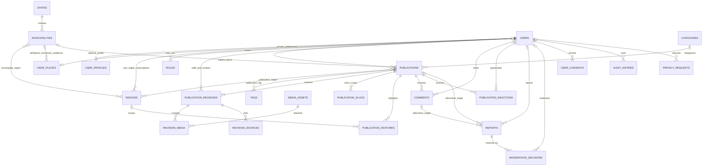

# DESG-V2-007 — Mídia editorial versionada

Data: 2026-10-08, America/Sao_Paulo.

Status: **implementação local concluída e validada.** O escopo cobre upload autenticado, processamento com GD, mídia por revisão, regras de publicação e ocultação, páginas públicas com SSR, auditoria e testes. Tudo roda nativamente no host: PHP 8.4, MariaDB 11.8 e Node 24, sem Docker. A próxima etapa só começa após análise e aprovação deste relatório.

## 1. Comparação do correio

O `correio.md` difere da execução anterior (DESG-V2-006.1, validação nativa, SHA-256 `55dddc38…7d42`). Ele autoriza a DESG-V2-007 para implementação local. SHA-256 executado agora: `8a415ac13a773517a7a469d96b7302cd75a6f276bdc3e467c050d2d99fd734ca`.

## 2. Fase A — Organização do ambiente

- **`yarn.lock` verificado antes do descarte.** Os 44 pacotes de `package.json` coincidem com a raiz do `package-lock.json`. As versões resolvidas são idênticas nos dois lockfiles (react 19.3.0, @inertiajs/react 3.8.0, vite-plus 0.3.0, typescript 5.9.3, tailwindcss 4.3.3). O `yarn.lock` não tinha nenhum pacote exclusivo; só lhe faltavam binários opcionais do Windows. `npm ls` confirmou que a árvore instalada está consistente com o `package-lock.json`. O arquivo foi removido (SHA-256 `8b252b48…d51da`).
- **Padronização npm.** `"packageManager": "npm@11.16.0"` no `package.json`, e `.gitignore` ignorando `yarn.lock`, `pnpm-lock.yaml` e `bun.lock(b)`. O `composer dev` agora inicia o Vite com `npm run dev` (antes usava `yarn run dev`).
- **Arquivos Docker intocados nesta etapa:** `Dockerfile`, `docker-entrypoint.sh`, `.dockerignore`, `docker/` e `deploy/`.
- Nenhum outro arquivo não rastreado foi excluído. Configurações globais do host, como `/etc/php`, não foram alteradas.
- `desgarrados2` e `desgarrados2_test` foram preservados (seção 10).

**Limite de upload do host.** O PHP do host está com `upload_max_filesize=2M` e `post_max_size=8M`, abaixo dos 10 MB pedidos. Como o `php.ini` global não pode ser alterado sem autorização, o projeto ganhou `php/conf.d/desgarrados-uploads.ini` (12M/16M). Ele só vale quando o servidor é iniciado assim:

```bash
PHP_INI_SCAN_DIR=":$PWD/php/conf.d" composer dev
```

Sem isso, uploads acima de 2 MB são recusados com mensagem clara: a interface checa o limite efetivo antes de enviar. O `ops:health` avisa quando os limites estão abaixo de 10 MB (`media_upload_limit`).

## 3. Arquivos criados e modificados

**Criados**

| Área | Arquivos |
| --- | --- |
| Schema | `database/migrations/2026_10_08_180000_create_media_tables.php` |
| Domínio | `app/Models/MediaAsset.php`, `app/Models/RevisionMedia.php`, `app/Enums/MediaProcessingStatus.php`, `app/Enums/MediaStatus.php`, `app/Enums/MediaRights.php`, `app/Enums/MediaPurpose.php` |
| Processamento | `app/Media/ImageInspector.php`, `app/Media/MediaProcessor.php`, `app/Media/MediaPresenter.php`, `app/Jobs/ProcessMediaAsset.php` |
| Ações e autorização | `app/Actions/Editorial/MediaLibrary.php`, `app/Actions/Editorial/RevisionMediaManager.php`, `app/Policies/MediaAssetPolicy.php` |
| HTTP | `app/Http/Controllers/Editorial/MediaController.php`, `MediaFileController.php`, `RevisionMediaController.php` |
| Comandos | `app/Console/Commands/ProcessMedia.php` (`media:process`), `app/Console/Commands/PruneOrphanMedia.php` (`media:prune-orphans`) |
| Configuração | `config/media.php`, `php/conf.d/desgarrados-uploads.ini` |
| Interface | `resources/js/components/editorial-media.tsx`, `resources/js/components/story-figure.tsx` |
| Testes | `tests/Feature/MediaTest.php` (23 testes), `tests/Support/media-concurrency.php` |

**Modificados**

- `app/Actions/Editorial/EditorialWorkflow.php`: nova revisão copia a mídia da revisão base; publicar e agendar exigem mídia publicável; o publicador agendado cancela o agendamento se a mídia deixou de ser publicável.
- `app/Models/PublicationRevision.php` (relação `media`) e `app/Models/AuditEntry.php` (`media_asset_id`).
- `app/Http/Controllers/Editorial/PublicationController.php` (mídia da revisão, biblioteca, tipos de direito, limite efetivo) e `PublicPublicationController.php` (capa, imagens, `ogImage`).
- `app/Console/Commands/OperationalHealth.php`: checagens `media_upload_limit` e `media_processing`.
- `routes/editorial.php` (11 rotas novas) e `routes/console.php` (`media:process --stale` a cada 5 min).
- `config/filesystems.php`: disco privado `media`.
- `lang/pt_BR/validation.php`: mensagens e atributos de mídia.
- `resources/js/types/editorial.ts`, `resources/js/pages/editorial/show.tsx`, `publication.tsx` e `feed.tsx`.
- `tests/Feature/OperationsTest.php`: o construtor da subclasse de teste passou a chamar o construtor pai.
- `package.json`, `.gitignore` e remoção do `yarn.lock`.

## 4. Migrations e alterações de schema

Migration `2026_10_08_180000_create_media_tables`. Ela exige MariaDB e os bancos `desgarrados2`/`desgarrados2_test`, como as anteriores.

**`media_assets`**

- Identificação: `uuid` UNIQUE (UUID v4 aleatório, o único identificador em URLs) e `owner_id` → users, `SET NULL`.
- Arquivo: `sha256`; `original_path`; `original_name` sanitizado; `mime` restrito a jpeg, png e webp; `width`, `height` e `size_bytes`.
- Processamento: `processing_status` (pending, processing, ready, failed), `processing_error` genérico, `variants` em JSON e `processed_at`.
- Moderação: `status` (active, blocked) e `blocked_reason`.
- Direitos: `rights_type` (own, authorized, licensed, creative_commons, public_domain), `rights_holder`, `license` e `rights_notes`.
- UNIQUE `(owner_id, sha256)`, que reaproveita o mesmo arquivo do mesmo dono sem duplicar.
- Índices de fila de processamento e por dono.
- CHECKs: dimensões e tamanho positivos; `ready` exige variantes e data; `blocked` exige motivo.

**`revision_media`**

- FKs `publication_revision_id` e `media_asset_id`, ambas `RESTRICT`. O histórico das revisões impede apagar imagens usadas.
- Campos: `purpose` (cover, content), `position`, `alt_text` (obrigatório), `caption` e `credit` (obrigatório).
- Coluna gerada `cover_revision_id` com UNIQUE, garantindo **no máximo uma capa por revisão** no próprio banco.
- UNIQUE `(revisão, imagem, finalidade)` e índice de ordenação.
- CHECK de `alt_text`/`credit` não vazios.
- O mesmo arquivo é reutilizado por várias revisões sem duplicação: só a linha de associação é copiada.

**`audit_entries`**

- `publication_id` passa a aceitar nulo e ganha `media_asset_id` (FK `SET NULL`) com índice.
- CHECK `publication_id IS NOT NULL OR action LIKE 'media\_%'`: operações de biblioteca são auditadas mesmo sem publicação, e a trilha sobrevive à exclusão da imagem (o UUID fica em `changes`).

**Aplicação**

- `desgarrados2_test`: aplicada.
- `desgarrados2`: aplicada como **lote 4**, incremental, depois de um dump de segurança completo: `storage/app/private/backups/desgarrados2-antes-DESG-V2-007-20261008165302.sql.gz`, 25 tabelas, ignorado pelo Git. As credenciais foram lidas do `.env` para um arquivo temporário `0600`, apagado em seguida.
- Sem `migrate:fresh` no principal.

## 5. Fluxo de processamento das imagens

1. **Upload autenticado e autorizado** (`POST /administracao/editorial/midia`): até 10 MB pela regra `max`, conferido antes de qualquer leitura.
2. **Inspeção do conteúdo real** (`ImageInspector`), sem confiar no nome nem no MIME do cliente:
   - o MIME detectado por `finfo` precisa ser JPEG, PNG ou WebP;
   - `getimagesize` precisa reconhecer a imagem e concordar com esse MIME;
   - mínimo de 200 × 200 px, máximo de 8.000 px por lado e 40 megapixels (contra imagens-bomba);
   - SVG, HTML, PHP disfarçado, GIF e JPEG truncado são recusados sem gravar nada.
3. **Deduplicação**: o mesmo SHA-256 do mesmo dono devolve o asset existente. Uma corrida no UNIQUE (`1062`) é tratada da mesma forma, e o arquivo perdedor é apagado.
4. **Original privado**: gravado no disco `media` (`storage/app/private/media`, `serve: false`) com nome aleatório `originals/{2 caracteres}/{uuid}.{ext}`. O nome do cliente vai só para `original_name`, sanitizado.
5. **Registro e auditoria** (`media_uploaded`) na mesma transação. O job `ProcessMediaAsset` é despachado `afterCommit`; se a linha falhar, o arquivo é removido.
6. **Processamento idempotente** (`MediaProcessor`):
   - Reivindicação por `SELECT … FOR UPDATE`: só pending/failed, ou também processing/ready com `--force`.
   - Decodificação com GD. A orientação EXIF de JPEG é aplicada aos pixels (as 8 orientações).
   - Derivados **WebP** (qualidade 82): `cover` 1600 px, `content` 1200 px e `card` 640 px de largura máxima, sem ampliação e com proporção preservada. PNG com transparência mantém o canal alfa.
   - A recodificação pelo GD **descarta EXIF, GPS e XMP**.
   - Caminhos determinísticos (`derivatives/{2}/{uuid}/{variante}.webp`): uma nova tentativa sobrescreve em vez de duplicar.
   - Falha: estado `failed`, mensagem genérica, log só com UUID e classe da exceção. Imagens com falha não podem ser associadas.
7. **Rede de segurança**:
   - `media:process --stale` a cada 5 min, sem sobreposição: retoma pendentes há mais de 10 min e travadas há mais de 15 min;
   - `media:process {uuid} [--force]` para reprocessar uma imagem;
   - `media:prune-orphans` lista arquivos sem registro no banco e só apaga com `--force`.
8. O `composer dev` processa a fila (`queue:listen`) e já inclui o scheduler (DESG-V2-006.1).

## 6. Mídia por revisão e publicação

- **Cada revisão tem seu conjunto de imagens.** Só revisões em **rascunho** podem ter imagens associadas, editadas, reordenadas ou removidas. Depois do envio para análise, o conjunto fica congelado.
- Toda alteração bloqueia a publicação (mesmo lock do fluxo editorial) e é auditada: `media_attached`, `media_updated` e `media_detached`.
- **Nova revisão** recebe uma cópia das associações da revisão base (`base_revision_id` enviado pela tela; o padrão é a última revisão). Imagens bloqueadas não são copiadas. Os arquivos não são duplicados, e a revisão publicada **não muda**; isso é testado.
- "Usar como capa" substitui a capa anterior da revisão.
- **Publicar ou agendar** exige que toda imagem da revisão esteja processada, ativa e **com direitos de uso** (tipo e titular). Caso contrário há erro de validação com a lista de problemas.
- Se uma imagem for bloqueada ou perder direitos depois do agendamento, o publicador cancela o agendamento e registra `schedule_blocked`.

## 7. Matriz de autorização

| Ação | Comum | Colaborador / Autor | Editor | Administrador sem Editor |
| --- | --- | --- | --- | --- |
| Enviar imagem | Não | Sim | Sim | Não |
| Ver na biblioteca, prévia e original | Não | Só as próprias | Todas | Não |
| Associar a uma revisão | Não | Próprias, em rascunho de publicação própria | Qualquer imagem ativa, em rascunho de qualquer publicação | Não |
| Editar textos, ordenar, remover da revisão | Não | Rascunho de publicação própria | Rascunho de qualquer publicação | Não |
| Editar direitos de uso | Não | Próprias, enquanto não usadas em revisão fora de rascunho | Sempre (auditado) | Não |
| Bloquear / desbloquear | Não | Não | Sim, com motivo obrigatório | Não |
| Excluir da biblioteca | Não | Próprias, só sem uso em revisões | Sem uso em revisões | Não |
| Publicar com imagens | Não | Não | Sim, se processadas, ativas e com direitos | Não |

Não há bypass para administrador: como no restante da redação, o acesso exige papel editorial. A autorização é aplicada em `MediaAssetPolicy`, `PublicationPolicy` e nas ações, e os testes a cobrem.

## 8. Política de armazenamento e acesso

- **Originais:** disco privado `media`, nunca servidos por URL pública. Download apenas autenticado, pelo dono ou editor (`/administracao/editorial/midia/{uuid}/original`), com `Cache-Control: no-store, private`, `nosniff`, `noindex` e `attachment`. `/storage/...` não os alcança (403).
- **Derivados:** também privados no disco, servidos só por `GET /midia/{uuid}/{cover|content|card}.webp`, com decisão por requisição:
  - **público** quando a imagem pertence à revisão publicada de uma publicação publicamente visível e está processada, ativa e com direitos. Resposta com `Cache-Control: public, max-age=300`, `image/webp` e `nosniff`;
  - **privado** para dono ou editor (prévia na redação), com `private, no-store`;
  - **404 em qualquer outro caso**: rascunho, rejeitada, bloqueada, publicação oculta ou arquivada, UUID inexistente, ID numérico, variante inválida ou tentativa de traversal. A resposta não revela se a imagem existe.
- **Ocultar** a publicação retira imediatamente a página e a mídia (404). Proxies podem reter por até 5 min (`max-age=300`).
- Bloquear uma imagem a retira da página pública e da URL na mesma hora. A página sai do feed e da publicação sem a imagem.
- UUID v4 aleatório distribuído em subdiretórios. Ele não revela data nem sequência e não é adivinhável.
- A página pública recebe só a lista permitida: URL, dimensões, `srcset`, `alt`, legenda e crédito. Nunca recebe caminho, nome original, dono ou dados de direitos.

## 9. Interface

**Redação** (`/administracao/editorial/publicacoes/{id}`, seção "Imagens"):

- imagens da revisão com prévia, finalidade, alertas (processando, bloqueada, sem direitos), edição de alt/legenda/crédito, subir/descer, "Usar como capa" e "Remover desta revisão";
- aviso de congelamento fora de rascunho;
- envio com direitos de uso e barra de progresso, com checagem do limite efetivo antes do envio;
- biblioteca (até 48 itens) com "Adicionar à revisão" (finalidade e textos), "Direitos de uso", "Bloquear/Desbloquear" com motivo, "Baixar original" e "Excluir". "Excluir" só aparece para imagens sem uso em revisões.

**Público:**

- capa responsiva (`srcset` e `sizes`, `width`/`height` explícitos, `fetchpriority="high"`, carregamento imediato) com legenda e "Foto: crédito";
- imagens do conteúdo após o texto, com `loading="lazy"`;
- cartões do feed com a variante `card`;
- `og:image` absoluto com largura, altura e `og:image:alt`;
- sem galerias nem editor visual avançado.

## 10. Resultados dos testes

| Verificação | Resultado |
| --- | --- |
| `EDITORIAL_TEST_SSR=1 php artisan test --compact` (SSR nativo ativo) | **166 testes: 162 aprovados, 4 ignorados (2FA desativado), 1.004 asserções.** |
| `php artisan test --compact` (sem renderer) | 166 testes: 160 aprovados, 6 ignorados (2FA + 2 de SSR). |
| `tests/Feature/MediaTest.php` | 23 testes. Cobrem: upload válido e inválido; MIME real (SVG, HTML, PHP, GIF, truncado); limites de tamanho e dimensões; deduplicação; EXIF removido e orientação aplicada; variantes sem ampliação; PNG/WebP; autorização por papel; associação por revisão; capa única no banco; ordem; congelamento fora de rascunho; cópia sem alterar a versão publicada; direitos obrigatórios; bloqueio e desbloqueio; publicação e ocultação; URLs públicas e privadas; originais privados; agendamento cancelado; idempotência e falha; exclusão; órfãos; SSR. |
| `tests/Support/media-concurrency.php` (processos independentes, MariaDB de testes) | **9/9 PASS**: uploads simultâneos do mesmo arquivo viram um asset e um arquivo; 1 de 3 workers processa a imagem; duas capas simultâneas resultam em uma; associação duplicada simultânea tem um vencedor e uma recusa. |
| `tests/Support/editorial-concurrency.php` | 8/8 PASS. |
| `vendor/bin/phpstan analyse --no-progress` | Zero erros. Os 5 apontamentos durante o desenvolvimento foram corrigidos sem supressão. |
| `vendor/bin/pint --test --format agent` | Aprovado. |
| `npm run types:check` / `npm run check` | Aprovados (90 arquivos formatados, 81 sem avisos de lint). |
| `npm run build:ssr` | Cliente 2.312 módulos; SSR 107 módulos. |
| `php artisan route:list` | 65 rotas (11 novas). |
| `php artisan schedule:list` | `editorial:publish-due` a cada minuto e `media:process --stale` a cada 5 min. |
| `git diff --check` (exceto `correio.md`) | Sem erros. |

**Problemas encontrados pelos testes e corrigidos:**

1. **Cache compartilhado de imagens privadas.** O `BinaryFileResponse` do Symfony nasce `public` e sobrescrevia o `private` da prévia, o que permitiria a proxies ou CDNs guardar imagens privadas. A resposta agora define `private, no-store` explicitamente, e o download do original também deixou de depender do middleware.
2. **Reprocessamento forçado ignorado.** A reivindicação contava linhas afetadas, e o MariaDB conta 0 quando os valores não mudam (item travado em `processing` no mesmo segundo). Foi trocada por `SELECT … FOR UPDATE`.
3. **UUID v7** concentrava todos os arquivos no mesmo subdiretório e revelava o horário do upload. Foi trocado por v4.

## 11. Evidências HTTP e SSR

Servidor isolado (`php -S 127.0.0.1:8018`, banco `desgarrados2_test`, armazenamento de mídia temporário, `.ini` de upload do projeto) e SSR nativo (`inertia:start-ssr`). As fixtures (`@homolog.invalid` e paisagens geradas com GD) passaram pelo fluxo real: upload, processamento, associação, envio, aprovação por outro editor e publicação.

| Verificação | Resultado |
| --- | --- |
| HTML SSR da publicação | 3 `` pré-renderizadas. Capa com `alt`, `width=1600`, `height=900`, `loading=eager`, `fetchpriority=high` e `srcset` de 3 larguras; 2 imagens de conteúdo `lazy`; legendas e créditos em `figcaption`; `og:image` absoluto com `og:image:width=1600`. Sem `originals/`, sem UUID da imagem privada e sem e-mails. |
| Capa pública | 200, `image/webp` 1600×900, `max-age=300, public`, `nosniff`. Derivado **sem EXIF e sem o marcador**; o original privado no disco ainda contém o marcador, como esperado. |
| Variante `card` | 200, 640×360. |
| Imagem de rascunho (visitante) | 404. |
| Variante inválida, UUID inexistente, ID numérico, traversal | 404. |
| Original sem sessão | 302 para login. |
| `/storage/originals/...` | 403. |
| Publicação ocultada | Página 404 e capa 404. Após republicar, capa 200. |
| Upload real pelo navegador (Chromium headless, formulário da redação) | JPEG de 7 MB (acima do limite global de 2 MB do host) aceito com o `.ini` do projeto, sem erros. Processado pela fila em 1 s: capa 1600×1169, conteúdo 1200×877, cartão 640×468. |
| Inspeção visual | Publicação a 375, 768 e 1440 px, claro e escuro; feed a 375 e 1440 px, claro e escuro; redação a 375 e 1440 px. Zero overflow horizontal, todas as imagens carregadas e com dimensões explícitas, zero erros de console. Capturas examinadas: publicação 1440, feed 375 escuro e redação 1440. |

## 12. Estado final

- **`desgarrados2`:** 27 tabelas (2 novas, vazias), 1 usuário (conta do operador), 0 papéis, 27 estados, 5.571 municípios, 0 publicações, 0 mídias, 0 auditorias. Nenhum dado existente alterado; nenhum upload no principal.
- **`desgarrados2_test`:** 27 tabelas, vazio.
- Processos temporários encerrados (`:8018`, SSR); servidores do operador (`:8000`, `:5173`) intocados.
- **Declarações:** sem Docker, push, deploy, alteração da VPS ou da infraestrutura externa, acesso a outros projetos, comunidade, comentários, reações, perfis públicos, publicidade ou monetização. Sem criação de usuário nem concessão de papel no principal. Sem commit.

## 13. Pendências e riscos

- **Limite de upload no host.** Sem `PHP_INI_SCAN_DIR=":$PWD/php/conf.d"`, o servidor local aceita só até 2 MB. O `ops:health` sinaliza. A alternativa definitiva é ajustar o `php.ini` global, o que exige sua autorização.
- **Processamento depende da fila.** Sem worker (por exemplo, só `artisan serve`), as imagens ficam "Aguardando processamento". O `composer dev` já inclui fila e scheduler; o `media:process --stale` retoma pendências.
- **Memória.** Imagens de até 40 MP exigem cerca de 160 MB decodificados; o job eleva o limite a 768 MB. Em produção, o worker precisa comportar isso.
- **Cache público de 5 min.** Após ocultar ou bloquear, navegadores ou proxies podem exibir a imagem já baixada por até 5 min. O servidor passa a responder 404 imediatamente.
- **Imagens no conteúdo** são exibidas depois do texto, não intercaladas por posição no corpo. A intercalação exigiria marcação no texto e foi evitada, por ser editor avançado, fora desta etapa.
- **Biblioteca** limitada às 48 imagens mais recentes, sem busca nem paginação. Suficiente para o início; precisará de paginação com o crescimento.
- **Comportamento novo em `audit_entries`:** `publication_id` agora pode ser nulo (apenas para ações `media_*`, garantido por CHECK). O `down()` da migration não restaura `NOT NULL`.
- **Contrato legado.** `App\Contracts\RevisionMediaProvider`, da DESG-V2-005, permanece sem implementação; a apresentação foi feita por `MediaPresenter`. Pode ser removido ou implementado em etapa futura.
- **Decisão sua sobre os arquivos Docker** não commitados das etapas anteriores, que seguem intocados.
- Homologação visual sem leitor de tela nem medição automatizada de contraste.

A etapa seguinte só pode começar após análise e aprovação da DESG-V2-007.

---

# Histórico preservado — DESG-V2-006.1 (validação nativa) e anteriores

# DESG-V2-006.1 — Diretriz definitiva de ambiente: validação nativa no host

Data: 2026-10-08, America/Sao_Paulo.

Status: **validação local concluída.** PHP, MariaDB e Node nativos do host; SSR local e fallback, scheduler, fila e health checks validados; um problema operacional local corrigido; suíte automatizada aprovada; bancos preservados. Nenhuma atividade de Docker nesta execução. A DESG-V2-007 **não** foi iniciada.

## 1. Comparação do correio

O `correio.md` difere do executado na rodada anterior da DESG-V2-006.1 ("Preparação controlada do ambiente de produção", SHA-256 `3428b6f39c55ddce08f289f410e2635b1042049fa737e7d110f51663584bb012`). Ele reorienta a etapa:

- desenvolvimento e homologação somente com PHP, MariaDB e Node nativos;
- Docker proibido até autorização explícita para a VPS;
- foco em validar o funcionamento local.

SHA-256 executado agora: `55dddc38ed61b4d70ecfb4094538cf0cda06f1e57f5381218d261ab9146b7d42`.

**Efeito sobre o trabalho anterior.** As rodadas DESG-V2-006 e DESG-V2-006.1 (anterior) deixaram alterações Docker no working tree, **sem commit**: `Dockerfile`, `docker-entrypoint.sh`, `.dockerignore`, `docker/` e `deploy/compose.desgarrados2.yml`, além de `docs/auditoria-banco-vps.sh` e das seções de produção de `docs/operacao-producao.md`. Pela nova diretriz, nesta execução esses arquivos **não foram tocados**. Também não foram revertidos, porque reverter seria outra modificação de arquivos Docker sem autorização. Cabe ao operador decidir se ficam guardados para a futura etapa da VPS ou se são descartados. Nada disso afeta a execução no host: o app lê `INERTIA_SSR_*` com padrões locais (`127.0.0.1:13714`, timeout 3 s).

## 2. Ambiente do host

| Componente | Versão / estado |
| --- | --- |
| PHP | 8.4.24 (CLI, NTS); `pdo_mysql`, `mbstring`, `pcntl`, `gd`, `zip`, `opcache` |
| MariaDB | 11.8.6, serviço `mariadb` ativo, escutando em `0.0.0.0:3306` |
| Node.js / npm | 24.18.0 / 11.16.0 (yarn 1.22.22 também presente) |
| Composer | 2.9.5 |
| Laravel | 13.35.0 |
| `.env` local | `APP_ENV=local`, `DB_CONNECTION=mariadb`, `DB_DATABASE=desgarrados2`; sessão, cache e fila `database`; `MAIL_MAILER=log` |
| Processos do operador | `php artisan serve` em `:8000` (banco principal) e Vite dev em `:5173`. Preservados durante toda a execução. |

As validações que escrevem dados usaram somente `desgarrados2_test`, por um servidor isolado (`php -S 127.0.0.1:8018` com roteador que ignora o hot file do Vite). No principal houve apenas leituras.

## 3. Estado inicial e final dos bancos

| Banco | Início | Fim |
| --- | --- | --- |
| `desgarrados2` | 25 tabelas, 1 usuário (conta do operador), 0 papéis, 27 estados, 5.571 municípios, 0 publicações, 0 jobs, 0 falhas, 0 auditorias | **Idêntico** |
| `desgarrados2_test` | 25 tabelas, vazio | 25 tabelas, vazio. Fixtures `@homolog.invalid` removidas pela recriação da suíte; ensaio de concorrência remove os próprios dados. |

Migrations: 6 Ran em cada banco, sem novas migrations. Não houve `migrate:fresh`, `db:wipe`, truncamento nem exclusão no principal. O `migrate:fresh` do `RefreshDatabase` atua só no banco de testes, protegido pelo `TestCase`.

## 4. SSR local e fallback

Execução nativa: `npm run build:ssr` (cliente 2.308 módulos, SSR 103) e `php artisan inertia:start-ssr`. Verificação com `inertia:check-ssr`: "Inertia SSR server is running".

| Verificação (servidor isolado, banco de testes) | Resultado |
| --- | --- |
| HTML inicial da publicação aprovada | h1, `<title>`, canonical, Open Graph e 4 parágrafos no `article`; sem nota interna, e-mails ou rascunho privado. |
| `/`, `/historias`, `/estados`, `/minha-terra`, `/login` | 200, h1 pré-renderizado. |
| Slug de rascunho privado | 404. |
| `/administracao`, `/administracao/editorial` sem sessão | 302 para login. |
| `php artisan inertia:stop-ssr` e depois `check-ssr` | Código 1 (renderer parado, como esperado). |
| Renderer parado | 200 em 0,053 s, sem h1 pré-renderizado, `data-page` presente, zero dados privados. |
| Renderer travado (aceita TCP, não responde) | 200 em 3,08 s (timeout). |
| `php artisan inertia:start-ssr` novamente | SSR restabelecido (h1 presente). |
| Log | `local.WARNING: SSR indisponível …` com componente, URL e tipo, sem props. |

## 5. Scheduler

Executado o `php artisan schedule:work` real (170 s) contra `desgarrados2_test`, com uma publicação aprovada e agendada para 19:17:53 UTC.

- 19:17:00: `editorial:publish-due` executado (DONE). Ainda não vencida, nada publicado.
- 19:18:00: executado (DONE). A publicação passou a `published`, com `published_at` 19:18:00 e `scheduled_for` limpo.
- Auditoria: `revision_created`, `created`, `submitted`, `approved`, `scheduled`, `published`.
- Heartbeat: `{"published": 1, "failed": 0}`. Página pública 200.

Prevenção de sobreposição (trava de 10 min), lotes, isolamento de falhas e bloqueio por perda de autorização continuam cobertos pelos testes automatizados.

## 6. Filas

O app ainda não enfileira jobs próprios; a verificação de e-mail é síncrona. A fila `database` foi validada no banco de testes com `queue:work database --stop-when-empty --tries=1`:

- `Artisan::queue('inspire')`: **DONE**.
- `Artisan::queue('comando:inexistente-homologacao')`: **FAIL**, registrado em `failed_jobs` com `CommandNotFoundException`.
- Uma primeira tentativa com closures criados pelo `tinker` falhou por limitação do método: closures avaliados não têm arquivo de origem e não podem ser serializados. Não é defeito do app; os registros foram limpos com `queue:flush`, só no banco de testes.

## 7. Health checks

| Verificação | Resultado |
| --- | --- |
| `/up` | 200. |
| `php artisan ops:health --strict` no banco de testes, com SSR e scheduler ativos | Todas as verificações `ok`, código 0. |
| `php artisan ops:health` no principal (somente leitura) | Banco e SSR ok; scheduler em aviso, porque nunca rodou no banco principal; código 0. |

## 8. Problema operacional local corrigido

**`composer dev` não iniciava o scheduler.** O script executa `php artisan dev`, que sobe `serve`, `queue:listen`, `pail` e Vite, mas não `schedule:work`. Publicações agendadas nunca saíam durante o desenvolvimento e a homologação local, e `ops:health` acusaria scheduler parado.

Correção em `app/Providers/AppServiceProvider.php`: `DevCommands::artisan('schedule:work', 'scheduler')`. O registro é idempotente por nome e ignorado fora do console. Processos do `composer dev` agora: `scheduler`, `server`, `queue`, `logs` e `vite`.

Teste novo em `tests/Feature/OperationsTest.php`: "starts the scheduler alongside the local dev processes".

## 9. Resultado das validações

| Comando | Resultado |
| --- | --- |
| `EDITORIAL_TEST_SSR=1 php artisan test --compact` (SSR nativo ativo) | **143 testes: 139 aprovados, 4 ignorados (2FA desativado), 783 asserções.** |
| `php artisan test --compact` (SSR parado) | **143 testes: 138 aprovados, 5 ignorados (2FA + teste SSR), 775 asserções.** |
| `tests/Support/editorial-concurrency.php` (banco de testes) | 8/8 PASS. |
| `vendor/bin/phpstan analyse --no-progress` | Zero erros. |
| `vendor/bin/pint --test --format agent` | Aprovado. |
| `npm run types:check` | Aprovado. |
| `npm run check` | 88 arquivos formatados; lint em 79 sem avisos. |
| `npm run build:ssr` | Aprovado. |
| `php artisan route:list` | 54 rotas. |
| `php artisan schedule:list` | `* * * * * php artisan editorial:publish-due`. |
| `git diff --check` (exceto `correio.md`) | Sem erros. |

## 10. Declarações

| Ação | Houve? |
| --- | --- |
| Docker (configurar, executar, modificar arquivos) | **Não** |
| Alteração da infraestrutura externa | **Não** (`docker-compose.yml` da infra-abrasil com o mesmo hash `8abcec43…`) |
| Migration | **Não** |
| Commit / push / deploy | **Não** |
| Criação de usuário ou concessão de papel no banco principal | **Não** |
| Alteração de dados no banco principal | **Não** |

Processos temporários encerrados ao final: SSR nativo via `inertia:stop-ssr`, servidor `:8018` e `schedule:work`. Os servidores do operador (`:8000`, `:5173`) seguem ativos.

## 11. Riscos e observações

- **Dois lockfiles.** O `yarn.lock` (não rastreado, criado às 14:37) faz o `composer dev` usar `yarn run dev`, enquanto o projeto e o build usam `npm` com `package-lock.json`. Os dois podem resolver versões diferentes. Recomenda-se escolher um gerenciador e remover o outro lockfile; não alterei porque o arquivo não é desta execução.
- **MariaDB escutando em todas as interfaces** (`0.0.0.0:3306`). No WSL2 isso normalmente fica restrito ao host Windows, mas `bind-address = 127.0.0.1` seria o mais seguro para desenvolvimento.
- **E-mail local em `log`.** Verificação de conta e redefinição de senha não enviam mensagens; o link fica em `storage/logs/laravel.log`. Isso é suficiente para homologar no host, mas impede o bootstrap administrativo real.
- **Scheduler no ambiente atual do operador.** O `artisan serve` em execução não roda o scheduler. A correção vale quando o ambiente for iniciado por `composer dev`; quem usar só `artisan serve` precisa rodar `php artisan schedule:work` à parte.
- **Arquivos Docker pendentes de decisão** (seção 1).

## 12. Recomendação

O ambiente local está validado para seguir com o desenvolvimento funcional. Próxima etapa prevista pelo correio: **DESG-V2-007 — Mídia editorial versionada** (upload, processamento, remoção de EXIF, versões, capas, créditos, direitos de uso e integração com a aprovação editorial), funcionando no host sem Docker. Ela não foi iniciada nesta execução e aguarda a aprovação deste relatório.

Antes de começar, convém decidir:

1. o que fazer com os arquivos Docker não commitados;
2. qual gerenciador de pacotes adotar (npm ou yarn).

---

# Histórico preservado — DESG-V2-006.1 (rodada anterior) e anteriores

# DESG-V2-006.1 — Preparação controlada do ambiente de produção

Data: 2026-10-08, America/Sao_Paulo.

Status: **preparação parcial.** A decisão de banco, o compose, a configuração de produção e o plano de implantação/rollback estão prontos e validados localmente. Os critérios de encerramento que dependem de Docker continuam **pendentes**: build real das imagens e SSR dentro da rede Docker. Nesta sessão o Docker Desktop estava parado e sem integração com o WSL; o operador escolheu seguir sem Docker. A auditoria do banco real depende de executar o script de leitura na VPS, opção também escolhida pelo operador.

## Declarações obrigatórias

| Ação                           | Houve?  | Observação |
| ------------------------------ | ------- | ---------- |
| Alteração da infraestrutura    | **Não** | `docker-compose.yml`, `.env.example`, `mysql-init/` e `nginx/` da infra-abrasil têm hashes idênticos aos do início. Uma tentativa de editar o compose compartilhado foi bloqueada pela política de permissões e não foi contornada; a proposta foi entregue como override no repositório do projeto. |
| Migration                      | **Não** | Nenhuma migration executada em nenhum banco. |
| Commit                         | **Não** | |
| Push                           | **Não** | |
| Deploy                         | **Não** | |
| Criação de usuário             | **Não** | Nem de banco nem da aplicação. Fixtures de teste, quando houve, ficaram restritas ao `desgarrados2_test`. |
| Concessão de papel             | **Não** | |
| Alteração DNS                  | **Não** | |

## 1. Estado encontrado

- **Correio:** difere do executado na DESG-V2-006 (`525ad5ff…f54c38`). SHA-256 executado agora: `3428b6f39c55ddce08f289f410e2635b1042049fa737e7d110f51663584bb012`.
- **Infra-abrasil (somente leitura):** commit `b7c7782`, sem alterações locais nos arquivos de infraestrutura. Hashes registrados:
  - `docker-compose.yml` `8abcec43…7784b`;
  - `.env.example` `1c75a14d…eec`;
  - `mysql-init/01-databases.sh` `01cf308f…d10c7`;
  - `nginx/conf.d/apps.conf` `7da67fad…d828`.

  Cópias de segurança foram guardadas fora do repositório.
- **Serviço de banco do Desgarrados no compose:** `mysql` (imagem `mysql:8.4`), **compartilhado por cinco projetos**: vetoros, vetorpet, abrasilsistemas, ab_prospect e desgarrados. O `mysql-init/01-databases.sh` cria o banco `desgarrados` (utf8mb4) e o usuário `desgarrados_user@'%'` com `ALL PRIVILEGES ON desgarrados.*`. Volume: `./volumes/mysql`, sem porta publicada e com health check `mysqladmin ping`.
- **Bancos, usuários, dados e volume reais:** não auditáveis daqui. Não existe `volumes/` nesta máquina, porque a pilha da infra nunca rodou localmente; os dados estão na VPS. Foi criado `docs/auditoria-banco-vps.sh`, somente leitura (sem `INSERT/UPDATE/DELETE/DROP/ALTER/CREATE/GRANT`; senha root lida dentro do contêiner por `MYSQL_PWD`). O script lista bancos, tamanhos, usuários sem credenciais, privilégios sobre `desgarrados`, tabelas e contagens, volume e backups.
- **Compartilhamento do banco `desgarrados`:** pelo compose, só os serviços do Desgarrados o referenciam; nenhum outro serviço usa `desgarrados_user`.
- **Política de backup:** não há para o MySQL. O README só documenta backup do n8n, e `backups/` está no `.gitignore` sem rotina definida.
- **Dependências dos contêineres:**
  - `desgarrados` depende de `mysql` (healthy);
  - `desgarrados-worker` e `desgarrados-scheduler` herdam tudo por `extends`, inclusive o health check `php-fpm -t`, que não diz nada sobre esses processos;
  - o Nginx depende de `desgarrados` (started).
- **Configuração indevida confirmada:**
  - o serviço usa `env_file: ./gateway/desgarrados/.env.example` (com `APP_DEBUG=true`, `LOG_LEVEL=debug`, `DB_CONNECTION=sqlite`);
  - usa a âncora `x-laravel-environment` do VetorOS, que injeta no Desgarrados `WAHA_BASE_URL`, `WAHA_API_KEY`, `REDIS_*` e defaults de `APP_URL`/banco do VetorOS. O app não usa WAHA nem Redis;
  - não define `LOG_LEVEL` nem `SESSION_SECURE_COOKIE`.
- **Ambiente do executor:**
  - CLI `docker.exe` do Windows (Compose v5.3.1) disponível pelo interop do WSL, mas daemon parado;
  - servidores do operador ativos (`artisan serve :8000` no banco principal e Vite dev `:5173`), que não foram tocados.
- **Banco principal local:** 25 tabelas, 27 estados, 5.571 municípios, 0 publicações, 0 papéis e 1 usuário (a conta criada pelo servidor do operador, já relatada na DESG-V2-006). Sem alteração nesta etapa.

## 2. Decisão MariaDB/MySQL

**MariaDB dedicado ao Desgarrados 2.** As migrations e a guarda (`mariadb` + `desgarrados2`/`desgarrados2_test`) não foram alteradas.

- Serviço `desgarrados-mariadb`, imagem `mariadb:11.8` (mesma linha do MariaDB 11.8.6 homologado localmente), `utf8mb4_unicode_ci`.
- Banco `desgarrados2` (distinto do `desgarrados2_test`, que existe só no ambiente local de testes), usuário `desgarrados2_user` com privilégios só sobre esse banco (criado pela imagem via `MARIADB_DATABASE`/`MARIADB_USER`).
- Volume próprio `./volumes/desgarrados-mariadb`, rede interna existente, sem porta publicada.
- Health check `healthcheck.sh --connect --innodb_initialized`, que usa o usuário interno de health check da imagem, sem senha na definição.
- Senha root em `DESGARRADOS_DB_ROOT_PASSWORD`; se vazia, só esse serviço recusa inicializar, e o compose dos outros projetos continua válido. Não foi usado `MARIADB_RANDOM_ROOT_PASSWORD`, que imprime a senha gerada no log.
- O MySQL compartilhado, o banco `desgarrados` e o `desgarrados_user` **permanecem intocados**. Reutilização ou arquivamento depende do resultado da auditoria na VPS (`docs/operacao-producao.md` §3); qualquer conteúdo real impede reutilização destrutiva.

## 3. Alterações realizadas (repositório do Desgarrados 2)

- `deploy/compose.desgarrados2.yml` (novo): override proposto para a infra, descrito na seção 4.
- `docker-entrypoint.sh`: com `APP_ENV=production`, executa `php artisan optimize` como `www-data` (config, rotas, views e eventos em cache a partir do ambiente do contêiner). Uma falha interrompe o contêiner.
- `.dockerignore`: passa a excluir `.env.*` (exceto `.env.example`), `**/*.sqlite`, `**/*.sqlite3`, `.aws/`, `.agents/`, `.claude/`, `.codex/` e `.github/`. Os diretórios de ferramentas encontrados estão vazios, e o `.npmrc` contém só `ignore-scripts=true`, sem credenciais.
- `docs/auditoria-banco-vps.sh` (novo).
- `docs/operacao-producao.md`: arquitetura, decisão de banco, variáveis, backup, diagnóstico, plano de implantação em 9 passos e rollback.

Nenhum arquivo PHP, TypeScript, migration ou teste foi alterado nesta etapa.

## 4. Compose proposto (não aplicado)

Uso, a partir da raiz da infra-abrasil, com Compose 2.24.4 ou superior:

```bash
docker compose -f docker-compose.yml -f gateway/desgarrados/deploy/compose.desgarrados2.yml …
```

- **Novos serviços:** `desgarrados-mariadb` (seção 2) e `desgarrados-ssr`, construído com `target: ssr`, `restart: unless-stopped`, só na rede interna e sem `ports`, de modo que `/render` e `/shutdown` não ficam expostos.
- **`desgarrados`, `desgarrados-worker` e `desgarrados-scheduler`:** `env_file: !reset []` e `environment: !override` com 34 variáveis explícitas, compartilhadas por âncora YAML:
  - `APP_ENV=production`, `APP_DEBUG=false`, `APP_URL=https://desgarrados.com.br`, locale pt_BR;
  - `LOG_CHANNEL=stderr`, `LOG_LEVEL=warning`;
  - banco `mariadb@desgarrados-mariadb/desgarrados2`;
  - sessão, cache e fila em banco;
  - `SESSION_SECURE_COOKIE=true`, `SESSION_HTTP_ONLY=true`, `SESSION_SAME_SITE=lax`;
  - `INERTIA_SSR_URL=http://desgarrados-ssr:13714`, timeout 3;
  - `MAIL_*` repassados de `DESGARRADOS_MAIL_*`.
- `depends_on: !override` com `desgarrados-mariadb: service_started`, para que uma falha no banco do Desgarrados não impeça o Nginx de subir os demais sites.
- **Validação com `docker compose config`:** feita sem daemon, numa cópia isolada, com valores fictícios para não expandir segredos reais. O resultado mesclado foi conferido:
  - zero variáveis da âncora (WAHA, Redis, CRM) nos três serviços PHP;
  - `env_file` vazio;
  - nenhum dos novos serviços com porta publicada;
  - `mysql`, `nginx` e demais serviços idênticos.

  A validação foi refeita após a formatação do arquivo.

## 5. Contêineres e health checks

| Serviço                 | Health check                                                     | Reinício |
| ----------------------- | ---------------------------------------------------------------- | -------- |
| `desgarrados-mariadb`   | `healthcheck.sh --connect --innodb_initialized`, 10 s, início 30 s | `unless-stopped` |
| `desgarrados-ssr`       | `HEALTHCHECK` da imagem: `node docker/ssr-healthcheck.mjs` (`/health`, 2 s) | `unless-stopped`; o processo encerra em rejeição não tratada |
| `desgarrados`           | `php-fpm -t` (inalterado)                                        | `unless-stopped` |
| `desgarrados-worker`    | desativado (o `php-fpm -t` herdado não testava o worker)         | `unless-stopped` ao terminar |
| `desgarrados-scheduler` | `php artisan ops:health`, 60 s, timeout 30 s, início 120 s       | `unless-stopped` ao terminar |

O health check do scheduler usa `ops:health` **sem `--strict`**, de propósito. Com `--strict`, aconteceria o seguinte:

- no primeiro minuto, sem heartbeat, o contêiner apareceria como unhealthy;
- com o SSR fora, que não afeta o scheduler, também apareceria como unhealthy.

O modo normal falha só com banco fora, publicador parado há mais de 5 min ou agendamento vencido há mais de 5 min. Com heartbeat presente, `--strict` também passou (seção 8).

`ops:health` continua sendo só CLI; nenhum endpoint HTTP foi criado.

## 6. Resultado dos builds

**Build Docker real: não executado.** O daemon está indisponível. Validado sem Docker:

- **Conteúdo do estágio `ssr` reproduzido:** `npm ci --omit=dev --ignore-scripts` num diretório isolado, com 207 pacotes e 193 MB de `node_modules`, mais `bootstrap/ssr` e os scripts. O renderer subiu, o health check retornou 0, uma página real (`/estados`) foi renderizada com h1 (20.503 bytes de corpo) e o SIGTERM encerrou em 13 ms com código 0. Ou seja, nenhuma dependência de desenvolvimento é necessária em runtime. Node local 24.18 contra Node 22 na imagem.
- **Extensões PHP:** `composer check-platform-reqs --no-dev` exige ctype, date, dom, fileinfo, filter, hash, iconv, json, libxml, mbstring, openssl, pcre, session e tokenizer. Todas vêm na `php:8.4-fpm` ou são instaladas pelo Dockerfile, que também traz `pdo_mysql` (usado pelo driver `mariadb`). `ext-redis` não é necessária.
- **Contexto de build:** `.env` e os SQLite `desgarrados`/`desgarrados2` já estavam excluídos e agora também `**/*.sqlite`, `.env.*` e diretórios de ferramentas. `bootstrap/ssr` local é excluído e regenerado no estágio frontend.
- **`php artisan optimize`:** concluído (config, eventos, 54 rotas, views), com os caches redirecionados para a pasta temporária. O `bootstrap/cache` do projeto não foi tocado, e o cache temporário foi apagado por conter valores locais.
- **`npm run build:ssr`:** cliente com 2.308 módulos e SSR com 103 (um a menos que antes, porque o `nav-footer` deixou de ser importado na DESG-V2-006).

Não verificados por falta de Docker: inicialização do PHP-FPM na imagem, presença de `bootstrap/ssr` na imagem PHP, permissões efetivas de `storage`/`bootstrap/cache` e do `optimize` como `www-data`, tamanho das imagens, warnings de build e segredos nas camadas.

## 7. Resultado dos testes

| Comando | Resultado |
| --- | --- |
| `php artisan test --compact` | **142 testes: 137 aprovados, 5 ignorados (4 de 2FA + SSR sem renderer), 772 asserções.** |
| `vendor/bin/phpstan analyse --no-progress` | Zero erros. |
| `vendor/bin/pint --test --format agent` | Aprovado. |
| `npm run types:check` | Aprovado. |
| `npm run check` | 88 arquivos formatados; lint em 79 sem avisos. |
| `npm run build:ssr` | Aprovado. |
| `php artisan route:list` | 54 rotas. |
| `php artisan schedule:list` | `* * * * * php artisan editorial:publish-due`. |
| `php artisan ops:health` (local, dev) | Banco ok; SSR e scheduler em aviso (renderer e scheduler não rodam no ambiente de desenvolvimento). |
| `git diff --check` (exceto `correio.md`) | Sem erros. |
| `sh -n` em `docker-entrypoint.sh` e `docs/auditoria-banco-vps.sh` | Sintaxe válida. |
| `docker compose config` (base + override, valores fictícios) | Válido, código 0. |
| Testes Docker | **Não executados** (daemon indisponível). |

## 8. Homologação HTTP/SSR com configuração de produção

Servidor isolado `php -S 127.0.0.1:8019` com as variáveis do override (`APP_ENV=production`, `APP_DEBUG=false`, `LOG_CHANNEL=stderr`, `LOG_LEVEL=warning`, cookie seguro, sessão/cache/fila em banco), após `php artisan optimize`. Usou o banco `desgarrados2_test` e o renderer montado só com dependências de produção. Fora da rede Docker, portanto **não** equivale à homologação no ambiente de destino.

| Verificação | Resultado |
| --- | --- |
| Ambiente efetivo | `production`, debug desligado, configuração em cache, cookie seguro, log `stderr`, banco `desgarrados2_test`. |
| `/up` | 200. |
| `/`, `/historias`, `/estados`, `/minha-terra`, `/login`, `/register`, `/forgot-password` | 200, com h1 pré-renderizado no HTML inicial. |
| `/administracao`, `/administracao/editorial`, `/administracao/papeis`, `/settings/profile` sem sessão | 302 para login. |
| Cookies | `XSRF-TOKEN`: `secure; samesite=lax`. Sessão: `secure; httponly; samesite=lax`. |
| 404 e 419 | Sem stack trace, Ignition ou caminhos do servidor. |
| `ops:health` | Saudável. Com heartbeat presente, `--strict` também aprovado (todas as verificações ok, inclusive `production_config`). |
| Renderer desligado | 200 em 0,051 s, sem h1 pré-renderizado, `data-page` presente, zero dados privados. |
| Renderer travado | 200 em 3,02 s (timeout). |
| Reinício do renderer | SSR restabelecido (h1 presente). |
| Log | `production.WARNING: SSR indisponível …` em stderr, sem props; zero ocorrências de `password`, `secret`, `APP_KEY` ou `base64:`. |

Os processos temporários foram encerrados (portas 8019 e 13714 livres). Os servidores do operador em 8000 e 5173 seguiram ativos e intocados.

## 9. Migrations

**Nenhuma executada.** Falta autorização para migrar a produção, o banco MariaDB de produção ainda não existe e não há backup definido. No plano, `migrate --force` só roda depois de auditoria, dump e serviço MariaDB saudável, num contêiner avulso e nunca com `migrate:fresh` (`docs/operacao-producao.md` §7, passo 6). Estado local inalterado: todas as migrations Ran no principal (batches 1–3) e no teste.

## 10. Situação do banco

- **Local principal (`desgarrados2`):** inalterado nesta etapa (25 tabelas, 27 estados, 5.571 municípios, 1 usuário do operador, 0 papéis, 0 publicações).
- **Local de testes:** usado pela suíte e pela homologação HTTP. Ao final, só tabelas de framework com o heartbeat do publicador, recriadas a cada execução da suíte.
- **Produção (VPS):** desconhecido até a execução de `docs/auditoria-banco-vps.sh`. MySQL `desgarrados` intocado. MariaDB `desgarrados2` ainda não criado.

## 11. Riscos

- **Build e rede Docker não validados.** Ainda não estão provados: o `optimize` como `www-data` na imagem, as permissões de `storage`, a resolução de `desgarrados-ssr` pela rede e o `healthcheck.sh` da imagem MariaDB.
- **E-mail ausente.** Sem `DESGARRADOS_MAIL_*`, o mailer fica em `log`: não há verificação de e-mail nem redefinição de senha, o que **bloqueia o bootstrap administrativo**.
- **Sem política de backup do MySQL nem do futuro MariaDB.** Os comandos estão no plano, mas não há rotina.
- **Compose 2.24.4 ou superior necessário** para `!override`/`!reset`. Versão da VPS não verificada.
- **Mudança do papel de `DESGARRADOS_DB_PASSWORD`.** Ela passa a autenticar o `desgarrados2_user` no MariaDB, mas continua sendo a senha do `desgarrados_user` no MySQL. Convém rotacionar uma delas após a migração.
- **Health checks não reiniciam sozinhos.** Um contêiner "unhealthy" não é reiniciado sem orquestrador; `ops:health` sinaliza, mas não alerta ativamente.
- **Renderer sem autenticação.** Qualquer publicação acidental da porta 13714 exporia `/shutdown`.
- **Instalação de dependências no build.** O `npm ci` do estágio frontend roda antes de copiar o `.npmrc` do projeto (`ignore-scripts=true`), então os scripts de instalação executam no build. É o comportamento anterior, sem mudança nesta etapa.

## 12. Rollback

Detalhado em `docs/operacao-producao.md` §8. Resumo:

- Remover o `-f deploy/compose.desgarrados2.yml` e subir de novo só os serviços do Desgarrados (`up -d --no-deps desgarrados desgarrados-worker desgarrados-scheduler`). Parar `desgarrados-mariadb` e `desgarrados-ssr`.
- O MySQL `desgarrados` nunca é alterado pelo plano.
- O volume `volumes/desgarrados-mariadb` só é removido após dump e decisão explícita.
- No código, voltar ao commit anterior e reconstruir.
- Estado de referência da infra: `b7c7782`, com os hashes da seção 1.

## 13. Pendências antes do deploy público

1. Executar `docs/auditoria-banco-vps.sh` na VPS e decidir sobre o MySQL `desgarrados`.
2. Ligar o Docker (Docker Desktop com integração WSL, ou diretamente na VPS) e executar os builds reais dos dois estágios. Verificar PHP-FPM, `bootstrap/ssr` na imagem, permissões, `optimize` como `www-data`, tamanhos e ausência de segredos nas camadas (`docker history`, inspeção do sistema de arquivos).
3. Subir `desgarrados-mariadb` e `desgarrados-ssr` e homologar o SSR **na rede Docker**, incluindo o fallback com o renderer parado.
4. Definir as novas variáveis no `.env` da infra: `DESGARRADOS_DB_ROOT_PASSWORD` e `DESGARRADOS_MAIL_*`.
5. Definir a rotina de backup e testar a restauração.
6. Com autorização: dump, `migrate --force`, `RoleSeeder`, `territory:import-ibge`.
7. Configurar e-mail e só então fazer o bootstrap administrativo pelo operador.
8. Conferir a versão do Docker Compose na VPS (2.24.4 ou superior).

**A DESG-V2-006.1 não está concluída**: os critérios "builds Docker reais executados" e "SSR funcionando dentro da rede Docker" seguem pendentes. Produção **não** está pronta. A DESG-V2-007 não foi iniciada e só deve começar após a aprovação deste relatório.

---

# Histórico preservado — DESG-V2-006 e anteriores

# DESG-V2-006 — Homologação operacional, bootstrap administrativo e preparação de produção

Data: 2026-10-08, America/Sao_Paulo.

Status: preparação operacional concluída, validada com testes automatizados, renderer SSR real, servidor HTTP isolado e inspeção visual em navegador headless. **Sem deploy, push, commit ou alteração da infraestrutura externa.** O build da imagem Docker e a homologação no ambiente de destino continuam pendentes.

## 1. Comparação do correio

O `correio.md` atual difere da versão em `HEAD` e do escopo registrado no relatório anterior (DESG-V2-005). A etapa passou do núcleo editorial para homologação operacional e preparação de produção.

- SHA-256 em `HEAD` (DESG-V2-004): `c933c400467d14e8f3a5edad79eecd2f175ef789e1da657919c8b0be6ebaf3ef`.
- SHA-256 executado na DESG-V2-005: `378a3577cb84aed431ab7e75ca0dd185afe6075bdc62770c8b504a6210f7a147`.
- SHA-256 executado agora (DESG-V2-006): `525ad5ff40c88b1df86f0a30704c309b5fc0681c5c525727b12dede238c54f38`.

Não foram iniciados mídia/upload (reservados à DESG-V2-007), comunidade, comentários, reações, perfis públicos, denúncias ou monetização.

## 2. Arquivos criados e modificados nesta etapa

Criados:

- `app/Console/Commands/OperationalHealth.php` — comando `ops:health` (somente CLI).
- `docker/ssr-server.mjs` e `docker/ssr-healthcheck.mjs` — processo e health check do renderer.
- `docs/operacao-producao.md` — procedimento de bootstrap, arquitetura, falhas, diagnóstico e configuração.
- `lang/pt_BR/auth.php`, `lang/pt_BR/passwords.php`, `lang/pt_BR/validation.php`.
- `tests/Feature/EditorialHomologationTest.php` e `tests/Feature/OperationsTest.php`.

Modificados:

- `Dockerfile` (build SSR, estágio `ssr`, bundle no PHP) e `.dockerignore` (`bootstrap/ssr/` e o arquivo SQLite `desgarrados`).
- `config/inertia.php` (SSR por ambiente, timeout de 3 s) e `app/Providers/AppServiceProvider.php` (log de falha SSR sem props).
- `app/Console/Commands/PublishScheduledPublications.php` (lotes, isolamento de falhas, heartbeat) e `routes/console.php` (trava de sobreposição de 10 min).
- `app/Http/Controllers/Editorial/PublicationController.php` e `resources/js/pages/editorial/index.tsx` (título na lista da redação).
- Identidade e idioma: `resources/js/components/app-logo-icon.tsx`, `app-sidebar.tsx`, `nav-main.tsx`, `user-menu-content.tsx`, `resources/js/layouts/auth/auth-simple-layout.tsx` e as seis páginas em `resources/js/pages/auth/`.
- `tests/Support/editorial-concurrency.php` (imports antes do bootstrap; ver seção 9).

Alterações preexistentes em `composer.lock`, `correio.md`, `yarn.lock`, nos arquivos da DESG-V2-005 e nos arquivos não rastreados `desgarrados`/`desgarrados2` (bancos SQLite) foram preservadas.

## 3. Diagnóstico inicial (Fase A)

- Git: branch `main`, DESG-V2-005 inteira ainda não commitada. Último commit: `c305c0f Adiciona Dockerfile para rodar na infra-abrasil`.
- Banco: MariaDB `11.8.6`, conexão `desgarrados@127.0.0.1`, principal `desgarrados2` e teste `desgarrados2_test`. Migrations todas Ran nos dois bancos (principal: batches 1–3).
- Principal no início: 25 tabelas, 27 estados, 5.571 municípios, **0 usuários**, 0 papéis atribuídos, 0 publicações.
- Rotas: redação sob `auth`, `verified`, `can:access-administration` e `EditorialNoIndex`; Policies `Publication`, `PublicationRevision` e `Role`; Gate `access-administration` sem bypass universal.
- SSR: `config/inertia.php` com SSR fixo em `127.0.0.1:13714`, sem timeout configurado. O Inertia não tem timeout padrão, então um renderer travado prenderia o worker PHP-FPM até o limite do cliente HTTP.
- Dockerfile: o estágio frontend rodava só `npm run build` (sem bundle SSR), e a imagem final é PHP-FPM sem Node. Em produção, portanto, não havia SSR.
- Ambiente de destino (somente leitura de `infra-abrasil/docker-compose.yml` e `nginx/conf.d/apps.conf`, nos trechos do Desgarrados): serviços `desgarrados` (PHP-FPM), `desgarrados-worker` e `desgarrados-scheduler` (`schedule:work`), todos com `restart: unless-stopped`. Esses serviços já fazem a supervisão e foram aproveitados. O Nginx encaminha via FastCGI e termina o TLS de `desgarrados.com.br`.
- **Bloqueio de produção:** o compose usa MySQL 8.4 com `DB_CONNECTION: mysql` e `DB_DATABASE: desgarrados`. A migration editorial exige MariaDB e `desgarrados2`/`desgarrados2_test`, então recusaria executar nesse ambiente.
- O compose carrega `.env.example` (`APP_DEBUG=true`, `LOG_LEVEL=debug`). `APP_DEBUG` é sobrescrito para `false`, mas `LOG_LEVEL` e `SESSION_SECURE_COOKIE` não são definidos.
- O renderer Inertia expõe `/shutdown` sem autenticação, por isso nunca deve ser publicado.
- O arquivo SQLite `desgarrados` (258 KB, não rastreado) não estava no `.dockerignore` e entraria na imagem.
- Ambiente do executor: Docker indisponível no WSL. Há Chromium headless do Playwright em cache. O usuário mantinha `artisan serve` na porta 8000 (banco principal) e o Vite dev na 5173 (`public/hot`); nenhum dos dois foi tocado.

## 4. Alterações realizadas

**Bootstrap (Fase B):** `roles:grant`, justificativa, auditoria e proteção do último administrador foram preservados sem mudança de código. Os papéis foram verificados por testes (seção 7), e o procedimento manual está em `docs/operacao-producao.md` §1.

**SSR (Fase C):**

- `INERTIA_SSR_ENABLED`, `INERTIA_SSR_URL`, `INERTIA_SSR_TIMEOUT` (padrão 3 s), `INERTIA_SSR_ENSURE_BUNDLE_EXISTS` e `INERTIA_SSR_THROW_ON_ERROR` agora vêm do ambiente.
- Ouvinte de `SsrRenderFailed` registra aviso com componente, URL, tipo e erro truncado, nunca as props.
- Dockerfile: `npm run build:ssr` no estágio frontend. Novo estágio `ssr` (Node 22 slim, `npm ci --omit=dev`, usuário `node`, `HEALTHCHECK`, `STOPSIGNAL SIGTERM`, porta 13714 sem publicação). O estágio final continua padrão e passa a receber `bootstrap/ssr` para a detecção do bundle.
- `docker/ssr-server.mjs`: um único processo (sem cluster), trata SIGTERM/SIGINT (Node como PID 1 ignora sinais sem handler) e encerra em rejeição não tratada para o `restart` reiniciar.

**Scheduler (Fase D):**

- `withoutOverlapping(10)`: a trava padrão de 24 h deixaria a publicação suspensa por um dia após um encerramento forçado.
- `editorial:publish-due` ganhou `--batch` (1–500, padrão 100).
- Falha de um item vira `schedule_failed` na auditoria e no log (somente ID e classe da exceção), e o lote continua. O código de saída é 1 quando há falha.
- O heartbeat em cache é consumido por `ops:health`.

**Observabilidade (Fase G):** `ops:health [--json] [--strict]` verifica banco, SSR (bundle e `/health`), idade do heartbeat, agendamentos vencidos há mais de 5 min, bloqueios e falhas em 24 h e, em produção, `APP_DEBUG`, HTTPS no `APP_URL`, cookie seguro, `http_only`, cache de configuração e escrita em `storage`/`bootstrap/cache`. Não imprime valores. Nenhum endpoint público foi criado; `/up` continua sendo o único health HTTP.

**Homologação visual (Fase F), correções:** telas de login, cadastro, recuperação, redefinição, confirmação e verificação traduzidas, com mensagens de autenticação e validação em pt-BR (regras não traduzidas recorrem ao inglês). Logo do Laravel trocado pela marca Desgarrados. Sidebar sem "Platform", "Repository" e "Documentation". "Dashboard", "Settings" e "Log out" traduzidos. A lista da redação mostra o título da revisão mais recente em vez do slug.

## 5. Arquitetura operacional SSR/scheduler

| Processo | Origem | Comando | Supervisão |
| --- | --- | --- | --- |
| `desgarrados` | estágio final | `php-fpm -F` | `restart: unless-stopped` (existente) |
| `desgarrados-ssr` (novo, proposto) | `--target ssr` | `node docker/ssr-server.mjs` | `restart` + `HEALTHCHECK` da imagem |
| `desgarrados-scheduler` | estágio final | `php artisan schedule:work` | existente; health check proposto com `ops:health` |

O trecho de compose sugerido está em `docs/operacao-producao.md` §2. **A infraestrutura não foi alterada.** Nenhum serviço permanente foi iniciado na máquina do executor: os processos de homologação foram encerrados (portas 8018, 13714 e 9333 livres ao final).

## 6. Procedimento de bootstrap administrativo

Resumo de `docs/operacao-producao.md` §1:

1. O titular cadastra a conta e verifica o e-mail.
2. O operador obtém o ID.
3. O operador executa `roles:grant <id> administrator --bootstrap --reason="…"`.
4. Se necessário, concede Editor em separado com `--actor=<id>`.

Nenhuma conta persistente foi criada ou alterada no banco principal.

## 7. Evidências dos fluxos testados

`EditorialHomologationTest` (10 testes, 127 asserções), pelas rotas HTTP reais com usuários temporários no `desgarrados2_test`:

1. O colaborador cria a publicação, que nasce privada (404 público). A primeira revisão é salva junto.
2. Submete para análise.
3. Rejeição sem nota é recusada. O Editor rejeita com nota, e publicar a revisão rejeitada é recusado.
4. O autor cria a v2, submete, e é proibido de autoaprovar (403).
5. Outro Editor aprova e publica.
6. O visitante vê a versão aprovada. O HTML não contém notas, e-mails, `review_note` nem `scheduled_by`.
7. Uma v3 em rascunho não altera a página pública.
8. A v3 é aprovada e agendada. Antes da data o publicador não troca a versão; depois troca, e uma segunda execução é idempotente (2 eventos `published`).
9. A troca de slug redireciona o antigo com 301. Ao ocultar, o slug atual e o antigo dão 404 e o feed fica vazio.

A matriz de seis perfis foi validada (gerenciar papéis × revisar/publicar × criar). Administrador + Editor continua sem autoaprovação. Editor recebe 403 em papéis e na concessão. Administrador sem Editor recebe 403 na redação.

Para o bootstrap, foram recusados: conta inexistente, conta não verificada, falta de justificativa e bootstrap de Editor. O bootstrap válido seguido de concessão separada de Editor não criou contas e gerou duas auditorias.

`OperationsTest` (8 testes):

- Registro `* * * * *` com trava de 10 min.
- Lotes com `--batch=1` e idempotência.
- Isolamento de falha com log sem conteúdo.
- `ops:health` sem segredos.
- Falha com heartbeat velho e agendamento vencido.
- Avisos de produção apenas por nome.
- Fallback SSR com renderer inacessível: 200, `data-page`, sem dados privados e log sem props.
- Rotas administrativas com SSR fora: login obrigatório, `noindex` e `no-store`.

Servidor HTTP isolado (`php -S 127.0.0.1:8018`, banco `desgarrados2_test`, hot file do Vite ignorado) e renderer real:

| Verificação | Resultado |
| --- | --- |
| HTML inicial da publicação aprovada | h1, `<title>`, canonical e 4 parágrafos no `article`; sem notas, e-mails ou rascunho privado. |
| `/`, `/historias`, `/estados`, `/minha-terra`, `/login` | 200. |
| `/administracao` e `/administracao/editorial` sem sessão | 302 para login. |
| SIGTERM no renderer | Encerrou em 16 ms, código 0, com mensagem no log. |
| Renderer desligado | 200 em 0,063 s, sem h1 pré-renderizado, `data-page` presente, zero dados privados, aviso `connection` no log. |
| Renderer travado (aceita TCP, não responde) | 200 em 3,05 s (timeout), aviso `cURL error 28`. |
| Reinício do renderer | SSR restabelecido na requisição seguinte; `ops:health` com SSR ok. |
| Navegação após hidratação | 80 capturas sem nenhum erro ou exceção de console. |

## 8. Resultado das validações (Fase H)

| Comando | Resultado |
| --- | --- |
| `php artisan test --compact` | **142 testes: 137 aprovados, 5 ignorados, 772 asserções** (4 de 2FA desativado + SSR sem renderer). |
| `EDITORIAL_TEST_SSR=1 php artisan test --compact` (com renderer) | **142 testes: 138 aprovados, 4 ignorados (2FA), 780 asserções.** |
| `tests/Support/editorial-concurrency.php` (banco de testes) | 8/8 PASS, repetido após o ajuste de imports. |
| `vendor/bin/phpstan analyse --no-progress` | Zero erros. |
| `vendor/bin/pint --test --format agent` | Aprovado. |
| `npm run types:check` | Aprovado. |
| `npm run check` | 87 arquivos formatados; lint em 79 arquivos sem avisos. |
| `npm run build:ssr` | Cliente 2.309 módulos; SSR 104 módulos. |
| `php artisan route:list` | 54 rotas. |
| `php artisan schedule:list` | `* * * * * php artisan editorial:publish-due`. |
| `php artisan migrate:status` | Todas Ran no principal e no teste. |
| `git diff --check` | Só aponta espaços finais em `correio.md` (quebras de linha Markdown do próprio correio, preservadas). Sem ocorrências nos arquivos alterados nesta etapa. |
| `php artisan ops:health` (local) | Banco ok; SSR ok com renderer e aviso sem ele; scheduler em aviso (sem execução local); produção omitida em `local`. |

## 9. Estado final das migrations e dos bancos

Nenhuma migration nova. Principal: batches 1–3 Ran, 25 tabelas, 27 estados, 5.571 municípios, 0 papéis atribuídos, 0 publicações e 0 auditorias editoriais. Teste: todas Ran e, ao final, sem usuários, publicações ou fixtures de homologação.

**Mudança observada no principal que não foi feita por esta execução:** `users` passou de 0 para 1. É uma conta de domínio gmail, não verificada, criada às 18:27:06 UTC pelo servidor de desenvolvimento do próprio operador (porta 8000). Os processos desta etapa usaram somente `desgarrados2_test` e e-mails `@homolog.invalid`. A conta não foi alterada e não tem papéis.

Não houve `migrate:fresh`, `db:wipe` ou truncamento no principal. O `migrate:fresh` do `RefreshDatabase` atua apenas no `desgarrados2_test`, protegido por `TestCase`.

## 10. Problemas encontrados e correções

- **Estado SSR reaproveitado no processo de teste:** o `SsrState` do Inertia é `scoped` e guarda a primeira resposta SSR. O Laravel não o descarta entre requisições de um mesmo teste, então, com o Vite dev ativo, a página de "visitante" saía com o HTML da sessão anterior. Reproduzi isoladamente e confirmei que em PHP-FPM (aplicação nova por requisição) isso não ocorre; no servidor HTTP real, o visitante não recebeu dados de sessão. O teste de homologação agora descarta instâncias scoped, guards e sessão antes de agir como visitante.
- **Ensaio de concorrência não executava:** usava `Kernel::class` antes do `use`. Os imports foram movidos para antes do bootstrap, com o Pint aprovado.
- **Achados visuais corrigidos:** listados na seção 4.

## 11. Homologação visual (o que foi realmente inspecionado)

Ferramenta: Chromium headless shell 1243 (cache do Playwright), controlado por DevTools Protocol, contra o servidor isolado com SSR real. Foram 80 capturas, além de medições automáticas de overflow horizontal, classe `dark`, foco por teclado (4 Tabs a 1440 px) e console.

- **375, 768 e 1440 px, claro e escuro:** home, feed, publicação e redação.
- **375 e 1440 px, claro e escuro:** estados, estado, município, Minha terra, login, painel administrativo, nova publicação, taxonomia, papéis e página de acesso negado (administrador sem Editor).
- **Edição em análise:** 375, 768 e 1440 px, claro e escuro.
- **Somente claro:** título extenso (375/1440), cadastro, recuperação de senha e edição publicada.
- **Erro de login:** 375 px, claro e escuro.

Resultado: zero overflow horizontal, zero erros de console, modo escuro aplicado em todas as variantes escuras, foco visível em todos os elementos alcançados por Tab (link "Ir para o conteúdo" primeiro nas páginas públicas). Capturas examinadas manualmente: publicação 375, home 1440 escuro, edição em análise 375 escuro, login 375, login com erro 375 escuro, redação 768 e 1440 escuro, taxonomia 375 (estado vazio "Nenhum registro encontrado.").

Não inspecionado ou limitado:

- Contraste medido por ferramenta (avaliado só visualmente).
- Leitores de tela.
- Navegadores reais Firefox/Safari.
- Menus responsivos abertos (só o gatilho foi visto).
- Paginação com mais de 20 itens.
- Aplicação de filtros pela interface.
- Telas de rejeição e aprovação acionadas pela interface (cobertas por testes HTTP).
- Recuperação de senha com envio real.

Observações sem correção:

- Os campos de busca dos filtros truncam o placeholder em 768 px.
- O seletor de data mostra `mm/dd/yyyy` porque o headless usa locale en-US; em navegador pt-BR segue a localidade.
- A recuperação de senha do Fortify informa quando o e-mail não existe (enumeração de contas, comportamento padrão do starter kit).
- O layout `app-header` e o layout split de autenticação, não utilizados, ainda têm o logo e os links do starter kit.

## 12. Pendências, riscos e recomendação para a próxima etapa

Pendências antes de qualquer deploy:

1. Decidir o banco de produção: a infraestrutura usa MySQL `desgarrados`, incompatível com a guarda da migration editorial (MariaDB `desgarrados2`).
2. Executar `docker build` dos dois estágios e homologar o SSR no ambiente de destino. **O SSR não está declarado pronto para produção.**
3. Aplicar o trecho de compose (`desgarrados-ssr`, `INERTIA_SSR_URL`, health check do scheduler) com autorização.
4. Definir `SESSION_SECURE_COOKIE=true`, `LOG_LEVEL` adequado e rodar `config:cache` em produção.
5. Fazer o bootstrap do primeiro administrador pelo operador, com conta verificada escolhida explicitamente.
6. Completar a homologação visual com leitor de tela, contraste medido e navegadores reais.

Riscos: renderer exposto por engano (rotas `/shutdown`, `/render` sem autenticação); cache em banco necessário para a trava do scheduler e para o heartbeat; ausência de alerta ativo, já que `ops:health` só sinaliza via health check ou execução manual.

Recomendação: resolver primeiro o bloqueio de banco e o build/homologação no ambiente de destino, como uma etapa curta de implantação supervisionada. Em seguida, iniciar a **DESG-V2-007 — Mídia editorial versionada** conforme reservado. Manter a participação comunitária fechada.

---

# Histórico preservado — DESG-V2-005 e anteriores

# DESG-V2-005 — Núcleo editorial, publicações e revisões

Data: 2026-10-08, America/Sao_Paulo.

Status: implementação e validações automatizadas locais concluídas. Homologação visual desktop/mobile/modo escuro e configuração operacional de produção pendentes.

## Comparação do correio

O `correio.md` atual difere da versão anterior no Git (`HEAD:correio.md`) e do escopo registrado anteriormente neste relatório. A etapa mudou de DESG-V2-004 (fundação territorial e administrativa) para DESG-V2-005 (núcleo editorial), autorizando implementação controlada.

- SHA-256 anterior: `c933c400467d14e8f3a5edad79eecd2f175ef789e1da657919c8b0be6ebaf3ef`.
- SHA-256 executado: `378a3577cb84aed431ab7e75ca0dd185afe6075bdc62770c8b504a6210f7a147`.

Foi implementado o fluxo **rascunho → revisão → aprovação → agendamento/publicação → página pública SSR**. Não foram iniciados comunidade, comentários, denúncias, reações, perfis públicos ou monetização. O histórico anterior de `executed.md` foi preservado abaixo.

## 1. Migration, tabelas e integridade

Migration: `database/migrations/2026_10_08_160000_create_editorial_tables.php`.

A migration exige MariaDB e exclusivamente os bancos `desgarrados2`/`desgarrados2_test` antes de iniciar DDL. O schema usa InnoDB, FKs, índices e restrições efetivamente testados no MariaDB `11.8.6-MariaDB-0+deb13u1 from Debian`.

| Tabela | Estrutura, índices e FKs relevantes |
| --- | --- |
| `categories` | Nome até 80 caracteres; slug normalizado até 100, UNIQUE; timestamps; sem hierarquia. |
| `tags` | Nome até 80 caracteres; slug até 100, UNIQUE; timestamps. |
| `publications` | Autor nullable → users, SET NULL; município/category opcionais com RESTRICT; type/status/visibility fechados; ponteiros de revisão; agendamento/ator, publicação e arquivamento; soft delete; timestamps. Índices para feed público, feed municipal, autor/data e agendamento. |
| `publication_revisions` | Publicação com RESTRICT; versão unsigned; editor/revisor nullable → users, SET NULL; estado fechado; título, resumo, corpo simples, assinatura pública, datas e nota de revisão. UNIQUE `(publication_id,version)`, `(publication_id,id)` e `(publication_id,id,status)`; índice de fila por publicação/status/versão. |
| `publication_slugs` | FK publication com RESTRICT; slug global UNIQUE até 180; is_current; retired_at; timestamps. Coluna gerada STORED `current_publication_id = CASE WHEN is_current = 1 THEN publication_id ELSE NULL END`, com UNIQUE. |
| `publication_tag` | PK `(publication_id,tag_id)`, índice reverso, ambas FKs com RESTRICT. |
| `publication_region` | PK `(publication_id,region_id)`, índice reverso, ambas FKs com RESTRICT. |
| `revision_sources` | FK da revisão com RESTRICT; título, URL HTTP(S) opcional, atribuição e data de acesso; timestamps. |
| `audit_entries` | Ator nullable → users SET NULL; publicação e revisão opcional com RESTRICT; ação, diferenças mínimas em JSON e created_at; índice publication/data/id. |

Integridade do ponteiro publicado:

- FK composta `(id,published_revision_id)` → revisions `(publication_id,id)` impede revisão pertencente a outra publicação.
- FK adicional `(id,published_revision_id,published_revision_status)` → revisions `(publication_id,id,status)`, combinada com CHECK que exige `approved` quando há ponteiro, impede publicar revisão não aprovada ou retirar a aprovação de revisão já apontada.
- Agendamento possui FK composta equivalente e CHECK que vincula revisão aprovada à presença da data.
- CHECK do estado publicado exige ponteiro e data de publicação.
- Criação de versões, troca de ponteiro, publicação, agendamento e slugs utilizam transação e lock da publicação.

Antes da migration foi executado ensaio de DDL em tabelas de prova no banco de testes, posteriormente removidas. Foram confirmadas a sintaxe das FKs compostas, a coluna gerada, a rejeição de ponteiro inválido (1452), a rejeição de revisão não aprovada (4025) e a rejeição de slug atual duplicado (1062). O ensaio foi repetido com a conexão dedicada. Não se assumiu rollback transacional de DDL.

`migrate:status` final confirmou a migration editorial como **Ran, batch 3 no principal**, e **Ran no banco de testes**. A execução final de `php artisan migrate --no-interaction` retornou `Nothing to migrate`.

Schema principal inspecionado com `SHOW CREATE TABLE`: 25 tabelas. Contagens finais: **27 estados, 5.571 municípios, zero regiões, zero usuários, zero associações de papéis e zero registros nas nove tabelas editoriais**. Nenhum conteúdo ou usuário de homologação foi criado no principal. Não houve `migrate:fresh` no principal nem reimportação/exclusão de dados territoriais.

## 2. Models, enums e contrato de mídia

Models criados: `Publication`, `PublicationRevision`, `PublicationSlug`, `Category`, `Tag`, `RevisionSource` e `AuditEntry`. Relacionamentos de publicação incluem autoria, município, categoria, revisões, revisão publicada, slug atual/histórico, tags e regiões. Campos sensíveis de publicação/revisão são protegidos contra mass assignment comum; as Actions atribuem somente campos autorizados.

Enums PHP em `app/Enums/`:

- `PublicationType`: article, news, chronicle, causo, cultural_history, personal_story, migration_story e memory.
- `PublicationStatus`: draft, in_review, scheduled, published, hidden e archived.
- `RevisionStatus`: draft, in_review, approved e rejected.
- `PublicationVisibility`: private e public.

**Mídia adiada.** Não há upload, `media_assets`, capa na publicação, imagens externas no corpo ou armazenamento de caminhos arbitrários. O contrato `app/Contracts/RevisionMediaProvider.php` prepara a resolução futura de mídia aprovada por revisão, com URL, alt, crédito e dimensões; documenta a exigência de reprocessamento, remoção de EXIF e direitos de uso. Não há implementação nem chamada desse contrato nesta etapa.

## 3. Actions e fluxo editorial

As operações foram reunidas em `app/Actions/Editorial/EditorialWorkflow.php`, sem criar uma classe vazia para cada transição:

- `create`: cria publicação privada, primeira revisão, slug e auditoria em uma transação.
- `createRevision`: cada salvamento de conteúdo cria uma versão independente sob lock; fontes pertencem à nova revisão.
- `submit`: congela a revisão para análise e registra a submissão.
- `review`: aprova ou rejeita; rejeição exige nota; registra revisor e data.
- `publish`: exige revisão aprovada da própria publicação; troca o ponteiro público atomicamente, define visibilidade pública/data e limpa agendamento anterior.
- `schedule`: exige revisão aprovada e data futura. A edição já publicada permanece acessível enquanto sua substituta aguarda a data.
- `publishDue`: revalida data, aprovação e permissão do ator sob lock; é idempotente após publicação. Se o ator perder a permissão, cancela o agendamento e audita `schedule_blocked`.
- `conceal`: oculta ou arquiva e cancela agendamento.
- `delete`: soft delete autorizado, preservando versões, aliases e auditoria.
- `metadata`: organização territorial/taxonômica e alteração de slug, exclusivamente por editor.

O corpo é texto simples com parágrafos, validado para recusar HTML e renderizado por React com escape automático. Não foi instalado editor rico ou Markdown. URLs de fontes aceitam HTTP(S), sem scraping, acesso automático ou busca de metadados.

`app/Console/Commands/PublishScheduledPublications.php` implementa `editorial:publish-due`. `routes/console.php` agenda execução a cada minuto com `withoutOverlapping`; `schedule:list` confirmou a tarefa. O runner usa lotes limitados e revalida autorização na execução.

## 4. Policies e RBAC efetivo

Policies: `PublicationPolicy` e `PublicationRevisionPolicy`, descobertas pela convenção Laravel. Não foi adicionado bypass universal de administrador.

| Papel | Capacidades editoriais |
| --- | --- |
| Colaborador | Criar, consultar seus materiais, criar novas revisões e submeter seus rascunhos. |
| Autor | Mesmas capacidades de autoria; sem aprovação, publicação ou taxonomia. |
| Editor | Criar/editar material, consultar a redação, revisar, aprovar/rejeitar revisões de outro editor, publicar/agendar, ocultar/arquivar/excluir e administrar território editorial, categorias e tags. |
| Administrador | Sem capacidade editorial automática; precisa também do papel Editor. |
| Moderador ou usuário sem papel editorial | Sem acesso ao núcleo editorial. |

Contas precisam estar verificadas. A propriedade é verificada no servidor; autores não consultam nem editam material alheio. A autoaprovação é recusada quando o editor da revisão é o próprio revisor. Não há exceção operacional de autoaprovação nesta entrega. IDs e campos enviados pelo frontend não substituem autorização.

## 5. Rotas, telas e filtros

Rotas em `routes/editorial.php`, incluídas por `routes/web.php`:

| Rotas | Finalidade |
| --- | --- |
| `GET /historias` | Feed público paginado, com filtros de município/região. |
| `GET /historias/secoes/{section}` | Histórias, Causos, Cultura e tradições; seções desconhecidas retornam 404. |
| `GET /historias/{slug}` | Revisão publicada aprovada ou alias público com 301. |
| `GET /administracao/editorial` | Redação com paginação e filtros de estado, tipo, autor, categoria, município, região e intervalo de criação. |
| `GET /administracao/editorial/nova` e `POST .../publicacoes` | Criação privada. |
| `GET .../publicacoes/{publication}` | Consulta de versão, histórico paginado, revisão e organização editorial. |
| `POST .../publicacoes/{publication}/revisoes` | Nova versão de texto/fontes. |
| `POST .../publicacoes/{publication}/transicao` | Submeter, aprovar, rejeitar, publicar, agendar, ocultar, arquivar e excluir. |
| `PATCH .../publicacoes/{publication}/metadados` | Slug, município, categoria, tags e regiões. |
| `GET .../busca/{kind}` | Busca nominal limitada a 20 resultados para seletores, sem carregar catálogos inteiros. |
| `GET/POST/DELETE .../taxonomia/{kind}/{id?}` | Administração paginada de categorias e tags, com proteção de registros referenciados. |

Telas React/Inertia/TypeScript em `resources/js/pages/editorial/`: `index`, `create`, `show`, `taxonomy`, `feed`, `publication` e `denied`. Componentes novos: `editorial-fields` e `editorial-pagination`; tipos compartilhados em `resources/js/types/editorial.ts`. Usam rotas geradas pelo Wayfinder, rótulos acessíveis, estados de processamento, vazio, erro, revisão pendente, agendamento, publicado e acesso restrito.

A administração existente recebeu entrada para a Redação conforme permissão. O layout público é aplicado aos feeds e ao artigo, seguindo a identidade visual existente. O link global Histórias aparece somente quando há conteúdo público; links de seções aparecem somente quando a seção possui conteúdo. Regiões e município levam aos feeds territoriais; não se inferem vínculos a partir de dados pessoais.

## 6. Slugs, privacidade e leitura pública

Slugs são normalizados, exclusivos e reservados permanentemente, inclusive após ocultação/exclusão. Alterações preservam aliases; um alias aposentado não é reutilizado. Colisões retornam erro de validação e revertem a operação, inclusive uma criação concorrente.

O scope `publiclyVisible` exige estado publicado, visibilidade pública, data não futura, ausência de soft delete e revisão publicada aprovada da própria publicação. Feeds ordenam por `published_at DESC, id DESC` e usam paginação.

Antes de retornar qualquer redirecionamento, o controller confirma a elegibilidade pública. Conteúdo privado, futuro, oculto, arquivado ou excluído retorna 404 tanto no slug atual quanto nos aliases, sem `Location` que revele o endereço.

O payload editorial público usa uma allowlist: título, resumo, tipo, assinatura pública, data, município, categoria, tags, regiões, corpo aprovado e referências. Não serializa a conta do autor, revisores, notas internas, revisões em elaboração/rejeitadas ou ponteiros administrativos.

`EditorialNoIndex` aplica `X-Robots-Tag: noindex, nofollow` e `Cache-Control: private, no-store` à administração; as telas editoriais administrativas também possuem meta robots. `bootstrap/app.php` renderiza a tela de acesso restrito para respostas 403 da área editorial. Não há endpoint público de preview.

## 7. SSR e SEO efetivamente verificados

Builds cliente e SSR concluídos. O servidor Inertia SSR foi iniciado localmente; `inertia:check-ssr` confirmou funcionamento. O teste automatizado usa DOMDocument/DOMXPath sobre o HTML inicial para verificar título, h1, descrição, canonical, Open Graph e os dois parágrafos do corpo, sem executar JavaScript.

Também foi levantado um servidor HTTP local em `127.0.0.1:8017`, exclusivamente com `desgarrados2_test`. Usuários e conteúdo de homologação foram criados somente no banco de testes, e o fixture HTTP foi removido após a inspeção.

| Verificação HTTP local | Resultado |
| --- | --- |
| Publicação aprovada pelo slug atual | 200; HTML com título, h1, resumo, corpo, canonical e OG. |
| Slug anterior da mesma publicação | 301 para o endereço atual. |
| Feed público | 200. |
| Administração sem sessão | 302 para login. |
| Nota interna confidencial no HTML público | Ausente. |

Canonical observado: `http://127.0.0.1:8017/historias/memoria-http-local-atual`. A tela pública exibiu os dados da revisão aprovada, sem nota de revisão.

O SSR foi validado **localmente**. Não houve publicação/deploy. O Dockerfile existente continua sem runtime Node/SSR na imagem final; seu ajuste e a supervisão do processo SSR precisam integrar a preparação de produção. Sitemap complexo foi adiado.

## 8. Testes e validações finais

| Verificação | Resultado executado |
| --- | --- |
| `EDITORIAL_TEST_SSR=1 php artisan test --compact tests/Feature/EditorialTest.php` | **39 aprovados, 266 assertions**. |
| `EDITORIAL_TEST_SSR=1 php artisan test --compact` | **124 testes: 120 aprovados, 4 ignorados, 599 assertions**. Os ignorados são de 2FA desativado, já existentes. |
| Ensaio `tests/Support/editorial-concurrency.php`, no MariaDB de testes | 8 verificações aprovadas com processos independentes. |
| `vendor/bin/phpstan analyse --no-progress` | Aprovado, zero erros. |
| `vendor/bin/pint --test --format agent` | Aprovado no projeto. |
| `npm run types:check` | Aprovado. |
| `npm run check` | Formatação: 84 arquivos corretos; lint: 77 arquivos, sem avisos ou erros. |
| `npm run build:ssr` | Cliente: 2.309 módulos; SSR: 104 módulos; ambos concluídos. |
| `php artisan migrate:status --no-interaction` | Migration editorial Ran no principal e no teste. |
| Inspeção do schema e contagens | Aprovada no MariaDB principal, conexão `desgarrados@127.0.0.1`. |
| `php artisan schedule:list` | Publicador registrado a cada minuto. |
| HTTP e HTML SSR locais | Aprovados conforme evidências acima. |
| `git diff --check` | Sem erros. |

A suíte editorial cobre criação, incremento de versões, fontes por revisão, submissão, aprovação/rejeição, publicação/agendamento, recusa de revisão não aprovada, autoaprovação, RBAC, propriedade, edição pública anterior durante análise, troca de revisão, slugs/aliases, ausência de vazamento, município/regiões/taxonomia, filtros, payload público, soft delete, FKs, índices e SSR. Também cobre perda de permissão antes do agendamento, paginação/escopo administrativo, URLs inseguras e HTML recusado.

O ensaio concorrente confirmou: quatro escritores produzem versões sequenciais `[1,2,3,4,5]`; duas criações com o mesmo slug produzem um vencedor e um erro de validação; duas trocas concorrentes de slug mantêm um atual e preservam aliases; duas publicações concorrentes terminam com ponteiro para revisão aprovada da própria publicação. Seus fixtures são removidos do banco dedicado ao final.

Para reproduzir a verificação SSR, executar primeiro `npm run build:ssr` e manter `php artisan inertia:start-ssr` ativo. Sem `EDITORIAL_TEST_SSR=1`, o teste específico de HTML SSR é explicitamente ignorado; nesta execução ele foi habilitado e aprovado.

## 9. Problemas encontrados e correções

1. O `.env` disponível apontava para SQLite (`desgarrados`) e usuário root, divergindo do ambiente MariaDB descrito na entrega anterior. A primeira tentativa de migration parou na sintaxe de CHECK do SQLite. Foram verificadas e removidas somente as quatro tabelas editoriais vazias criadas nessa tentativa: categories, tags, publications e publication_revisions. A conexão local foi corrigida para MariaDB, banco `desgarrados2`, usuário dedicado `desgarrados`, preservando a senha existente. A migration ganhou proteção explícita contra outro driver/banco antes de DDL. Não se declara restauração binária do arquivo SQLite; o schema introduzido pela tentativa foi removido.
2. O frontend instalado estava incompleto, sem `@babel/core`, embora o pacote já constasse no lockfile. Executado `npm ci --cache /tmp/desgarrados-npm-cache --no-audit --no-fund`, restaurando dependências já previstas. Não foram adicionadas dependências ao manifesto ou alterado o lockfile npm.
3. A rota de redirecionamento de settings gerava método `query` incompatível com os tipos do Wayfinder instalado. Foi explicitada a rota GET/HEAD para o mesmo RedirectController, destino e status, preservando a autenticação e o redirecionamento; arquivos Wayfinder foram regenerados.
4. A suíte completa encontrou a rota de vendas do ebook apontando para um componente ausente. Criado `resources/js/pages/ebooks/pagina-de-vendas.tsx`, que reexporta o componente existente `crescer-seguro-guia-dos-pais`. O único problema de formatação preexistente nesse componente foi corrigido. Os testes existentes da rota passaram.
5. O build emitiu avisos sobre o pacote opcional `fontaine` e sourcemap do plugin Inertia. Os builds concluíram; não foi instalada dependência opcional para silenciar esses avisos.

Alterações preexistentes em `composer.lock`, `correio.md` e o `yarn.lock` não rastreado foram preservadas. Não houve commit, concessão automática de papéis, criação de contas no principal ou acesso a outros projetos.

## 10. Pendências e recomendação para DESG-V2-006

- **Homologação visual pendente:** não há ferramenta de navegador nem navegador local disponível nesta sessão. Desktop, mobile, teclado e modo escuro precisam de inspeção visual; testes HTTP/SSR não substituem essa verificação.
- Preparar a operação de produção: runtime Node e supervisão de SSR, monitoramento de saúde e execução contínua do scheduler. O registro da tarefa foi testado; cron/supervisor de produção não foi instalado.
- Não há primeiro administrador/editor provisionado: autorização deve continuar explícita, sem concessão automática.
- Mídia versionada e seu pipeline, sitemap, editor avançado e destaques permanecem adiados. O contrato de mídia já está vinculado à revisão.

Recomendação para DESG-V2-006: homologar a redação com contas autorizadas, preparar a execução SSR/scheduler no ambiente de produção e implementar mídia versionada com reprocessamento, privacidade e direitos de uso. Manter a participação comunitária fechada até uma autorização específica e a definição operacional de moderação.

---

# Histórico preservado — DESG-V2-004 e anteriores

# DESG-V2-004 — Fundação territorial e administrativa

Data: 2026-10-05, America/Sao_Paulo. Status: implementação e verificações automatizadas concluídas. Homologação visual pendente; primeiro administrador não concedido.

## Comparação e escopo executado

O `correio.md` mudou da DESG-V2-003 para DESG-V2-004 e autorizou implementação controlada. SHA-256 anterior: `4657b95853aa213fadf3ca97153ff19524fdfab6eb0ee1afc971b2d1e22bb654`. SHA-256 atual executado: `c933c400467d14e8f3a5edad79eecd2f175ef789e1da657919c8b0be6ebaf3ef`.

Foram implementados território nacional, importação IBGE, papéis, auditoria e proteção do último administrador verificado, páginas públicas e navegação administrativa. Somente este projeto e os bancos `desgarrados2`/`desgarrados2_test` foram utilizados. Não foram instaladas dependências, criados usuários/senhas no principal, iniciados editorial/comunidade nem executado `migrate:fresh` no banco principal. A proteção de testes existente foi preservada.

Versões conferidas por Composer: Laravel 13.34.0, Fortify 1.40.0, Inertia Laravel 3.5.1, Wayfinder 0.1.21 e Pest 5.3.0. A interface utiliza os pacotes React/Inertia/TypeScript existentes. Node instalado: 24.18.0. `.ai/rules` não existe neste workspace. O Git não está disponível como repositório utilizável no executor; a lista abaixo foi registrada diretamente a partir dos arquivos trabalhados.

## 1. Arquivos criados e alterados

### Banco e Models

- `database/migrations/2026_10_05_182231_create_territory_tables.php`.
- `database/migrations/2026_10_05_182232_create_roles_and_role_audits_tables.php`.
- Models novos: `app/Models/State.php`, `Municipality.php`, `Region.php`, `Role.php`, `RoleAssignmentAudit.php`.
- `app/Models/User.php`: relação com papéis, verificação explícita de papel, proteção transacional da exclusão e da perda de verificação, auditoria das associações removidas pela exclusão.
- Factories: `database/factories/StateFactory.php`, `MunicipalityFactory.php`, `RegionFactory.php`, `RoleFactory.php`.
- `database/seeders/RoleSeeder.php`: catálogo fixo e idempotente de cinco papéis, sem contas ou associações.
- `database/seeders/DatabaseSeeder.php`: substituída a criação automática de “Test User” pela chamada exclusiva ao catálogo de papéis.

### Operações, autorização e HTTP

- `app/RoleCode.php`.
- `app/Actions/Territory/ImportIbgeTerritory.php`.
- `app/Actions/Administration/ManageRoleAssignments.php` e `ProtectLastAdministrator.php`.
- `app/Console/Commands/ImportTerritory.php` e `GrantRole.php`.
- `app/Policies/RolePolicy.php`.
- `app/Http/Requests/Admin/RoleAssignmentRequest.php`.
- `app/Http/Controllers/TerritoryController.php` e `Admin/AdministrationController.php`.
- `app/Http/Controllers/Settings/ProfileController.php`: proteção antes do logout, mantendo logout/exclusão dentro da transação.
- `app/Providers/AppServiceProvider.php`: Gates explícitos, sem `Gate::before` universal.
- `app/Http/Middleware/HandleInertiaRequests.php`: capacidade administrativa compartilhada com a navegação.
- `routes/web.php`: rotas públicas e administrativas.

### Interface e testes

- `resources/js/layouts/public-layout.tsx`: navegação pública, link de pular conteúdo, adaptação mobile e modo escuro.
- `resources/js/pages/welcome.tsx`: nova home com conceito de pertencimento, ilustração vetorial de campos e destaque para RS.
- `resources/js/pages/territory/states.tsx`, `state.tsx`, `municipality.tsx`, `my-land.tsx`.
- `resources/js/pages/admin/index.tsx` e `roles.tsx`.
- `resources/js/components/territory-pagination.tsx` e `resources/js/types/territory.ts`.
- `resources/js/app.tsx`: aplicação do layout público à home/território.
- `resources/js/components/app-sidebar.tsx`: Minha terra e item administrativo autorizado.
- `tests/Feature/TerritoryTest.php`, `IbgeImportTest.php`, `RoleAccessTest.php`.
- `executed.md`: registro desta execução, preservando abaixo as anteriores.

Wayfinder regenerou `resources/js/actions/`, `resources/js/routes/` e `resources/js/wayfinder/`. Builds geraram `public/build/` e `bootstrap/ssr/`, diretórios já ignorados. Arquivos temporários de trabalho e respostas HTTP ficaram em `/tmp`, sem credenciais. `.env`, dependências e migrations da fundação não foram modificados.

## 2. Estrutura efetiva do banco

As duas migrations foram aplicadas no principal, batch 2. `migrate:status` confirmou as três migrations anteriores no batch 1 e as duas novas como `Ran`. Não houve remoção de tabela existente.

| Tabela nova | Campos/índices relevantes | FKs e exclusão |
| --- | --- | --- |
| `states` | PK `id`; UNIQUE `ibge_code CHAR(2)`, `abbreviation CHAR(2)`, `slug`; nome, active, synced_at, timestamps | Sem FK |
| `municipalities` | PK `id`; UNIQUE `ibge_code CHAR(7)` e `(state_id,slug)`; índice `(state_id,name,id)`; active/synced_at | state_id → states, RESTRICT |
| `regions` | PK `id`; slug UNIQUE; `kind ENUM(cultural,geographic)`; nome/descrição/active/timestamps | Sem limitação a um estado |
| `municipality_region` | PK `(municipality_id,region_id)`; reverso `(region_id,municipality_id)` | Ambas FKs com RESTRICT; associações sobrepostas permitidas |
| `roles` | PK `id`; code UNIQUE; nome/timestamps | Valores conhecidos por RoleCode e catálogo fixo, sem endpoint de criação arbitrária |
| `role_user` | PK `(role_id,user_id)`; índice reverso `(user_id,role_id)`; granted_by e created_at | role → roles RESTRICT; user → users CASCADE; granted_by → users SET NULL |
| `role_assignment_audits` | PK `id`; role_code, action ENUM(granted,revoked), reason até 500; índice `(target_user_id,created_at,id)` | actor/target → users SET NULL, preservando o registro após exclusão |

Models têm relacionamentos tipados; flags booleanas e synced_at possuem casts. O schema final foi consultado com `database-schema` do Boost, incluindo os índices e as FKs acima. As nove tabelas da fundação permanecem presentes; total final: 16 tabelas.

## 3. Importação oficial IBGE

Fonte: [API oficial de localidades do IBGE](https://servicodados.ibge.gov.br/api/docs/localidades), endpoints `/api/v1/localidades/estados` e `/api/v1/localidades/municipios`.

Comando executado duas vezes: `php artisan territory:import-ibge --no-interaction`.

Resultados confirmados no banco principal:

- 27 unidades da Federação.
- 5.571 municípios, todos com código IBGE distinto e ID distinto.
- 497 municípios vinculados ao Rio Grande do Sul.
- Segunda importação manteve as contagens e não duplicou registros.
- Zero regiões culturais/geográficas criadas automaticamente: a curadoria não foi substituída por inferências sobre cultura.
- Zero usuários, zero associações de papéis e zero auditorias de concessão no principal.

O importador usa timeouts/retry para GET, lock do cache existente e transação de gravação após validação das duas respostas. Valida códigos, nomes, siglas, duplicidades e correspondência município/UF pelo prefixo IBGE. Faz upsert em lotes de 500; preserva IDs, slugs existentes, registros ausentes da resposta e associações regionais. Inativações manuais existentes também são preservadas. `synced_at`/`updated_at` são atualizados ao sincronizar; idempotência significa identidade e conteúdo estáveis, não timestamps imutáveis.

Não há truncamento, exclusão por ausência na fonte, importação durante migrations ou busca da API para servir páginas públicas. Os testes confirmaram atualização de nome com preservação de slug/ID, vínculo regional e município previamente cadastrado; resposta inválida e indisponibilidade HTTP não produziram gravação territorial parcial.

## 4. Administração e segurança

Usuário comum é o acesso base, sem precisar de associação. Papéis adicionais: Colaborador, Autor, Editor, Moderador e Administrador. O catálogo não concede poderes automaticamente.

Todos os cinco papéis podem acessar a estrutura administrativa com e-mail verificado. Somente Administrador pode consultar e alterar associações. Editor e Moderador não herdam poderes de administração de papéis; capacidades editoriais/comunitárias não foram implementadas nesta etapa. O Gate `manage-territory` está definido para Administrador, mas não há CRUD territorial administrativo nesta entrega.

Concessões/revogações passam pela Policy, exigem justificativa e usam transação, lock na linha do papel Administrador e atualização do alvo. Repetição da mesma concessão é idempotente e não duplica a auditoria. Remoção de papel administrativo, exclusão de conta e perda de verificação são recusadas quando eliminariam o último administrador verificado. Administradores não verificados não contam como sucessores ativos.

Não existe bypass universal de Policies/Gates. Capacidade compartilhada com a UI apenas controla a navegação; middleware, Form Request, Policy e operação transacional mantêm a autorização no servidor. Usuários comuns, visitantes e privilegiados não verificados foram cobertos nos testes.

O seeder padrão agora também não cria contas. Não foi concedido administrador no principal, que contém zero usuários. Para uma futura concessão inicial explícita, existe `roles:grant` com `--bootstrap`, permitido somente para o papel Administrador quando não existe administrador e o usuário escolhido já existe e está verificado. O comando exige justificativa e não cria usuário/senha. Depois do bootstrap, concessões CLI exigem `--actor` autorizado; pela interface, o responsável vem da sessão. A opção bootstrap não é aceita como atalho pela requisição HTTP.

Exemplo para um operador, não executado nesta entrega: `php artisan roles:grant ID_EXISTENTE administrator --bootstrap --reason='Concessão inicial aprovada' --no-interaction`. O ID precisa ser substituído por uma conta real escolhida explicitamente.

## 5. Rotas e páginas funcionais

| Rota | Página/comportamento |
| --- | --- |
| `/` | Home pública Desgarrados, destaque RS e chamadas para exploração |
| `/estados` | Todas as UFs ativas, RS primeiro e contagem de municípios ativos |
| `/estados/{state:slug}` | Municípios ativos, busca com limites e paginação de 24 itens |
| `/estados/{state:slug}/municipios/{municipality:slug}` | Página municipal e regiões vinculadas; binding escopado e rejeição de estado divergente |
| `/minha-terra?state=...` | Escolha de território apenas na URL/navegação, sem gravar dados pessoais ou solicitar geolocalização |
| `/administracao` | Estrutura administrativa sob auth, verified e Gate |
| `/administracao/papeis` | Lista paginada de usuários, papéis, concessão/revogação e últimas auditorias, somente Administrador |
| POST/DELETE `/administracao/usuarios/{user}/papeis/{role}` | Alteração autorizada, justificada e auditada |

Links e formulários utilizam funções Wayfinder. A listagem administrativa não envia e-mails de outros usuários. Páginas territoriais inativas e município acessado sob UF incorreta retornam 404. Busca escapa `%`/`_` como caracteres literais. A interface pública inclui labels, estados vazios, navegação por teclado e classes responsivas/modo escuro; isso não equivale a homologação visual ou certificação de acessibilidade.

## 6. Evidências das verificações executadas

| Verificação | Resultado |
| --- | --- |
| Testes novos de território/importação/papéis | 30 aprovados, 188 assertions |
| Testes de perfil e papéis após correção da exclusão | 24 aprovados, 120 assertions |
| Testes de papéis após ajuste do seeder padrão | 19 aprovados, 99 assertions |
| Suíte completa `php artisan test --compact` | 83 testes: 79 aprovados, 4 ignorados por 2FA desativado; 317 assertions |
| `vendor/bin/phpstan analyse --no-progress` | Aprovado, zero erros após os ajustes finais |
| Pint nos arquivos/pastas PHP trabalhados, `--format agent` | Formatação aplicada; verificações seguintes aprovadas |
| `npm run types:check` | Aprovado |
| `vp fmt` nos arquivos frontend trabalhados | Formatação aplicada em 12 arquivos |
| `vp lint` nos arquivos frontend trabalhados | Saída 0, sem diagnósticos |
| `npm run build:ssr` | Builds cliente e SSR aprovados; 2286 módulos cliente, 81 módulos SSR |
| Schema e migrations principais via Boost/Artisan | 16 tabelas; migrations novas no batch 2; fundação preservada |

Durante o desenvolvimento, a suíte detectou uma regressão de exclusão: logout após apagar o usuário podia gravá-lo novamente ao atualizar o remember token. A ordem final verifica a proteção antes do logout e mantém logout/exclusão na mesma transação. O teste existente de exclusão voltou a passar; o teste novo confirma que a recusa do último administrador mantém a sessão autenticada.

Também foi corrigida a tipagem de uso do lock do importador para a API documentada `Cache::lock()`. Nenhum erro de PHPStan foi suprimido.

### HTTP e SSR local

Requisições reais via curl ao servidor local retornaram HTTP 200 para home, estados, RS, Porto Alegre, Minha terra, login, cadastro e recuperação de senha. `/administracao` sem sessão retornou HTTP 302. Essas verificações não criaram contas.

O HTML da home continha `<h1>` com “Nossas raízes … seguem conosco”, demonstrando conteúdo renderizado no servidor no ambiente local, sem executar JavaScript pelo curl. O build SSR utilizou a entrada automática `resources/js/app.tsx` e gerou `bootstrap/ssr/app.js`/manifest. Não foi iniciado nem homologado um processo SSR de produção; essa operação depende do ambiente de implantação. Referência técnica consultada: [SSR do Inertia v3](https://inertiajs.com/docs/v3/advanced/server-side-rendering).

Não há ferramenta de navegador nesta sessão. Portanto, login/cadastro/reset, dashboard, navegação, responsividade e foco visual ainda precisam de homologação visual; status HTTP e testes não substituem essa inspeção. Não foi criada conta persistente no principal.

## 7. Pendências, limites e recomendações para DESG-V2-005

- Selecionar explicitamente uma conta existente/verificada e conceder o primeiro administrador; a administração permanece protegida enquanto isso não ocorrer. Não houve concessão automática nesta execução.
- Homologar em navegador mobile/desktop, teclado e modo escuro. Fluxos administrativos foram validados por testes no banco dedicado, sem login manual no principal.
- Fazer a curadoria das regiões culturais/geográficas e, se aprovado, implementar seu CRUD administrativo e associação a municípios. O modelo N:N está pronto e testado; não existem regiões sem curadoria no principal.
- Planejar publicação/agendamento editorial como próximo incremento, com revisões aprovadas e privacidade, sem iniciar comunidade ou comércio nesta entrega.
- No ambiente de implantação, supervisionar o processo SSR e verificar respostas sem JavaScript, indisponibilidade do renderer e hidratação.
- O build emitiu avisos não bloqueantes sobre `fontaine` opcional e sourcemaps do plugin Inertia. Os dois builds terminaram com sucesso; não foram instaladas dependências para silenciar avisos.
- `pint --dirty --format agent` não é utilizável sem Git neste executor; foi executado conforme solicitado e substituído por formatação explícita dos caminhos trabalhados.
- A proteção do último administrador cobre operações da aplicação via Model/serviço. Alterações SQL diretas ou remoção de associações fora dessas operações exigem cuidado operacional; concorrência foi tratada por locks/transações, mas não foi realizado ensaio multiprocesso de carga.
- A importação preserva registros ausentes; não decide automaticamente extinção territorial nem fusão de municípios. Mudanças dessa natureza precisam de curadoria e procedimento específico.

Para reproduzir a verificação completa no ambiente local, executar `php artisan test --compact`. A configuração continua direcionando testes para MariaDB `desgarrados2_test` e recusando o banco principal.

---

# Histórico preservado — DESG-V2-003

O trecho abaixo registra a etapa anterior e não representa comandos repetidos nesta execução.

# DESG-V2-003 — Arquitetura funcional e modelagem de domínio

Data: 2026-10-05, America/Sao_Paulo. Status: análise e documentação concluídas; proposta ainda não aprovada para implementação. Inspeção visual pendente.

## Controle da execução e evidências

O `correio.md` mudou da DESG-V2-002.4 para DESG-V2-003. Hash anterior: `8bc710404e42be96bda2c22a34a205a0befc187811bbf1ed7e75a7c8e668e722`. SHA-256 atual executado: `4657b95853aa213fadf3ca97153ff19524fdfab6eb0ee1afc971b2d1e22bb654`.

Esta execução consultou exclusivamente o Desgarrados 2 e fontes oficiais públicas. Foram lidos código, configuração, rotas e schema existentes. Não foram executadas migrations, testes com preparação de banco, instalação de dependências, criação de contas, alterações de autenticação/permissões ou implementação de módulos. Somente `executed.md` foi editado. O relatório da fundação está preservado ao final como histórico.

Versões conferidas: PHP 8.4.24; Laravel 13.34.0; Fortify 1.40.0; Inertia Laravel 3.5.1; Wayfinder 0.1.21; React 19.3.0; adaptador React e plugin Vite do Inertia 3.8.0; TypeScript 5.9.3. As versões JavaScript foram obtidas dos pacotes em `node_modules`, além da leitura do `package.json`; as PHP, de `composer show --direct`, com confirmação específica de Wayfinder por `composer show laravel/wayfinder --format=json`.

Schema MariaDB consultado pelo Boost: as nove tabelas da fundação permanecem presentes (`users`, `password_reset_tokens`, `sessions`, `cache`, `cache_locks`, `jobs`, `job_batches`, `failed_jobs`, `migrations`). Não existem tabelas de domínio implementadas. As versões e resultados do relatório anterior são evidências históricas, não uma nova execução da suíte.

## 1. Visão funcional

Desgarrados é um portal de pertencimento: “nossas raízes seguem conosco”. Reúne quem saiu e quem permaneceu, permitindo descobrir histórias, memória, cultura e informações de uma terra escolhida, sem exigir exposição da residência ou classificação de alguém como migrante.

Território nacional no modelo; curadoria e lançamento concentrados no Rio Grande do Sul, com expansão para Santa Catarina e Paraná. O estado inicial é um recorte editorial, não uma restrição nas entidades. Municípios oficiais e regiões culturais são conceitos distintos: uma região cultural pode atravessar limites estaduais, e um município pode integrar várias regiões.

Jornadas centrais: visitante explora a região e lê conteúdo; pessoa cadastrada escolhe suas terras em privado, acompanha regiões e envia uma história; equipe editorial revisa e publica; moderador recebe denúncias e retira conteúdo quando necessário. Origem, terra natal afetiva, residência atual e regiões acompanhadas são escolhas independentes.

## 2. Escopo proposto do MVP

O MVP completo deve ser entregue em incrementos, sem abrir participação pública antes de haver moderação e privacidade.

| Incremento | Inclui | Condição para abertura |
| --- | --- | --- |
| MVP A — portal editorial | Estados/municípios, regiões, página Minha terra, artigos/notícias/crônicas/causos, categorias, tags, imagens, revisões, agendamento, destaques e administração mínima | Publicação autorizada, SEO com HTML verificável e conteúdo inicial curado |
| MVP B — comunidade controlada | Perfil opcional, lugares privados, histórias/relatos/memórias, comentários sem encadeamento, reação de apreciação, denúncias, consentimento e exclusão | Moderação operacional e matriz de privacidade testada |
| Expansão posterior | Agenda e guias de serviços públicos curados | Fontes, responsáveis e rotina de atualização definidos |

Tradições começam como conteúdo editorial categorizado. Uma entidade cultural própria só entra quando houver atributos e relacionamentos que categorias e publicações não representem bem. Agenda e serviços são domínios planejados, mas não requisitos para abrir MVP A/B. Esse recorte é uma decisão proposta para evitar iniciar módulos comerciais nesta fase.

## 3. Limites entre domínios

| Domínio | Responsabilidade | Limite |
| --- | --- | --- |
| Território | Identificadores oficiais, regiões curadas, associação município/região | Não armazena residência individual nem redefine o IBGE |
| Identidade e preferências | Perfil público opcional, lugares pessoais e regiões acompanhadas | Nunca publica preferências pessoais por inferência |
| Publicação | Texto, revisão, atribuição, mídia, taxonomia e ciclo de publicação | Compartilhado apenas por conteúdo editorial e histórias; não absorve eventos/serviços |
| Comunidade e moderação | Comentários, apreciações, denúncias e decisões | Não concede poderes editoriais automaticamente |
| Agenda e diretório | Datas de eventos, fontes e validade de informações locais | Futuro; sem checkout, cobrança ou marketplace |
| Administração | Papéis, acesso e auditoria | Sem multitenancy e sem permissões definidas pelo cliente |

Uma tabela `publications` é justificável porque artigos e histórias compartilham texto, revisão, taxonomia e moderação. O campo `kind` terá conjunto fechado de valores; não será uma tabela universal para qualquer entidade, nem usará EAV, `target_type` ou `target_id` sem FK. Regras específicas por tipo ficam em validação, Policies e transições.

## 4. Modelo entidade-relacionamento proposto

O diagrama representa tabelas futuras, não o schema atual. Para leitura, pivôs simples são resumidos como relações N:N e descritos no dicionário. Toda tabela nova depende de aprovação.



`PUBLICATIONS` referencia também sua revisão pública em `PUBLICATION_REVISIONS`; essa FK circular deve ser adicionada após criar as duas tabelas, com ponteiro inicialmente nulo. Em `REPORTS`, somente um dos alvos publicação/comentário pode ser preenchido.

## 5. Dicionário preliminar de dados

Convenções propostas: PK `id BIGINT UNSIGNED`; FKs do mesmo tipo; timestamps `DATETIME(6)` em UTC; nomes em inglês conforme a fundação. Tabelas de negócio recebem `created_at`/`updated_at`, salvo logs imutáveis e pivôs com apenas `created_at`. `?` significa nullable. Texto em `utf8mb4_unicode_ci`, preservando tabelas existentes. Estados de domínio: `VARCHAR(32)` limitado por CHECK e enum PHP com casos TitleCase. Não armazenar documentos ou endereços residenciais.

| Tabela | Campos principais e restrições |
| --- | --- |
| `states` | `id`, `ibge_code CHAR(2)` UNIQUE, `abbreviation CHAR(2)` UNIQUE, `name VARCHAR(100)`, `slug VARCHAR(100)` UNIQUE, `active BOOL` |
| `municipalities` | `id`, `state_id` FK, `ibge_code CHAR(7)` UNIQUE, `name VARCHAR(150)`, `slug VARCHAR(160)`, `active BOOL`; UNIQUE `(state_id,slug)` |
| `regions` | `id`, `name VARCHAR(150)`, `slug VARCHAR(160)` UNIQUE, `kind VARCHAR(32)` (`cultural`/`geographic`), `description TEXT?`, `active BOOL`; sem hierarquia obrigatória |
| `municipality_region` | PK composta `(municipality_id,region_id)`, duas FKs; não presumir uma única região por município |
| `user_profiles` | `id`, `user_id` FK UNIQUE, `public_slug VARCHAR(100)` UNIQUE, `display_name VARCHAR(100)`, `bio TEXT?`, `avatar_media_id?` FK, `is_public BOOL DEFAULT false`; não reutilizar e-mail como identificador público |
| `user_places` | `id`, `user_id` FK UNIQUE, `birthplace_municipality_id?`, `hometown_municipality_id?`, `residence_municipality_id?`, todas FKs; `birthplace_visibility`, `hometown_visibility`, `residence_visibility` (`private`/`public`, padrão `private`) |
| `user_region_subscriptions` | PK composta `(user_id,region_id)`, FKs; assinatura apenas personaliza leitura, sem adesão automática a marketing |
| `roles` / `role_user` | Papel: `id`, `code VARCHAR(32)` UNIQUE, `name`; pivô PK `(role_id,user_id)`, FKs, `granted_by?` FK users, `created_at`; papéis fixos, permissões inicialmente em código |
| `categories` | `id`, `name VARCHAR(100)`, `slug VARCHAR(120)` UNIQUE, `description TEXT?`; uma categoria principal por publicação; hierarquia adiada |
| `tags` / `publication_tag` | Tag: `id`, `name VARCHAR(80)`, `slug VARCHAR(100)` UNIQUE; pivô PK `(publication_id,tag_id)` com FKs |
| `publications` | `id`, `author_id?` FK users, `municipality_id?` FK, `category_id?` FK, `kind VARCHAR(32)`, `status VARCHAR(32)`, `visibility VARCHAR(16)` padrão `private`, `published_revision_id?` FK, `scheduled_for?`, `published_at?`, `archived_at?`, `deleted_at?`; nenhum campo monetário |
| `publication_revisions` | `id`, `publication_id` FK, `version INT UNSIGNED`, `editor_id?` FK users, `reviewer_id?` FK users, `status VARCHAR(32)`, `title VARCHAR(200)`, `summary VARCHAR(500)?`, `body LONGTEXT`, `public_byline VARCHAR(120)?`, `submitted_at?`, `reviewed_at?`, `review_note TEXT?`; UNIQUE `(publication_id,version)` e `(publication_id,id)` |
| `publication_region` | PK `(publication_id,region_id)`, FKs; regiões do assunto, sem derivação automática dos lugares privados do autor |
| `publication_slugs` | `id`, `publication_id` FK, `slug VARCHAR(180)` UNIQUE global, `is_current BOOL`, `retired_at?`; registra slug atual e anteriores; máximo um atual por publicação, via restrição auxiliar descrita abaixo |
| `media_assets` | `id`, `uploader_id?` FK users, `disk VARCHAR(32)`, `path VARCHAR(255)`, `mime_type VARCHAR(100)`, `byte_size BIGINT UNSIGNED`, `width INT?`, `height INT?`, `status VARCHAR(32)` (`pending`/`ready`/`blocked`), `rights_basis VARCHAR(32)`, `rights_note TEXT?`, `deleted_at?`; UNIQUE `(disk,path)` |
| `revision_media` | PK `(revision_id,media_asset_id)`, FKs, `position SMALLINT UNSIGNED`, `usage VARCHAR(16)` (`cover`/`inline`), `alt_text VARCHAR(255)?`, `caption VARCHAR(500)?`, `credit VARCHAR(150)?`; contexto pertence à revisão |
| `revision_sources` | `id`, `revision_id` FK, `title VARCHAR(200)`, `url VARCHAR(500)?`, `attribution VARCHAR(255)?`, `accessed_at?`; fontes e créditos vinculados à versão aprovada |
| `publication_features` | `id`, `publication_id` FK, `region_id?` FK (nulo = home geral), `position SMALLINT`, `starts_at`, `ends_at`, `created_by?` FK users; período e posição validados; nada de publicidade implícita |
| `comments` | `id`, `publication_id` FK, `user_id?` FK, `body TEXT`, `status VARCHAR(32)` (`pending`/`approved`/`hidden`/`rejected`), `reviewed_by?` FK users, `reviewed_at?`, `deleted_at?`; comentários planos no MVP |
| `publication_reactions` | `id`, `publication_id` FK, `user_id` FK, `kind VARCHAR(16)` limitado a `appreciate`; UNIQUE `(publication_id,user_id)` |
| `reports` | `id`, `reporter_id?` FK users, `publication_id?` FK, `comment_id?` FK, `reason_code VARCHAR(32)`, `details TEXT?`, `status VARCHAR(32)` (`open`/`reviewing`/`resolved`/`dismissed`), `assigned_to?` FK users, `closed_at?`; CHECK de exatamente um alvo |
| `moderation_decisions` | `id`, `report_id` FK, `moderator_id?` FK users, `action VARCHAR(32)`, `reason TEXT`, `created_at`; imutável; histórico de decisão e recurso, sem copiar o conteúdo denunciado indiscriminadamente |
| `user_consents` | `id`, `user_id` FK, `purpose VARCHAR(50)`, `notice_version VARCHAR(32)`, `granted_at`, `withdrawn_at?`; registros históricos, sem IP obrigatório; autorização de imagem de terceiros documentada separadamente na mídia |
| `privacy_requests` | `id`, `user_id?` FK, `type VARCHAR(32)` (`access`/`correction`/`export`/`erasure`/`withdrawal`), `status VARCHAR(32)`, `requested_at`, `completed_at?`, `handled_by?` FK users, `retention_reason TEXT?`; dados de contato apenas quando necessários e com acesso restrito |
| `audit_entries` | `id`, `actor_id?` FK users, `subject_user_id?` FK users, `publication_id?` FK, `comment_id?` FK, `report_id?` FK, `action VARCHAR(50)`, `changes JSON?`, `created_at`; alvos explícitos, JSON somente para diferenças permitidas; nunca senha/token/texto pessoal integral |

Tipos fechados de publicação: `article`, `news`, `chronicle`, `causo`, `cultural_history`, `personal_story`, `migration_story`, `memory`. `publication_revisions` usam `draft`, `in_review`, `approved`, `rejected`; após submissão o snapshot é imutável, e correções geram nova revisão. O armazenamento inicial do corpo deve ser texto simples com parágrafos, escapado ao renderizar. Editor rico/Markdown depende de avaliação posterior, sem aceitar HTML arbitrário nem instalar biblioteca nesta etapa.

Fontes oficiais de município: [API de localidades do IBGE](https://servicodados.ibge.gov.br/api/docs/localidades). Importação futura deve guardar proveniência e data em execução auditada, ser idempotente por código IBGE, preservar municípios referenciados e não depender da API durante uma leitura do portal. Códigos oficiais são identificadores externos; não substituem as PKs internas.

### Entidades futuras, fora do MVP A/B

| Domínio | Tabelas e campos propostos |
| --- | --- |
| Localidades/distritos | `localities(id,municipality_id,name,kind,ibge_code?,slug,active)`, UNIQUE `(municipality_id,slug)`; introduzir apenas com fonte e demanda; códigos não oficiais não podem fingir ser IBGE |
| Tradições estruturadas | `traditions(id,name,slug UNIQUE,description,status)` e pivôs `tradition_region`/`publication_tradition`; só quando conteúdo categorizado for insuficiente |
| Eventos | `events(id,municipality_id,title,slug UNIQUE,status,source_url,source_checked_at,expires_at,organizer_name?,public_venue?)`; `event_occurrences(id,event_id,starts_at,ends_at,timezone,is_cancelled)`, FK e CHECK `ends_at > starts_at`; rodeios, feiras e festas como categorias |
| Serviços e guias | `service_listings(id,municipality_id,name,slug UNIQUE,kind,description,public_address?,public_phone?,source_url,last_verified_at,valid_until,status)`; apenas dados destinados a divulgação; `service_hours(id,service_listing_id,weekday,opens_at,closes_at,valid_from,valid_until)` e `service_hour_exceptions(id,service_listing_id,date,is_closed,opens_at?,closes_at?)` |
| Monetização | Conceitos reservados: anunciante, campanha, posição publicitária e patrocínio com vínculo explícito ao estabelecimento; sem tabelas ou campos de cobrança agora. Produtos personalizados, parceiros e classificados terão requisitos próprios antes da modelagem detalhada |

Horários que atravessam meia-noite exigirão `ends_next_day` e validação própria. Eventos públicos usam horário UTC e timezone IANA para apresentação, inicialmente `America/Sao_Paulo`; eventos de dia inteiro usarão datas locais, sem converter meia-noite como se fosse horário universal. Serviços vencidos devem ser marcados como desatualizados e sair de recomendações; horário sem fonte não é apresentado como confirmado.

## 6. Integridade, estados, índices e consultas

### Integridade e ciclo editorial

- FKs em InnoDB. Catálogos de território: `RESTRICT` se referenciados, com inativação em vez de apagar. Pivôs podem ter `CASCADE`; referências a autor/editor/moderador podem ter `SET NULL` após tratamento de privacidade, evitando perda automática de conteúdo ou prova de decisão.
- `publications.status`: `draft → in_review → scheduled/published`; revisão pode ser rejeitada e reaberta como nova versão. `published → hidden/archived` por ação autorizada. Conteúdo excluído usa `deleted_at`; exclusão definitiva é um processo distinto. Agendamento exige revisão aprovada e data futura.
- A leitura pública exige simultaneamente status `published`, `visibility=public`, `published_at <= agora UTC`, ausência de `deleted_at` e revisão apontada com status `approved`. Autor não pode trocar esses atributos por mass assignment.
- Revisar um texto já publicado gera nova revisão em paralelo; a versão aprovada anterior continua pública até a troca autorizada do ponteiro. Anexos e fontes também pertencem à revisão, impedindo troca de imagem ou de texto após aprovação.
- FK composta `(id,published_revision_id)` em publications para `(publication_id,id)` em revisions assegura que a revisão pertença à publicação. Ponteiro nulo permite criar a publicação antes da primeira revisão. Aprovação e publicação precisam de transação, controle de versão e lock na publicação para resolver concorrência; versão se aloca sob o mesmo lock.
- Exclusão definitiva de publicação deve primeiro remover o ponteiro de revisão e depois tratar revisões/anexos conforme retenção, evitando conflito na FK circular. Anexos não devem apagar um arquivo compartilhado com outra revisão ainda válida.
- Denúncia tem CHECK `(publication_id IS NOT NULL AND comment_id IS NULL) OR (publication_id IS NULL AND comment_id IS NOT NULL)`. Datas de destaques têm CHECK `ends_at > starts_at`. Estados e visibilidades têm CHECKs de valores permitidos, além de validação na aplicação.
- Um slug nunca é reaproveitado por outra publicação, mesmo após soft delete. Mudança cria alias e redirecionamento 301; conteúdo privado/removido não revela título nem slug histórico por redirecionamento público.
- Para garantir um único slug atual no MariaDB: coluna gerada nullable `current_publication_id`, derivada de `is_current`, com índice UNIQUE. UNIQUE global em `slug` impede colisões; transação resolve troca de slug. A sintaxe da coluna gerada será confirmada antes da migration.
- Texto, título e slug têm limites em Form Requests. Não usar UNIQUE incluindo `deleted_at` para tentar reservar slugs: múltiplos NULL não dão a garantia pretendida.
- Relação entre perfil e lugar não torna qualquer município público. Denúncias, razões de revisão, dados de contato e lugares privados ficam fora de Resources públicos e cache público.

### Índices propostos por consulta

| Consulta | Índice inicial |
| --- | --- |
| Municípios por estado e nome | `municipalities(state_id,name,id)`; UNIQUE do slug já cobre busca estadual por slug |
| Municípios de uma região | PK `(municipality_id,region_id)` e reverso `(region_id,municipality_id)` |
| Feed público | `publications(status,visibility,deleted_at,published_at,id)` |
| Feed municipal | `publications(municipality_id,status,visibility,deleted_at,published_at,id)` |
| Fila editorial/agendamento | `(status,scheduled_for,id)`; revisão `(publication_id,status,version)` conforme uso |
| Conteúdo do autor | `publications(author_id,created_at,id)` |
| Conteúdo regional/tag | PKs dos pivôs e reversos `(region_id,publication_id)` / `(tag_id,publication_id)`; ordenar pelo índice da publicação e medir o JOIN |
| Comentários públicos | `comments(publication_id,status,deleted_at,created_at,id)` |
| Denúncias pendentes | `reports(status,created_at,id)`; índice para `assigned_to` se a fila por responsável justificar |
| Histórico de auditoria | `audit_entries(publication_id,created_at,id)` e `(subject_user_id,created_at,id)` conforme telas |
| Consentimento por finalidade | `user_consents(user_id,purpose,granted_at,id)` |
| Agenda futura | `event_occurrences(starts_at,id)` e `(event_id,starts_at)`; diretório `(municipality_id,status,valid_until,id)` |

Esses índices são candidatos, não uma promessa de plano de execução. Conferir índices de FK já criados para evitar duplicação e medir EXPLAIN com dados representativos antes de ampliar. Filtros opcionais por tipo/categoria só ganham índices próprios quando o uso justificar. Não criar todos os índices possíveis por combinação de filtros.

Feeds ordenados por `published_at DESC,id DESC`, comentários por `created_at,id`. Cursor para feeds extensos; paginação por página para catálogos/administração onde total e página são úteis. Limite inicial de 20 itens, máximo 50 por requisição. Contagem de reações por agregação, sem carregar todas as linhas; contadores persistentes apenas após medir demanda.

Busca inicial: título, categoria, região e município; filtro textual limitado e paginado. `LIKE '%termo%'` é uma solução limitada, não usa índice B-tree para resolver texto. Avaliar FULLTEXT nativo MariaDB com amostra de nomes e termos regionais antes de adotá-lo. Elasticsearch e Redis ficam fora da proposta inicial.

## 7. Arquitetura Laravel, React e contratos

Manter um único aplicativo, usando as pastas Laravel existentes. Os agrupamentos abaixo são propostas de organização futura, sem criar diretórios agora: `app/Models` para entidades; `app/Http/Controllers/{Territory,Publications,Community,Admin}`; `app/Http/Requests` com agrupamentos equivalentes; `app/Policies`; operações transacionais em `app/Actions/{Publications,Moderation,Privacy}` quando necessárias. Não criar pacotes internos ou repositório abstrato para cada Model.

| Camada | Responsabilidade proposta |
| --- | --- |
| Models | Relações tipadas: State hasMany Municipality; Municipality belongsTo State e belongsToMany Region; User hasOne Profile/Places, belongsToMany Role/Region; Publication belongsTo autor/município/categoria e hasMany revisions/comments; pivôs com FKs |
| Form Requests | `StorePublicationRequest`, `SubmitRevisionRequest`, `UpdatePlacesRequest`, `StoreCommentRequest`, `StoreReportRequest`; normalização, limites, valores permitidos e autorização; autor vem da sessão |
| Policies | `PublicationPolicy`, `RevisionPolicy`, `CommentPolicy`, `ProfilePolicy`, `ReportPolicy`; visibilidade, propriedade, papéis e estado do recurso |
| Actions | `SubmitRevision`, `ApproveRevision`, `PublishRevision`, `ResolveReport`, `ErasePersonalData`; transações, locks e auditoria. CRUD simples permanece no controller |
| Controllers | Coordenar Request/Policy/ação/resposta; recursos para index/show/store/update/destroy, operações editoriais explícitas quando necessárias |
| Resources/DTOs | Contratos distintos para resumo público, detalhe público, edição própria e revisão administrativa; nunca enviar Model completo ao cliente para depois esconder campos na UI |
| Jobs e eventos | Processar variantes de imagem, publicar agendados, exportar/excluir dados e invalidar cache; jobs idempotentes, com retries limitados e dispatch após commit |

Inertia serve as páginas React em `resources/js/pages`, com `Inertia::render()` e props tipadas. Exemplos de contratos propostos: listagem `{items:{data,next_cursor},filters,region}`; detalhe `{publication:{id,slug,title,summary,body,published_at,byline,media},can:{comment,report}}`; edição `{draft,revisionVersion,errors}`. Flags `can` ajudam a interface, mas toda autorização é repetida no servidor. E-mail, município privado, IP, tokens, notas de moderação e caminhos internos de mídia não entram no contrato público.

Reutilizar `components/ui`, `heading`, `input-error`, `alert-error`, `pagination` quando existir, e elementos de navegação existentes. Novos componentes de domínio serão pequenos: cartão de publicação, seletor de município, filtro regional, metadados de autoria e lista de comentários. Rotas frontend por funções nomeadas Wayfinder; formulários Inertia `<Form>`/`useForm`, sem URLs de ações codificadas diretamente. Resources de API versionada apenas se uma API externa passar a ser requisito.

Layouts propostos: público para home/território/conteúdo; autenticado usando o AppLayout existente para preferências e contribuições; administrativo reutilizando a estrutura de navegação existente com itens autorizados. AuthLayout e configurações atuais são preservados. Skeleton em props adiadas; título e conteúdo principal de páginas indexáveis não podem depender de props adiadas.

## 8. Autenticação e autorização

Preservar Fortify, guard web, sessões atuais, cadastro, recuperação e verificação de e-mail. 2FA permanece desativado conforme a fundação. A leitura pública permite visitante; contribuição, comentário e reação exigem sessão e e-mail verificado. Nenhuma destas regras foi implementada nesta etapa.

RBAC inicial: tabela de papéis e pivô usuário/papel; usuário comum é o papel base implícito, e os demais são cumulativos. Capacidades ficam declaradas em Policies/Gates, sem painel para criar permissões arbitrárias. Um papel não implica os poderes de outro automaticamente.

| Papel | Poderes propostos |
| --- | --- |
| Usuário comum | Gerir seu perfil/lugares, submeter suas histórias, comentar, apreciar e denunciar; editar somente rascunhos próprios |
| Colaborador | Enviar material editorial para revisão, sem aprovar/publicar |
| Autor | Criar e revisar suas próprias publicações editoriais, sem publicar por conta própria |
| Editor | Revisar, aprovar, agendar e publicar conteúdo editorial e comunitário; gerir taxonomia/destaques |
| Moderador | Avaliar denúncias, ocultar comentários/publicações e registrar decisão; não publicar editorial nem conceder papéis |
| Administrador | Gerir papéis e operação; acesso a capacidades editoriais por regra explícita, sem bypass universal de privacidade |

Gate para acesso administrativo; Policy por ação e estado. Ownership deriva da sessão e FK, nunca de `author_id` fornecido pelo formulário. Editor não aprova a própria revisão no fluxo normal; exceção operacional, se necessária, exige regra explícita, justificativa e auditoria. Moderador não decide sua própria denúncia. Concessão/revogação de papel exige transação/auditoria; proteger a existência de pelo menos um administrador ativo. Não automatizar criação de administrador nesta fase. A distinção entre Gates e Policies foi conferida na [documentação oficial de autorização do Laravel 13](https://github.com/laravel/docs/blob/13.x/authorization.md).

A rota existente de exclusão em `ProfileController::destroy()` apaga o usuário diretamente. Ela é compatível com a fundação atual, mas antes de criar novas FKs será necessário projetar a integração com o processo de exclusão, mídia e atribuição. Essa observação não autoriza alterar autenticação agora.

## 9. Segurança, privacidade, moderação e retenção

### Controles de produto e aplicação

Perfil público é opcional e desligado por padrão. Lugares pessoais são opcionais e privados por campo; mostrar a cidade só após escolha explícita, sem endereço, coordenadas ou data completa de nascimento. “Minha terra” funciona também por filtro de leitura, sem gravar uma localização pessoal. Assinatura de região não permite inferir origem ou residência. Texto de história deve alertar o autor sobre divulgação voluntária e identificação de terceiros.

Uploads: lista permitida de imagens raster, limite de 10 MB e limite de dimensões a validar com a infraestrutura. Inspecionar o conteúdo, reprocessar imagem, remover EXIF e gerar nomes internos; não aceitar SVG/HTML enviados pelo usuário. Originais privados, derivados públicos somente para versões aprovadas e mídias liberadas. Impedir acesso direto a arquivos privados; bloquear também derivados e invalidar cache quando uma publicação for ocultada.

CSRF, cookies seguros em produção, validação, escaping e rate limits por ação. Comentários/denúncias têm tamanho e frequência limitados; motivos de denúncia estruturados e detalhes privados. Não buscar automaticamente URLs fornecidas pelo usuário, evitando transformar fontes editoriais em um mecanismo de acesso à rede interna. Logs não registram senhas, tokens nem corpos pessoais integrais.

Comentários começam pendentes; edição de comentário aprovado volta à revisão. Publicações comunitárias exigem revisão inicial; denúncia não remove automaticamente o alvo. Moderador registra decisão, motivo e possibilidade de recurso; ocultação urgente pode anteceder análise final, com trilha auditada. Relator e acusado não recebem a identidade um do outro pela resposta pública. Antes de abrir participação, definir responsáveis, canal de contato, atendimento e tratamento de abuso recorrente.

### LGPD e ciclo de dados

Finalidade, necessidade, transparência e segurança orientam a proposta. Cada finalidade deve ter base legal registrada; consentimento não é a base universal. O processo deve atender direitos do titular e prever término do tratamento, com retenção excepcional justificada. A responsabilidade pelo enquadramento e pelos prazos deve ser validada pelo controlador antes do lançamento. Referência: [LGPD, arts. 6, 7, 15, 16 e 18](https://www.planalto.gov.br/ccivil_03/_ato2015-2018/2018/lei/l13709compilado.htm).

Proposta operacional de retenção, sujeita a aprovação: rascunhos apagados ficam recuperáveis por 30 dias; arquivos de exportação expiram em 7 dias; imagens órfãs são purgadas após 30 dias; logs técnicos têm janela de 90 dias; evidências de moderação/consentimento seguem prazo documentado por finalidade, evitando retenção indefinida. Esses números são escolhas de produto, não prazos legais afirmados.

Exclusão começa bloqueando acesso público e sessões. Processo idempotente elimina lugares, perfil, reações e mídias pessoais; conteúdo e autoria recebem tratamento específico conforme solicitação e eventual retenção justificada. `SET NULL` não anonimiza por si só: revisar texto, byline, fotos, revisões, fontes, auditoria, denúncias e referências indiretas. Soft delete não equivale a eliminar dados. Originais e derivados, caches, exports e cópias de segurança entram no plano; backups precisam de prazo aprovado e reaplicação de exclusões após restauração. Não prometer apagamento imediato de backups sem mecanismo correspondente.

Antes de abrir comunidade, decidir política etária e tratamento de imagens/relatos sobre menores. Não coletar idade/documentos preventivamente sem necessidade definida. Publicação de foto de terceiros exige comprovação de direitos/autorização aplicável, além do consentimento do titular da conta.

## 10. SEO, performance e experiência

### Renderização e descoberta

Priorizar Inertia SSR para home, páginas territoriais e publicações. O plugin `@inertiajs/vite` já existe; `config/inertia.php` habilita SSR. O script `build:ssr` está declarado, mas não foi encontrado bundle em `bootstrap/ssr` nesta inspeção. Configuração habilitada e build cliente aprovado não demonstram SSR operacional.

Inertia v3 oferece SSR automático em desenvolvimento via plugin; produção exige bundle e processo SSR supervisionado, com Node compatível. A implementação futura deve confirmar HTML inicial contendo título, texto e metadados com JavaScript desligado, além de testar hidratação e falhas. Fonte: [SSR do Inertia v3](https://inertiajs.com/docs/v3/advanced/server-side-rendering). A ausência de `resources/js/ssr.tsx` isoladamente não é diagnóstico de erro: o plugin pode usar entrada automática. Não introduzir Blade como um segundo sistema de páginas sem decisão arquitetural explícita.

URLs propostas: território por UF e slug municipal, conteúdo por slug global reservado. Canonical, title, descrição, Open Graph e dados estruturados apropriados ao tipo; sitemap somente com conteúdo público aprovado. Preview privado requer autenticação e `noindex`; robots não substitui autorização. Antigos slugs redirecionam sem cadeias. Conteúdo oculto não pode reaparecer no sitemap, busca ou cache. Filtros geram canonical e regras de indexação para evitar infinitas páginas equivalentes.

### Performance

Eager loading de relações necessárias, seleção de colunas e paginação limitada. Cache em banco para feeds públicos e taxonomias; chaves por filtros/versão pública e invalidação após publicação/ocultação. Nunca cachear uma resposta autenticada sob chave compartilhada nem incluir locais privados em feed público. Locks e filas MariaDB preservam a fundação; monitorar contenção antes de sugerir novos serviços.

Imagens com dimensões explícitas, variantes responsivas e lazy loading abaixo da dobra; imagem principal não deve ser atrasada. Formatos derivados dependem de extensões já disponíveis, a conferir antes de implementação; não instalar pacotes nesta etapa. Métricas iniciais propostas: ausência de N+1, paginação máxima respeitada e orçamento de consultas por página medido; metas de latência só após amostra e ambiente definidos.

### Navegação e identidade

Navegação alvo: início, Minha terra, Histórias, Cultura e tradições, Causos, Agenda regional, Serviços e Comunidade. No MVP A/B, não mostrar links vazios para módulos futuros. “Minha terra” usa seleção municipal/regional independente da cidade de residência; permite acompanhar mais de uma região.

Identidade valoriza paisagens, linguagem e memória do Sul sem pressupor vestimenta, origem étnica ou hábitos iguais para todos. Embaixador é recurso editorial opcional, não avatar obrigatório nem barreira ao acesso; não criar personagem ou telas definitivas agora.

Projeto mobile-first: navegação clara, filtros utilizáveis sem mapa, formulários curtos, estados de carregamento/erro/vazio, retorno preservando filtros. Meta de acessibilidade: WCAG 2.2 AA, teclado, foco visível, labels e mensagens associadas, contraste, texto alternativo, zoom/reflow e respeito a movimento reduzido. Conferência manual e automatizada será critério de entrega, não afirmação de conformidade atual. Referência: [WCAG 2.2](https://www.w3.org/TR/WCAG22/).

## 11. Auditoria local e riscos técnicos

`php artisan route:list --no-interaction` listou 30 rotas. Confirmadas rotas de login, cadastro, recuperação/reset, confirmação de senha, verificação de e-mail, dashboard e configurações. A leitura do código confirmou dashboard sob `auth`/`verified`, User implementando `MustVerifyEmail`, layouts de autenticação/aplicação existentes e Fortify com cadastro, reset e verificação ativos.

Não há ferramenta de navegador/Playwright disponível nesta sessão. `browser-logs` do Boost retornou conexão Vite perdida às 17:16 UTC e conexões restabelecidas às 17:30/17:33 UTC em 2026-10-05, sem exceção de aplicação nas cinco entradas consultadas. São logs anteriores de outro acesso, não navegação produzida nesta execução nem prova de ausência de erros.

Pendências de homologação visual: login, cadastro, recuperação de senha, área autenticada, navegação e responsividade. Não criar conta persistente no banco principal para resolvê-las; usar ambiente de teste dedicado e conta descartável quando houver navegador disponível. Nenhum layout foi alterado.

| Risco | Mitigação proposta / condição |
| --- | --- |
| Escopo grande | Lançar editorial e comunidade em incrementos; agenda, diretório e comércio separados |
| SSR presumido funcional | Verificar HTML inicial e bundle/processo antes de aceitar SEO |
| Revisão contornada por troca de texto/imagem | Snapshot de texto, mídia e fontes; troca de ponteiro apenas autorizada |
| Vazamento de lugares ou props | Resources específicos e testes de privacidade por campo e por estado |
| Exclusão direta diante de novas FKs | Planejar processo de exclusão antes das migrations de conteúdo; nenhum ajuste agora |
| DDL MariaDB com locks/commit implícito | Migrations pequenas, ensaio no banco dedicado, backup e recuperação; não assumir rollback transacional de DDL |
| Custos de JOIN/índices e busca textual | Medir EXPLAIN/dados reais, limitar consultas; FULLTEXT somente se necessário |
| Moderação sem equipe | Abertura comunitária condicionada a responsáveis e processo de recurso |
| Mídia sem direitos ou localização EXIF | Comprovação de direitos, reprocessamento e acesso privado até aprovação |
| Consentimento/retenção indefinidos | Matriz por finalidade e política aprovada antes do lançamento |

## 12. Plano incremental de migrations — somente após aprovação

Não gerar nem executar migrations nesta etapa. Após aprovação, confirmar APIs e sintaxe nos pacotes instalados, usar geradores Artisan e preservar as migrations já aplicadas. Cada lote deve ter teste de integridade e roteiro de recuperação. A ordem proposta é:

1. **Território:** states, municipalities, regions e municipality_region. Importação oficial em comando idempotente separado, sem alterar registros já referenciados de modo destrutivo.
2. **Acesso administrativo:** roles e role_user. Aprovar antes a matriz; concessão inicial a usuário existente via procedimento autorizado, sem contas/senhas embutidas em seeders.
3. **Conteúdo e taxonomia:** categories, tags, publications sem ponteiro obrigatório, revisions, pivôs e slugs; adicionar depois a FK composta do ponteiro. Testar criação em duas etapas e troca de revisão.
4. **Mídia, fontes e destaques:** media_assets, revision_media, revision_sources e publication_features; validar direitos e geração de derivados antes de publicação.
5. **Privacidade e auditoria:** audit_entries, user_consents e privacy_requests; integrar exclusão/retirada de conteúdo e remoção de arquivos antes de habilitar contribuições.
6. **Perfis e comunidade:** user_profiles, user_places, assinaturas, comments, reactions, reports e moderation_decisions. Abrir MVP B somente após Policies, moderação e testes.
7. **Futuro independente:** eventos/ocorrências e serviços/horários. Exigem decisão própria; nenhuma migration comercial reservada agora.

Coluna obrigatória/índice UNIQUE em tabela populada: adicionar nullable, preencher em lotes, verificar duplicidades, só então restringir. Não fazer importação externa durante migration. Ensaiar atualização e instalação vazia em banco dedicado. No principal, apenas migrations incrementais não destrutivas com backup e inspeção; nunca `migrate:fresh`. `down()` que perde conteúdo não deve ser tratado como recuperação segura; preferir correção adiante em produção.

## 13. Estratégia de testes e critérios de aceitação

Preservar Pest, MariaDB `desgarrados2_test` e a proteção anterior a `RefreshDatabase`. Não rodar testes nesta etapa documental, pois eles recriam schema no banco de testes e não acrescentariam evidência sobre código não implementado. Os 49 aprovados/4 ignorados da DESG-V2-002.4 permanecem o último resultado histórico.

Cobertura futura prioritária: matriz de Policies e propriedade; visitante recebe apenas versão pública aprovada; privacidade por campo; perfil privado fora da busca; revisão em análise não modifica conteúdo publicado; slug concorrente/alias; agendamento idempotente e horário UTC; aprovar/ocultar invalida cache e mídia; unicidade/FKs; denúncia com alvo inválido recusada; limites de upload; exclusão/exportação com mídia/cache/revisões. Factories isoladas e testes HTTP para fluxos acessíveis; unitários apenas para decisões puras. Fakes nas fronteiras externas; MariaDB real nas relações e consultas.

Critérios de aceite propostos:

1. Importação IBGE idempotente sem perda de municípios referenciados e regiões sobrepostas permitidas.
2. Leitura pública apresenta apenas revisão aprovada, inclusive sob URL direta, busca, sitemap e cache.
3. Editorial cria, revisa, agenda e publica com autorização, trilha de auditoria e prevenção de autoaprovação.
4. Usuário mantém origens/residência privadas por padrão; cada alteração de visibilidade respeita sua escolha.
5. Histórias, comentários e mídia passam por moderação; denúncias e recursos têm fluxo operacional definido.
6. Exclusão e exportação passam pelos dados relacionados, mídia e cache; retenções excepcionais são documentadas.
7. SSR entrega conteúdo/metadados no HTML inicial; canonical/slugs e conteúdo oculto têm comportamento testado.
8. Interfaces mobile e teclado, login/cadastro/reset/dashboard e navegação são homologados com navegador, sem conta permanente no principal.
9. Testes afetados, suíte completa, PHPStan, Pint, TypeScript e builds cliente/SSR passam na implementação; sem dependência nova não autorizada.
10. Atualização incremental do schema preserva dados existentes e foi ensaiada no banco dedicado, com recuperação documentada.

## 14. Funcionalidades adiadas e decisões para aprovação

Adiados: localidades sem demanda comprovada, catálogo estruturado de tradições, agenda/diretório públicos, classificados, estabelecimentos comerciais autogeridos, publicidade/patrocínio, produtos, parceiros, pagamentos, faturamento, checkout e marketplace; também chat, seguidores, múltiplos tipos de reação, comentários encadeados, geolocalização precisa, gamificação, Redis, Elasticsearch e multitenancy.

Antes da implementação, aprovar: escopo MVP A/B; ciclo compartilhado de publicação; papéis e segregação de revisão; política etária; direitos de mídia; retenção e responsabilidades de moderação; fluxo de exclusão; condições de produção para SSR. A homologação visual continua pendente por indisponibilidade de ferramenta.

Entrega desta etapa: visão funcional, escopo, fronteiras, ER, dicionário, índices/integridade, arquitetura, autorização, privacidade/moderação, SEO/performance, riscos, plano de migrations, critérios de aceite e adiamentos documentados. A próxima etapa depende de aprovação explícita conforme o `correio.md`; não foi iniciada.

---

# Histórico preservado — DESG-V2-002.4

O trecho abaixo registra a execução anterior e não representa comandos repetidos nesta etapa.

# DESG-V2-002.4 — Resultado da execução

Data: 2026-10-05, America/Sao_Paulo.

Status: concluído para as validações solicitadas nesta etapa.

## Comparação do correio

O `correio.md` atual difere da cópia anterior disponível em `/tmp/claude-1000/-home-anderson-projects-laravel-desgarrados2/7d2e2ff3-0e04-4803-8719-f2337b9f0c6e/scratchpad/correio.DESG-V2-002.md`.

A cópia anterior corresponde à DESG-V2-002, com seis fases de estabilização. O arquivo atual corresponde à DESG-V2-002.4 e solicita retomada após ajuste externo do executor, validação TCP/PDO e uso dos bancos e usuário já provisionados. Não foi encontrada uma cópia da DESG-V2-002.3 para comparação direta. O `executed.md` estava vazio, e o histórico Git não está disponível neste executor.

SHA-256 do `correio.md` executado: `8bc710404e42be96bda2c22a34a205a0befc187811bbf1ed7e75a7c8e668e722`.

## Conexão e privilégios

- Criação de socket TCP pelo PHP: aprovada.
- Conexão TCP a `127.0.0.1:3306`: aprovada.
- PDO conectado a `desgarrados2` e `desgarrados2_test` com o usuário dedicado `desgarrados`.
- Servidor confirmado: `11.8.6-MariaDB-0+deb13u1 from Debian`.
- Laravel Boost confirmou `DATABASE() = desgarrados2` e `CURRENT_USER() = desgarrados@127.0.0.1`.
- Privilégios conferidos: `ALL PRIVILEGES` exclusivamente nos dois bancos do projeto e `USAGE` global. Não foram recriados usuários nem alteradas senhas ou permissões.
- Ambos os bancos existem e usam `utf8mb4`. O padrão existente do banco principal é `utf8mb4_uca1400_ai_ci`; o de testes é `utf8mb4_unicode_ci`. As nove tabelas do banco principal usam `utf8mb4_unicode_ci`. Esses padrões foram preservados.
- PHP instalado: 8.4.24, com PDO MySQL disponível. Laravel instalado: 13.34.0; Fortify: 1.40.0; Inertia Laravel: 3.5.1; Pest: 5.3.0. O `package.json` declara React `^19.2.0`.

## Alterações realizadas

- `.env`: conexão alterada de `mysql` para `mariadb` e usuário de `root` para `desgarrados`, mantendo `127.0.0.1:3306` e o banco `desgarrados2`. A senha existente foi preservada e aceita pelo usuário dedicado; os demais parâmetros foram mantidos.
- `phpunit.xml`: SQLite em memória substituído por MariaDB em `desgarrados2_test`, com usuário dedicado. Valores críticos são forçados para impedir sobrescrita pelo ambiente externo; URL e socket alternativos são desabilitados. A senha continua sendo carregada do ambiente local, sem inclusão no XML.
- `tests/TestCase.php`: proteção executada antes de `RefreshDatabase`, exigindo exatamente `desgarrados2_test`, driver MariaDB, host/porta locais e usuário dedicado. Rejeita outros bancos, inclusive nomes terminados em `_test`, além de URLs, sockets e configurações alternativas de leitura/escrita.
- `tests/Feature/TestDatabaseGuardTest.php`: ampliada a cobertura de recusa de conexões inseguras.
- `tests/Feature/InfrastructureTest.php`: adicionadas validações reais dos drivers de banco para sessões, cache, locks e transporte de filas, exclusivamente no banco de testes.
- `executed.md`: registrado este resultado.

O build também regenerou os artefatos em `public/build/` e os arquivos TypeScript gerados pelo Wayfinder em `resources/js/actions/`, `resources/js/routes/` e `resources/js/wayfinder/`. Esses diretórios constam no `.gitignore`, assim como `.env`.

## Migrations

Executado `php artisan migrate --no-interaction` no banco principal: `Nothing to migrate`.

Executado o mesmo comando no banco de testes com variáveis de conexão explicitamente direcionadas a `desgarrados2_test`: `Nothing to migrate` após a execução dos testes.

`migrate:status` confirmou nos dois bancos, no batch 1:

- `0001_01_01_000000_create_users_table` — Ran.
- `0001_01_01_000001_create_cache_table` — Ran.
- `0001_01_01_000002_create_jobs_table` — Ran.

Schema principal confirmado: `users`, `password_reset_tokens`, `sessions`, `cache`, `cache_locks`, `jobs`, `job_batches`, `failed_jobs` e `migrations`.

Não houve `migrate:fresh` no banco principal. A preparação de schema por `RefreshDatabase` ficou restrita ao banco de testes, após a proteção de conexão.

## Validações

| Comando / verificação | Resultado |
| --- | --- |
| `php artisan config:clear --no-interaction` | Aprovado |
| Testes de isolamento e infraestrutura | 15 aprovados, 38 assertions |
| `php artisan test --compact`, após formatação | 53 testes: 49 aprovados, 4 ignorados, 129 assertions |
| `vendor/bin/phpstan analyse --no-progress` | Aprovado, zero erros, nível 7 conforme configuração existente |
| Pint nos três arquivos PHP alterados, `--format agent` | Aprovado |
| `npm run types:check` | Aprovado |
| `npm run build` | Aprovado, 2276 módulos transformados |

A suíte existente validou login, senha inválida, logout, rate limiting, registro, recuperação de senha, verificação de e-mail e controle de acesso. Os quatro testes ignorados correspondem a recursos de 2FA desativados na configuração existente.

Os testes de infraestrutura confirmaram gravação, leitura e remoção de sessões; armazenamento e remoção de cache; exclusividade e liberação de locks; inserção, reserva e remoção de payloads na fila de banco. Não foi iniciado um worker persistente nem executado um job de negócio.

## Observações e limites

- `vendor/bin/pint --dirty --format agent` não pôde funcionar porque o executor não disponibiliza um repositório Git utilizável. Foi aplicado Pint diretamente aos arquivos PHP alterados, com aprovação.
- Composer avisou que seu cache fora do workspace não é gravável; a inspeção das versões funcionou sem cache.
- O build emitiu aviso sobre o pacote opcional `fontaine` para otimização de fallback de fontes. O build foi concluído, sem alteração de dependências.
- Não foi realizada validação visual em navegador. As evidências de autenticação são da suíte automatizada.
- Não foram acessados bancos de outros projetos, alteradas dependências ou iniciados novos módulos.
- Nenhuma senha foi incluída neste relatório ou nos arquivos de teste.

Para reproduzir a suíte completa no ambiente local, executar `php artisan test --compact`.
